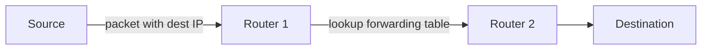
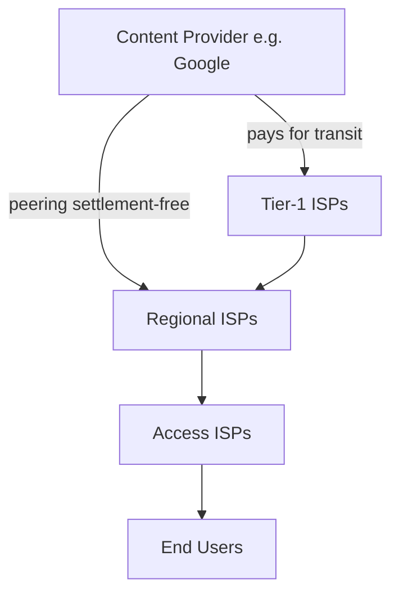

# 1.3 The Network Core

The **network core** = mesh of packet switches and links interconnecting the Internet's end systems.

## 1.3.1 Packet Switching

End systems break messages into **packets** of L bits, transmitted over links at rate R bits/sec.

### Store-and-Forward Transmission

- Packet switch must receive the **entire packet** before forwarding any bit onto outbound link
- Consequence: adds latency at each hop

**End-to-end delay (N links, ignoring queuing/propagation):**
```
d_end-to-end = N * (L/R)
```
- N = number of links (= number of routers + 1)
- L = packet size in bits
- R = link rate in bits/sec

Example: source → router → destination (N=2 links), one packet:
- Time 0: source starts transmitting
- Time L/R: router receives full packet, starts forwarding
- Time 2L/R: destination receives full packet → total delay = 2L/R

For P packets over N links: total = (N + P - 1) × L/R

### Queuing Delays and Packet Loss

- Each packet switch has an **output buffer (queue)** per link
- If outbound link busy: arriving packet **waits in queue** → queuing delay
- Queue has finite capacity → if full, **packet loss** occurs (arriving packet or queued packet dropped)
- Queuing delay is **variable** — depends on network congestion level

```
Example: Hosts A and B each send to Host E
- A→router and B→router: 100 Mbps Ethernet links
- router→E: 15 Mbps link
- If aggregate arrival > 15 Mbps: congestion, packets queue
```

### Forwarding Tables and Routing Protocols

- Every end system has an **IP address** (hierarchical structure)
- Router examines destination IP in packet header → looks up **forwarding table** → selects outbound link
- Forwarding tables set automatically by **routing protocols** (e.g., shortest-path algorithms)



## 1.3.2 Circuit Switching

Resources (buffers, link capacity) along a path are **reserved for the duration** of a communication session.

- Guaranteed constant transmission rate
- Used in traditional **telephone networks**
- Requires call setup before data transfer

### Multiplexing in Circuit-Switched Networks

#### FDM (Frequency-Division Multiplexing)
- Frequency spectrum divided among simultaneous connections
- Each connection gets a dedicated **frequency band** for duration of connection
- FM radio example: 88–108 MHz divided among stations (each ~200 kHz band)
- Telephone: typically 4 kHz bands

#### TDM (Time-Division Multiplexing)
- Time divided into **fixed-duration frames**, each frame divided into fixed slots
- Connection gets **one time slot per frame** for its exclusive use
- Circuit rate = frame rate × bits per slot
- Example: 8,000 frames/sec × 8 bits/slot = **64 kbps per circuit**

```
FDM: [--f1--][--f2--][--f3--][--f4--]  (frequency domain)
TDM: [1][2][3][4][1][2][3][4]...       (time domain, per frame)
```

### Circuit Switching Numerical Example
- File: 640,000 bits; TDM link: 24 slots, 1.536 Mbps total
- Per-circuit rate: 1.536 Mbps / 24 = **64 kbps**
- Transfer time: 640,000 / 64,000 = **10 seconds**
- + 500 ms circuit establishment = **10.5 seconds total**
- Transfer time independent of number of links (capacity already reserved)

### Packet Switching vs. Circuit Switching

| Aspect | Packet Switching | Circuit Switching |
|--------|-----------------|-------------------|
| Resource allocation | On demand | Reserved upfront |
| Idle resource handling | Used by others | Wasted |
| Delay | Variable (queuing) | Fixed/guaranteed |
| Setup | None | Required (complex signaling) |
| Efficiency for bursty traffic | High | Low |
| Guarantees | Best-effort | Guaranteed rate |

**Efficiency example:**
- 1 Mbps shared link; each user: 100 kbps when active, active 10% of time
- Circuit switching: supports max **10 users** (100 kbps × 10 = 1 Mbps)
- Packet switching with 35 users: P(>10 simultaneously active) ≈ **0.0004** → supports 35 users with essentially same performance

## 1.3.3 A Network of Networks

End systems → access ISPs → ... → global Internet. Built incrementally:

### Evolution of ISP Hierarchy

| Structure | Description |
|-----------|-------------|
| **Network Structure 1** | Single global transit ISP connects all access ISPs |
| **Network Structure 2** | Multiple competing global transit ISPs; must interconnect |
| **Network Structure 3** | Multi-tier hierarchy: access → regional → tier-1 ISPs |
| **Network Structure 4** | Add PoPs, multi-homing, peering, IXPs |
| **Network Structure 5** | Add content-provider networks (e.g., Google) |

### Key Concepts

- **Tier-1 ISPs:** ~dozen exist (Level 3, AT&T, Sprint, NTT); no one officially grants tier-1 status; do not pay anyone upstream
- **Regional ISPs:** connect access ISPs in a region to tier-1
- **PoP (Point of Presence):** group of routers in provider's network where customer ISPs connect
- **Multi-homing:** ISP connects to 2+ provider ISPs for redundancy (continues sending/receiving even if one provider fails)
- **Peering:** two ISPs at same level directly connect — traffic between them bypasses upstream; typically **settlement-free**
- **IXP (Internet Exchange Point):** third-party facility where multiple ISPs peer; >600 IXPs worldwide; typically standalone building with own switches

### Content-Provider Networks (Network Structure 5)



- Google (as of writing): 19 major data centers + smaller data centers at IXPs
- All interconnected via **Google's private TCP/IP network** (separate from public Internet)
- Bypasses upper tiers where possible by peering directly with lower-tier ISPs
- Benefits: reduced payments to upper-tier ISPs + greater control over service delivery

### Today's Internet Summary

- Dozen or so tier-1 ISPs + hundreds of thousands of lower-tier ISPs
- ISPs diverse in coverage (continents → narrow geographic regions)
- Lower-tier connects to higher-tier; higher-tier interconnect with each other
- Major content providers increasingly bypass hierarchy via private networks + direct peering
