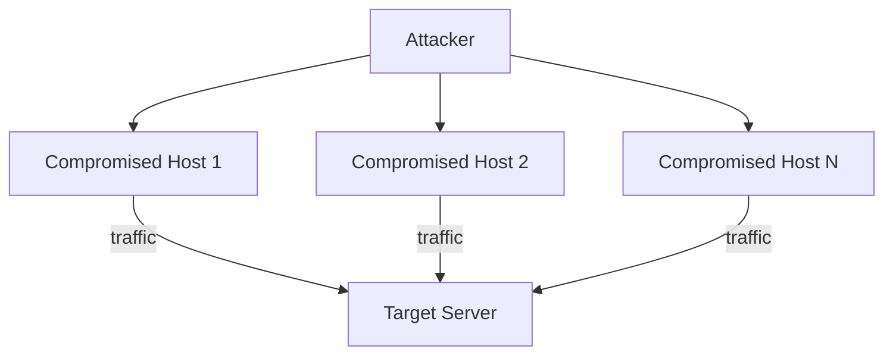

# 1.6 Networks Under Attack

## Why the Internet Is Insecure by Design

- Original design model: "a group of **mutually trusting users** attached to a transparent network"
- No built-in authentication — user identity taken at declared face value by default
- Sending to any other user is the **default**, not a granted capability
- Today's Internet users are **not** mutually trusting — yet must still communicate

## Attack Categories

### 1. Malware

**Vector:** Malicious content received over the Internet infects end systems.

**Types of damage:**
- Delete files
- Install **spyware** — collects passwords, SSNs, keystrokes → sends to attacker
- Enroll device in a **botnet** (thousands of compromised devices controlled by attacker)

**Botnet uses:**
- Spam email distribution
- Distributed Denial-of-Service (DDoS) attacks

**Self-replication:** Modern malware is self-replicating — exponential spread through the network.

### 2. Denial-of-Service (DoS) Attacks

**Goal:** Render a network, host, or infrastructure unusable by legitimate users.

**Three DoS categories:**

| Type | Mechanism |
|------|-----------|
| **Vulnerability attack** | Well-crafted packets exploit vulnerable application/OS → service crash or host crash |
| **Bandwidth flooding** | Deluge of packets clogs target's access link; legitimate traffic can't reach server |
| **Connection flooding** | Attacker creates large number of half-open or fully-open TCP connections; host stops accepting legitimate connections |

**Bandwidth flooding analysis:**
- Server access rate = R bps → attacker needs to send ≈ R bps to cause damage
- Single attacker with small rate: less likely to overwhelm large R

**DDoS (Distributed DoS):**

- Attacker controls multiple sources (botnet) → aggregate rate ≈ R needed
- Thousands of compromised hosts common today
- Much harder to detect and defend against than single-source DoS

### 3. Packet Sniffing

**Mechanism:** Passive receiver records copies of all packets that pass by.

**Vulnerable environments:**
- **Wireless:** any receiver in range can capture packets
- **Wired broadcast:** Ethernet LAN broadcast packets capturable by any NIC in promiscuous mode
- **Cable access:** broadcasts downstream to all homes — sniffable
- **Compromised router/access link:** attacker with access can install sniffer

**A packet sniffer:**
- Passive — does not inject packets → **hard to detect**
- Captures passwords, SSNs, private messages, trade secrets
- Wireshark is widely used free packet-sniffing software

**Defense:** Cryptography (covered in Chapter 8)

### 4. IP Spoofing (Identity Masquerading)

**Mechanism:** Craft a packet with an arbitrary (false) source IP address and transmit it — the Internet will forward it to the destination.

**Risk:** Receiver trusts the false source address and acts on embedded commands (e.g., router modifies its forwarding table).

**Defense:** End-point authentication — mechanism to verify with certainty that a message originates from the claimed source (Chapter 8).

## Summary of Attacks and Defenses

| Attack | Mechanism | Primary Defense |
|--------|-----------|----------------|
| Malware | Infected download/attachment | Antivirus, sandboxing, patching |
| DoS (vulnerability) | Exploit vulnerable service | Patching, input validation |
| DoS (bandwidth flood) | Overwhelm access link | Traffic filtering upstream, CDN |
| DDoS | Botnet-driven flood | Upstream filtering, CDN, anycast |
| Packet sniffing | Passive capture | Encryption (TLS, VPN) |
| IP spoofing | Fake source address | Ingress filtering, authentication |

## Security Challenges Ahead

- Sniffing attacks
- End-point masquerading
- Man-in-the-middle attacks
- DDoS attacks
- Malware / botnets

Communication among mutually trusted users is the **exception** rather than the rule in today's Internet.
