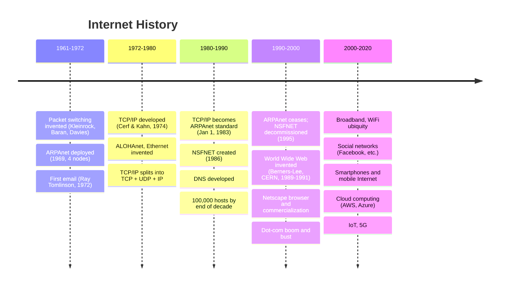

# 1.7 History of Computer Networking and the Internet

## Timeline Overview

## 1.7.1 Development of Packet Switching: 1961–1972

### Key Researchers (working independently)

| Researcher | Institution | Contribution |
|-----------|-------------|-------------|
| **Leonard Kleinrock** | MIT (grad student) | First published work on packet switching; used queuing theory to show effectiveness for bursty traffic [1961, 1964] |
| **Paul Baran** | Rand Institute | Investigated packet switching for secure voice over military networks [1964] |
| **Donald Davies & Roger Scantlebury** | NPL (England) | Independently developed packet switching ideas |

### ARPAnet
- J. C. R. Licklider + Lawrence Roberts (MIT colleagues of Kleinrock) → led computer science program at ARPA
- Roberts published ARPAnet plan [Roberts 1967]
- **Labor Day 1969:** First packet switch installed at UCLA (Kleinrock's supervision)
- By end of 1969: **4 nodes** (UCLA, SRI, UC Santa Barbara, U. of Utah)
- First use: remote login from UCLA to SRI → crashed the system
- By 1972: ~15 nodes; first public demonstration by Robert Kahn
- **NCP (Network Control Protocol):** first host-to-host protocol between ARPAnet end systems [RFC 001]
- **1972:** Ray Tomlinson wrote first email program

## 1.7.2 Proprietary Networks and Internetworking: 1972–1980

### Parallel Networks (1970s)
- **ALOHANet** — microwave network linking Hawaiian universities [Abramson 1970]
- **DARPA packet-satellite** [RFC 829] and **packet-radio networks** [Kahn 1978]
- **Telenet** — BBN commercial packet-switching network based on ARPAnet
- **Cyclades** — French packet-switching network (Louis Pouzin)
- **Tymnet, GE Information Services** — time-sharing networks
- **IBM SNA (1969–1974)**

### TCP/IP Creation
- **Vinton Cerf + Robert Kahn [Cerf 1974]:** pioneered internetworking (under DARPA); coined term "internetting"
- Early TCP combined: reliable in-sequence delivery (retransmission) + forwarding functions
- Experimental need for unreliable, non-flow-controlled service (packetized voice) → **IP split out from TCP; UDP created**
- **By end of 1970s:** TCP, UDP, IP conceptually in place

### Ethernet and Multiple-Access
- **Norman Abramson (Hawaii):** ALOHAnet — first **multiple-access protocol** for shared broadcast radio medium
- **Metcalfe + Boggs:** built on ALOHA work → developed **Ethernet protocol** [Metcalfe 1976] for wire-based shared broadcast networks
  - Motivated by connecting PCs, printers, shared disks

## 1.7.3 Proliferation of Networks: 1980–1990

### Growth
- End of 1970s: ~200 hosts on ARPAnet
- End of 1980s: ~100,000 hosts on public Internet

### Key Networks of the 1980s
- **BITNET** — email + file transfers among Northeast US universities
- **CSNET** — linked university researchers without ARPAnet access
- **NSFNET (1986)** — NSF-sponsored supercomputing center access
  - Initial backbone: 56 kbps
  - By end of decade: 1.5 Mbps backbone; primary backbone linking regional networks

### ARPAnet Milestones
- **January 1, 1983:** TCP/IP becomes official host protocol for ARPAnet (replacing NCP — RFC 801); "flag day" — all hosts required to switch simultaneously
- **Late 1980s:** TCP congestion control extensions added [Jacobson 1988]
- **DNS developed:** maps human-readable names (e.g., gaia.cs.umass.edu) to 32-bit IP addresses [RFC 1034]

### Minitel (France)
- Ambitious plan to bring data networking to every French home
- Public packet-switched network (X.25 protocol), servers, cheap terminals with built-in low-speed modems
- 1984: French government gave free terminal to every household that wanted one
- Peak mid-1990s: >20,000 services (home banking, research databases, etc.)
- In French homes **10 years before** most Americans heard of the Internet

## 1.7.4 The Internet Explosion: 1990s

### Early 1990s
- ARPAnet ceases to exist
- **1991:** NSFNET lifts restrictions on commercial use
- **1995:** NSFNET decommissioned; Internet backbone carried by commercial ISPs

### World Wide Web
- **Inventor:** Tim Berners-Lee at CERN, 1989–1991 [Berners-Lee 1989]
- Based on hypertext ideas: Vannevar Bush (1940s), Ted Nelson (1960s)
- **Initial components:** HTML, HTTP, Web server, browser
- End of 1993: ~200 Web servers
- **Marc Andreessen + Jim Clark** → Mosaic Communications → **Netscape** Communications Corporation
- 1995: students using Netscape daily; companies start Web commerce
- 1996: Microsoft enters browser market → "browser war" (Microsoft won)

### Four Killer Apps of the Late 1990s
1. **Email** (including attachments, Web-accessible email) — from research community
2. **The Web** (browsing + Internet commerce) — from research community
3. **Instant messaging** with contact lists — created by entrepreneurs
4. **Peer-to-peer file sharing** of MP3s (pioneered by Napster) — created by entrepreneurs

### Dot-Com Era
- 1995–2001: hundreds of Internet startups IPO'd, valued in billions with little revenue
- Internet stocks collapsed 2000–2001; many startups shut down
- Winners: Microsoft, Cisco, Yahoo, eBay, Google, Amazon

## 1.7.5 The New Millennium (2000s–present)

### Key Developments

- **Broadband deployment:** cable modems, DSL, FTTH, 5G fixed wireless → high-speed home access; enabled video applications (YouTube, Netflix, Skype)
- **Wireless ubiquity:** smartphones surpassed wired devices in 2011; enabled location-specific apps (Yelp, Tinder, Waze)
- **Social networks:** Facebook, Instagram, Twitter, WeChat — massive people-networks; APIs creating new application platforms (mobile payments, distributed games)
- **Private content-provider networks:** Google, Microsoft run private global networks; bypass public Internet where possible; peer directly with lower-tier ISPs → near-instant search/email
- **Cloud computing:** Amazon EC2, Microsoft Azure, Alibaba Cloud; companies run applications in cloud with implicit access to high-performance private networks
