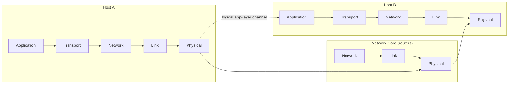
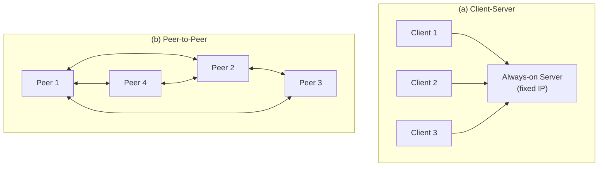
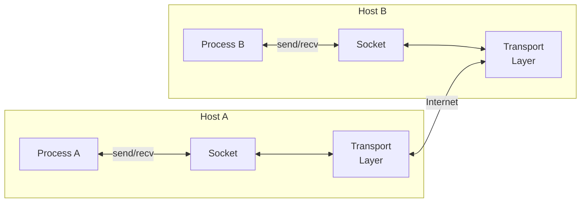

# 2.1 Principles of Network Applications

> Kurose, J. & Ross, K. (2022). *Computer Networking: A Top-Down Approach* (8th ed.), Section 2.1.

---

## Core Premise

Network application development means writing programs that run on **end systems** and communicate over the network. You never write software for network-core devices (routers, switches) — those operate at the network layer and below. Confining application software to end systems is what enables rapid application development and deployment.



---

## 2.1.1 Network Application Architectures

### Client-Server

- **Always-on server** with a fixed, well-known IP address
- Clients do not communicate directly with each other
- A single server host often can't handle load → **data centers** used to create a powerful virtual server
- Examples: Web (HTTP), FTP, Telnet, e-mail, Google, Amazon, Gmail, Facebook

### Peer-to-Peer (P2P)

- Minimal or no reliance on dedicated servers
- Peers (desktops/laptops controlled by users) communicate directly
- **Self-scalability**: each peer that requests files also adds service capacity by distributing files to others
- **Cost effective**: no significant server infrastructure or bandwidth costs
- Challenges: security, performance, reliability due to decentralized structure
- Example: BitTorrent



---

## 2.1.2 Processes Communicating

### Processes vs. Programs

Communication happens between **processes** (running program instances), not programs. Processes on different hosts communicate by exchanging **messages** across the network.

### Client and Server Processes

| Role | Definition |
|------|------------|
| Client process | Initiates communication at the beginning of the session |
| Server process | Waits to be contacted to begin the session |

This labeling applies per communication session. In P2P, a single peer can be both client and server across different sessions (or simultaneously in different sessions).

### Sockets

A **socket** is the interface between the application layer and the transport layer — the API between the application and the network.

```
Application process
       |
    [socket]   ← API boundary; developer controls above this line
       |
Transport layer (TCP/UDP)
       |
Network layer
```

- Sending: process pushes message out through its socket
- Receiving: message arrives at destination socket, process reads it
- Developer controls: (1) choice of transport protocol, (2) a few transport-layer parameters (max buffer size, max segment size)



### Addressing Processes

To deliver a message to a specific process, two pieces of information are required:

1. **IP address** — 32-bit quantity uniquely identifying the host
2. **Port number** — identifies the specific receiving process (socket) within the host

Well-known port assignments (from [iana.org](https://www.iana.org)):
- HTTP: port 80
- SMTP: port 25

---

## 2.1.3 Transport Services Available to Applications

Transport-layer services can be classified along four dimensions:

### 1. Reliable Data Transfer

- Packets can be lost in transit (buffer overflow, bit corruption, etc.)
- **Reliable data transfer**: guarantee that all data is delivered correctly and completely
- Applications that cannot tolerate loss: e-mail, file transfer, web documents, financial apps
- **Loss-tolerant applications**: multimedia (audio/video) — a lost packet results in a small glitch, not a failure

### 2. Throughput

- Available throughput fluctuates as sessions share bandwidth
- **Bandwidth-sensitive applications**: require a minimum guaranteed throughput (e.g., VoIP at 32 kbps — half the needed throughput is useless)
- **Elastic applications**: can use whatever throughput is available; more is always better (e-mail, file transfer, web)

### 3. Timing

- Example guarantee: every bit pumped into the socket arrives at receiver within 100 ms
- Required by interactive real-time applications: VoIP, virtual environments, teleconferencing, multiplayer games
- Non-real-time apps prefer lower delay but have no hard constraint

### 4. Security

- Transport layer can encrypt data at the sender and decrypt at receiver → **confidentiality**
- Additional services: data integrity, end-point authentication (covered in Chapter 8)

---

## 2.1.4 Transport Services Provided by the Internet

The Internet provides two transport protocols: **TCP** and **UDP**.

### Application Requirements Reference Table

| Application | Data Loss | Throughput | Time-Sensitive |
|---|---|---|---|
| File transfer/download | No loss | Elastic | No |
| E-mail | No loss | Elastic | No |
| Web documents | No loss | Elastic (few kbps) | No |
| Internet telephony / Video conferencing | Loss-tolerant | Audio: few kbps–1 Mbps; Video: 10 kbps–5 Mbps | Yes: 100s of ms |
| Streaming stored audio/video | Loss-tolerant | Same as above | Yes: few seconds |
| Interactive games | Loss-tolerant | Few kbps–10 kbps | Yes: 100s of ms |
| Smartphone messaging | No loss | Elastic | Yes and no |

### TCP Services

**Connection-oriented service**
- Three-way handshake before application-level messages flow (transport-layer control info exchange)
- Establishes a **full-duplex** TCP connection between the two process sockets
- Connection must be torn down when finished

**Reliable data transfer**
- Delivers all bytes sent, in order, without errors or duplicates
- Application passes a byte stream into the socket; TCP guarantees the same stream arrives at the receiving socket

**Congestion control**
- Throttles the sending process when the network between sender and receiver is congested
- Limits each TCP connection to its fair share of network bandwidth
- For the general welfare of the Internet, not the direct benefit of the communicating processes

**What TCP does NOT provide**: throughput guarantees, timing guarantees

### UDP Services

- **Connectionless**: no handshaking before communication begins
- **Unreliable data transfer**: no guarantee that messages reach the receiving process
- **No ordering guarantee**: messages may arrive out of order
- **No congestion control**: sender can pump data into the network at any rate

**What UDP does NOT provide**: reliable delivery, ordering, congestion control, throughput guarantees, timing guarantees

### Services Not Provided by Either Protocol

Neither TCP nor UDP provides **throughput guarantees** or **timing guarantees**. Time-sensitive applications (VoIP, streaming) work because they are designed to cope with this lack — but clever design has limits under excessive delay or insufficient throughput.

### Why Applications Use UDP Despite Its Limitations

- Internet telephony (e.g., Skype, SIP/RTP) prefers UDP to bypass TCP's congestion control and reduce overhead
- Many firewalls block UDP traffic → telephony apps often fall back to TCP as a backup

### Popular Applications: Protocol Summary

| Application | App-Layer Protocol | Transport |
|---|---|---|
| Electronic mail | SMTP [RFC 5321] | TCP |
| Remote terminal access | Telnet [RFC 854] | TCP |
| Web | HTTP/1.1 [RFC 7230] | TCP |
| File transfer | FTP [RFC 959] | TCP |
| Streaming multimedia | HTTP / DASH | TCP |
| Internet telephony | SIP [RFC 3261], RTP [RFC 3550], or proprietary | UDP or TCP |

---

## 2.1.5 Application-Layer Protocols

An **application-layer protocol** defines the rules for how processes on different end systems pass messages to each other. It specifies:

- **Message types**: e.g., request messages and response messages
- **Syntax**: fields in each message type and how fields are delineated
- **Semantics**: meaning of the information in each field
- **Rules**: when and how a process sends messages and responds to messages

### Public vs. Proprietary Protocols

- **Public (RFC-defined)**: HTTP [RFC 7230], SMTP [RFC 5321], FTP [RFC 959], etc. — any conforming implementation can interoperate
- **Proprietary**: e.g., Skype — intentionally not in the public domain

### Application ≠ Application-Layer Protocol

The application-layer protocol is one component of a network application, not the whole thing.

**Web application** components:
- HTML (document format standard)
- Web browsers (Chrome, IE)
- Web servers (Apache, Microsoft IIS)
- HTTP (the application-layer protocol — defines format and sequence of messages exchanged)

**Netflix** components:
- Video storage and transmission servers
- Billing/client management servers
- Client apps (smartphone, tablet, computer)
- DASH (application-level protocol — defines format and sequence of messages between Netflix server and client)

---

## 2.1.6 Network Applications Covered in Chapter 2

- **Web** (HTTP) — pervasive, protocol is straightforward
- **Electronic mail** — the Internet's first killer app; uses multiple application-layer protocols
- **DNS** — directory service; illustrates how core network functionality (name-to-address translation) is implemented at the application layer
- **P2P file sharing**
- **Video streaming on demand** — including content distribution networks (CDNs)
