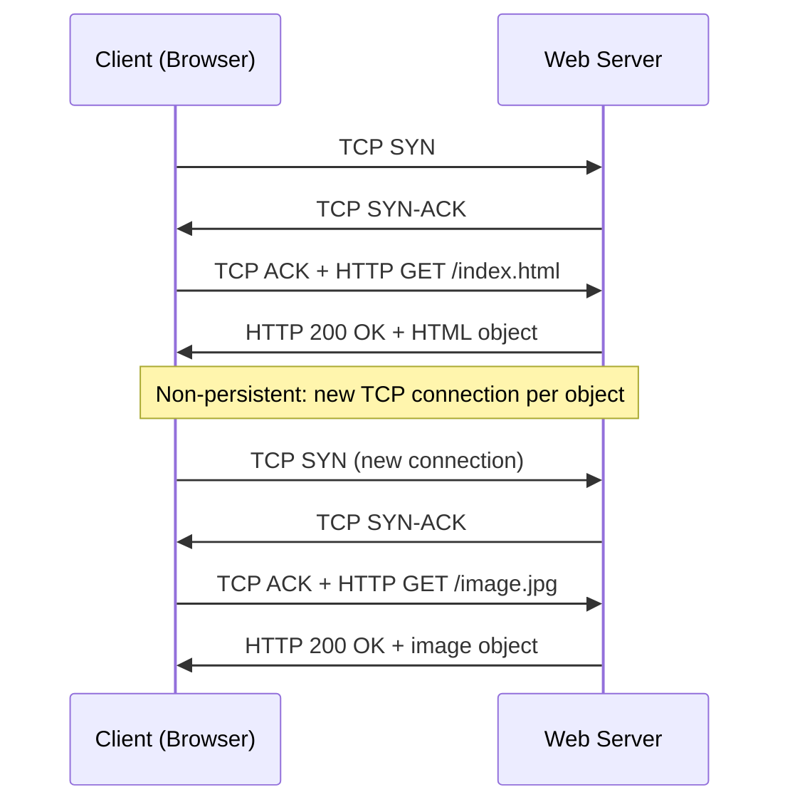
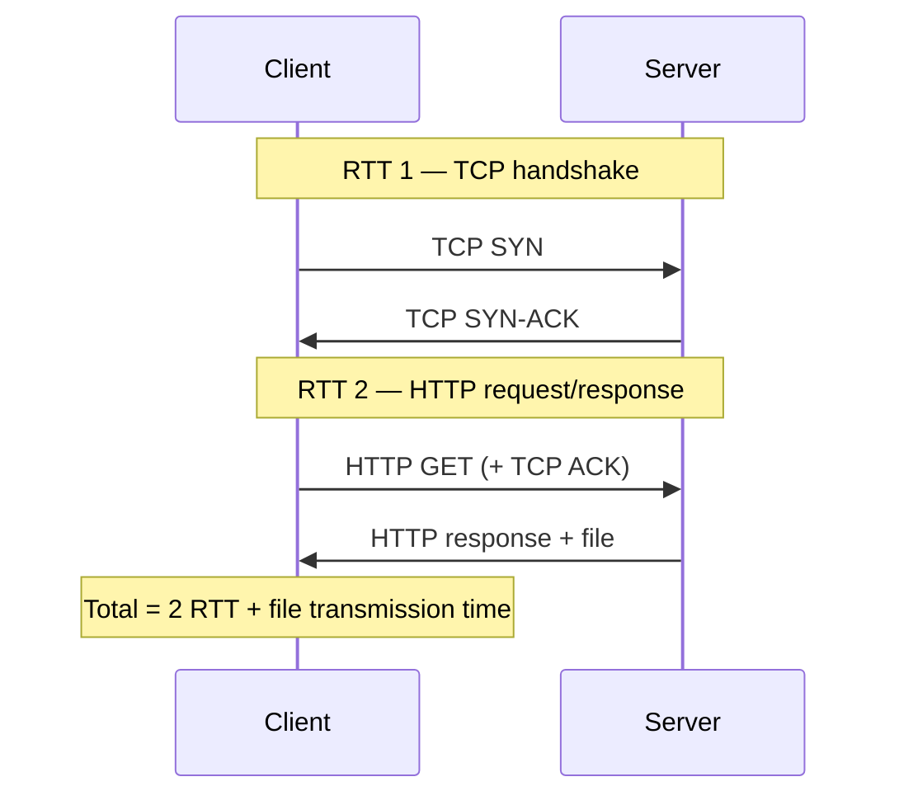
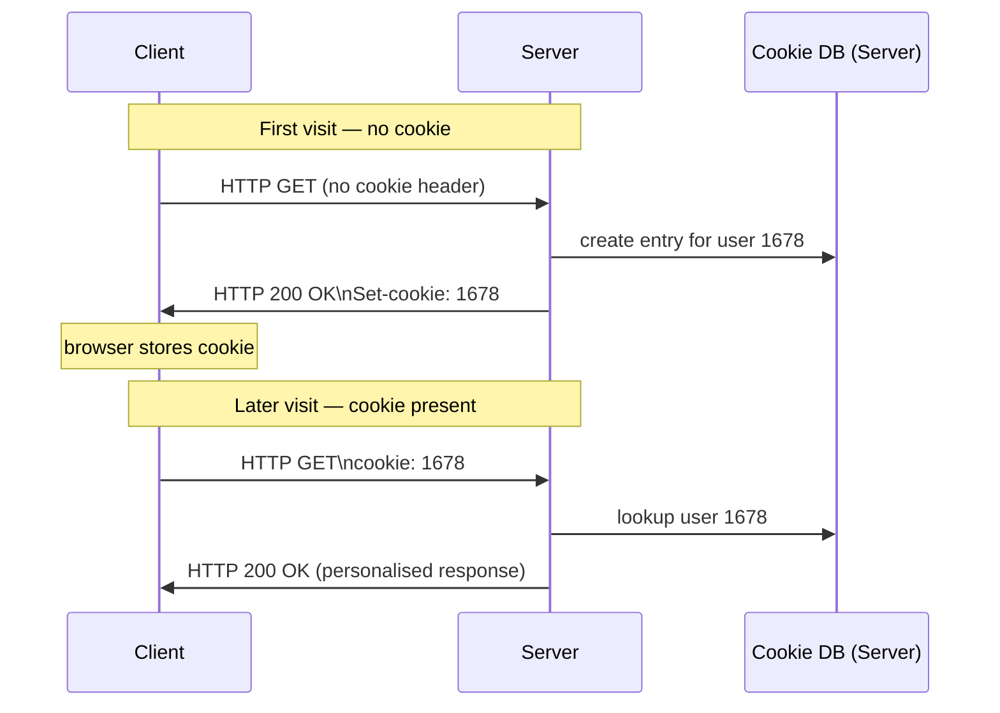
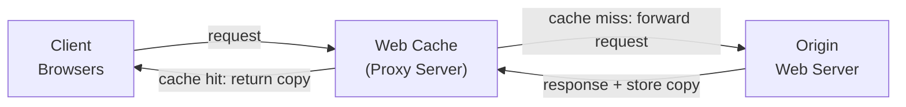

# 2.2 The Web and HTTP

> Kurose, J. & Ross, K. (2022). *Computer Networking: A Top-Down Approach* (8th ed.), Section 2.2.

---

## 2.2.1 Overview of HTTP

**HTTP** (HyperText Transfer Protocol) is the Web's application-layer protocol, defined in RFC 1945, RFC 7230, and RFC 7540.

### Core Concepts

- **Web page**: a document consisting of **objects** (HTML files, JPEG images, JS files, CSS, video clips), each addressable by a single URL
- **URL structure**: `hostname` + `path name` (e.g., `www.someSchool.edu` + `/someDepartment/picture.gif`)
- **Base HTML file**: references other objects in the page via their URLs

### Transport Characteristics

- HTTP runs over **TCP** (not UDP)
- Client initiates TCP connection; both sides access TCP via socket interfaces
- TCP provides reliable data transfer — HTTP offloads all loss/reordering concerns to lower layers
- HTTP is **stateless**: the server retains no information about past client requests; each request is treated independently
- HTTP has nothing to do with how a Web page is interpreted (rendered) by a client — it only defines the communication protocol between client and server programs



### Version History

| Version | RFC | Notes |
|---------|-----|-------|
| HTTP/1.0 | RFC 1945 | Non-persistent connections default |
| HTTP/1.1 | RFC 7230 | Persistent connections default; majority of transactions as of 2020 |
| HTTP/2 | RFC 7540 | Standardized 2015; multiplexing, server push, header compression |

---

## 2.2.2 Non-Persistent vs. Persistent Connections

### Non-Persistent Connections (HTTP/1.0 default)

- Each TCP connection carries exactly **one request/response pair**, then closes
- Fetching a page with 1 HTML file + 10 JPEGs requires **11 TCP connections**
- Connections may be serial or parallel (browsers can open multiple in parallel)

**Step-by-step non-persistent example** (fetching base HTML + 10 JPEGs):
1. HTTP client initiates TCP connection to the server (port 80)
2. Client sends HTTP request message including the path name
3. Server retrieves the object from storage (RAM or disk), encapsulates it in an HTTP response, sends it via socket
4. Server tells TCP to close the TCP connection (TCP waits until client has received the response intact before actually terminating)
5. Client receives the response; TCP connection terminates; client finds references to 10 JPEG objects in the HTML
6. Steps 1–4 are repeated for each of the 10 referenced JPEG objects

**RTT cost per object:**

```
Non-persistent response time = 2 RTT + file transmission time
```

- **1 RTT** for TCP three-way handshake (first two parts)
- **1 RTT** for HTTP request + response
- Plus the server's transmission time for the file



**Shortcomings:**
- New TCP connection (buffers + variables) must be allocated per object
- Significant overhead on servers handling hundreds of simultaneous clients
- Each object incurs 2 RTTs of delay

### Persistent Connections (HTTP/1.1 default)

- Server leaves the TCP connection open after sending a response
- Multiple objects (even across multiple pages on the same server) sent over a **single TCP connection**
- **Pipelining**: client can issue requests back-to-back without waiting for prior responses
- Server closes the connection after a configurable idle timeout

**Advantages over non-persistent:**
- Eliminates per-object connection setup overhead (TCP buffers, variables)
- Typically one RTT for all referenced objects after the base page is received (with pipelining)

> The default mode of HTTP uses **persistent connections with pipelining**. See [Heidemann 1997; Nielsen 1997; RFC 7540] for quantitative performance comparisons.

---

## 2.2.3 HTTP Message Format

### Request Message

```
GET /somedir/page.html HTTP/1.1\r\n
Host: www.someschool.edu\r\n
Connection: close\r\n
User-agent: Mozilla/5.0\r\n
Accept-language: fr\r\n
\r\n
```

**Structure:**
- Written in ordinary **ASCII text** (human-readable)
- Each line terminated by a **carriage return and line feed** (`\r\n`); the blank line after the headers is an additional `\r\n`
- **Request line** (first line): `<method> <URL> <HTTP-version>`
- **Header lines** (subsequent lines): key-value pairs, each terminated by `\r\n`
- **Blank line**: `\r\n` (marks end of headers)
- **Entity body**: empty for GET; used by POST

#### HTTP Methods

| Method | Description |
|--------|-------------|
| `GET` | Retrieve object identified by URL; entity body is empty |
| `POST` | Send form data in entity body; page content depends on form input; if the value of the method field is POST, the entity body contains what the user entered into the form fields |
| `HEAD` | Like GET but server responds with HTTP message that omits the requested object; used by application developers for debugging |
| `PUT` | Upload an object to a specific path (directory) on a specific Web server; used in conjunction with Web publishing tools and applications that need to upload objects to Web servers |
| `DELETE` | Delete an object on a Web server; can be used by a user or an application |

**GET with form data**: a form does not have to use POST — HTML forms often use GET and include the inputted data in the URL:
```
www.somesite.com/animalsearch?monkeys&bananas
```
(e.g., a form with GET method and two fields with inputs "monkeys" and "bananas" produces the URL above)

#### Key Request Headers

| Header | Purpose |
|--------|---------|
| `Host:` | Required by proxy caches to identify the origin server (even though a TCP connection already exists to the host) |
| `Connection: close` | Tell server to use non-persistent connection (close after object sent) |
| `User-agent:` | Browser type/version; server can return different versions of the same object to different user agents (each version addressed by the same URL) |
| `Accept-language:` | Preferred language for content negotiation; one of many content-negotiation headers available in HTTP |

**How browsers choose headers:** as a function of browser type and version, user configuration, and whether the browser has a cached (possibly out-of-date) version of the object. Servers similarly vary header inclusion based on product, version, and configuration. See [Krishnamurthy 2001] for a comprehensive discussion.

**Inspecting real HTTP messages with Telnet:**
```
telnet gaia.cs.umass.edu 80
GET /kurose_ross/interactive/index.php HTTP/1.1
Host: gaia.cs.umass.edu
(press Enter twice)
```
Replace `GET` with `HEAD` to see only the response headers without the object body.

### Response Message

```
HTTP/1.1 200 OK\r\n
Connection: close\r\n
Date: Tue, 18 Aug 2015 15:44:04 GMT\r\n
Server: Apache/2.2.3 (CentOS)\r\n
Last-Modified: Tue, 18 Aug 2015 15:11:03 GMT\r\n
Content-Length: 6821\r\n
Content-Type: text/html\r\n
\r\n
(data data data data data ...)
```

**Structure:**
- **Status line** (first line): `<HTTP-version> <status-code> <phrase>`
- **Header lines**: metadata about response and server
- **Entity body**: the requested object (the "meat" of the message)

#### Common Status Codes

| Code | Phrase | Meaning |
|------|--------|---------|
| 200 | OK | Request succeeded; object returned in body |
| 301 | Moved Permanently | New URL in `Location:` header; client auto-redirects |
| 400 | Bad Request | Request could not be understood by server |
| 404 | Not Found | Requested document does not exist on server |
| 505 | HTTP Version Not Supported | Server does not support requested HTTP version |

#### Key Response Headers

| Header | Purpose |
|--------|---------|
| `Date:` | Time the server created and sent the response (not object creation time) |
| `Server:` | Server software (analogous to `User-agent:` in requests) |
| `Last-Modified:` | Object creation/modification time; critical for caching |
| `Content-Length:` | Byte count of object being sent |
| `Content-Type:` | MIME type of entity body (authoritative — not the file extension) |

---

## 2.2.4 User-Server Interaction: Cookies

HTTP is stateless by design, but cookies (RFC 6265) layer identity tracking on top of it.

### Four Components of Cookie Technology

1. `Set-cookie:` header in the HTTP **response** message
2. `Cookie:` header in the HTTP **request** message
3. Cookie file on the user's end system, managed by the browser
4. Back-end database at the Web site

### How Cookies Work

1. First visit: server creates a unique ID, stores it in back-end DB, sends `Set-cookie: <id>` in response
2. Browser appends `<hostname, id>` to its cookie file
3. Subsequent requests to same host: browser includes `Cookie: <id>` in every request
4. Server uses the ID to look up user state in its database

**Concrete example — Susan visits Amazon.com for the first time (textbook Figure 2.10):**
- Susan uses Internet Explorer from her home PC; she has previously visited eBay (so her cookie file already has an eBay entry)
- Amazon creates unique ID **1678**, creates a back-end DB entry indexed by 1678, and sends `Set-cookie: 1678` in the response
- Susan's browser appends the Amazon hostname + ID 1678 to her cookie file
- Every subsequent HTTP request to Amazon includes `Cookie: 1678`
- Amazon tracks exactly which pages user 1678 visited, in which order, and at what times
- If Susan registers (provides name, email, postal address, credit card), Amazon links this info to ID 1678 — enabling "one-click shopping" on future visits (no need to re-enter payment/address details)
- Amazon also recommends products based on pages Susan has visited in past sessions

```
# Server response (first visit)
Set-cookie: 1678

# Browser on all subsequent requests
Cookie: 1678
```



Cookies can thus be used to **create a user session layer on top of stateless HTTP**. For example, when a user logs into a web-based e-mail application (e.g., Hotmail/Outlook.com), the browser sends cookie information to the server, which identifies the user throughout the session.

### Use Cases

- Shopping carts (maintaining item lists across requests)
- Session management (e-mail apps identifying users across a session)
- User-specific content and recommendations
- "One-click" purchasing (associating stored profile data with cookie ID)

### Privacy Implications

Cookies combined with user-supplied account info allow sites to build detailed user profiles, which can be sold to third parties.

---

## 2.2.5 Web Caching (Proxy Servers)

A **Web cache** (proxy server) satisfies HTTP requests on behalf of an origin server, using its own local disk storage. Web caches are configured via RFC 7234.

### Deployment

Web caches are purchased and installed by ISPs:
- A university may install a cache on its campus network and configure all campus browsers to point to it
- A major residential ISP (e.g., Comcast) may install caches in its network and preconfigure its shipped browsers to point to them

### Request Flow Through a Cache

1. Browser sends HTTP request to the Web cache (all browser requests directed to cache via configuration)
2. Cache checks local storage: **cache hit** → returns cached object in HTTP response
3. **Cache miss** → cache opens TCP connection to origin server, forwards request, receives response
4. Cache stores the object locally, then forwards it to the client



> A cache is simultaneously a **server** (to the client) and a **client** (to the origin server).

### Why Deploy Caches

- **Reduced response time**: if client-to-cache bandwidth >> client-to-origin bandwidth, cache hits are fast
- **Reduced access link traffic**: fewer requests traverse the WAN/Internet access link
- **Lower cost**: avoids expensive bandwidth upgrades
- **Web-wide benefit**: caches can substantially reduce Web traffic in the Internet as a whole, improving performance for all applications

**Total response time** = LAN delay + access link delay + Internet delay (the three additive components)

**Hit rates in practice:** typically range from **0.2 to 0.7**.

### Traffic Intensity Analysis Example

Setup:
- Institutional LAN: 100 Mbps internal
- Access link to Internet: 15 Mbps
- Average object size: 1 Mbits
- Request rate: 15 req/sec
- Internet delay (round trip beyond access link): 2 seconds

Without cache:
```
Traffic intensity on LAN      = (15 req/s × 1 Mbit/req) / 100 Mbps = 0.15  → tens of ms (negligible)
Traffic intensity on access link = (15 req/s × 1 Mbit/req) / 15 Mbps  = 1.0   → delay grows without bound (minutes)
```

With access link at full intensity (1.0), average response time is on the order of minutes — unacceptable.

Option 1 — Upgrade access link to 100 Mbps:
```
Traffic intensity on access link = (15 req/s × 1 Mbit/req) / 100 Mbps = 0.15 → negligible queuing delay
Total response time ≈ 2 seconds (Internet delay dominates)
```
Effective but expensive — requires upgrading the WAN link.

Option 2 — Install web cache with 0.4 hit rate:
```
40% of requests served from cache in ~10 ms (LAN speed)
60% of requests still go to Internet:
  Traffic intensity on access link = 0.6 × (15 req/s × 1 Mbit) / 15 Mbps = 0.6
  → traffic intensity 0.6 on 15 Mbps link ≈ tens of ms delay (negligible vs. Internet delay)

Average response time = 0.4 × 0.01 s + 0.6 × 2.01 s ≈ 1.2 seconds
```

Cache option is both faster than the expensive link upgrade and cheaper — caches typically run public-domain software on inexpensive PCs.

### CDNs

Web caches are the foundation of **Content Distribution Networks (CDNs)**. CDN companies install geographically distributed caches to localize traffic:
- **Shared CDNs**: Akamai, Limelight
- **Dedicated CDNs**: Google, Netflix

---

## 2.2.6 Conditional GET

Problem: cached copies may be stale. The **conditional GET** (RFC 7232) lets a cache validate freshness without re-downloading unchanged objects.

### Mechanism

A request is a conditional GET if:
1. Method is `GET`
2. Request includes `If-Modified-Since:` header

### Full Exchange Example

**Step 1 — Cache fetches object initially:**
```
GET /fruit/kiwi.gif HTTP/1.1
Host: www.exotiquecuisine.com
```

**Step 2 — Server responds with object:**
```
HTTP/1.1 200 OK
Date: Sat, 3 Oct 2015 15:39:29
Server: Apache/1.3.0 (Unix)
Last-Modified: Wed, 9 Sep 2015 09:23:24
Content-Type: image/gif
(data data data ...)
```
Cache forwards the object to the requesting browser, stores a local copy, and **stores the `Last-Modified` date** alongside the object.

**Step 3 — Later request; cache validates:**
```
GET /fruit/kiwi.gif HTTP/1.1
Host: www.exotiquecuisine.com
If-modified-since: Wed, 9 Sep 2015 09:23:24
```

**Step 4a — Object unchanged (304):**
```
HTTP/1.1 304 Not Modified
Date: Sat, 10 Oct 2015 15:39:29
Server: Apache/1.3.0 (Unix)
(empty entity body)
```
Cache serves its local copy to the requesting browser. No object transmitted over the network (saves bandwidth and reduces user-perceived response time, especially for large objects).

**Step 4b — Object changed:** Server returns `200 OK` with the new object.

---

## 2.2.7 HTTP/2

HTTP/2 (RFC 7540, standardized 2015) is the first major revision since HTTP/1.1 (1997). Over 40% of the top 10 million websites supported HTTP/2 by 2020. Most browsers (Chrome, IE, Safari, Opera, Firefox) also support HTTP/2.

**Primary goals of HTTP/2:**
1. Reduce perceived latency by enabling request and response **multiplexing** over a single TCP connection
2. Provide **request prioritization** and **server push**
3. Provide efficient **compression of HTTP header fields**

**What HTTP/2 does NOT change:** methods, status codes, URLs, header field semantics.

**What HTTP/2 changes:** how data is formatted and transported between client and server.

### The HOL Blocking Problem (HTTP/1.1)

With a single persistent TCP connection per page, a large object at the head of the queue blocks all smaller objects behind it (Head-of-Line blocking).

**HTTP/1.1 workaround:** browsers open up to 6 parallel TCP connections per host — circumvents HOL blocking but "cheats" TCP congestion control by grabbing disproportionate bandwidth share.

### HTTP/2 Framing

**Core idea:** break each HTTP message into small **frames**, interleave frames from different streams on the same TCP connection, reassemble at the other end.

- Each response is split by a **framing sub-layer**: headers → one frame; body → one or more frames
- Frames from different responses are **interleaved** on the single TCP connection
- Frames are **binary encoded** (more efficient to parse, smaller, less error-prone than text)

**HOL blocking reduction example:**
- Page: 1 large video (1000 frames) + 8 small objects (2 frames each)
- With interleaving: all 8 small objects delivered after 18 total frames sent
- Without interleaving (serial): small objects wait until after 1016 frames

### Response Prioritization

- Clients assign each request a **weight (1–256)** — higher weight = higher priority
- Clients declare **dependencies** between messages (by specifying which message ID a request depends on)
- Server sends highest-priority frames first

### Server Push

- Server proactively sends objects the client will need before the client requests them
- Triggered by parsing the HTML base page to identify referenced objects
- Eliminates the extra RTT latency of waiting for the client to discover and request each sub-resource

---

## 2.2.8 HTTP/3

HTTP/3 is defined over **QUIC** — a new "transport" protocol implemented in the application layer over the bare-bones UDP protocol. Key improvements over HTTP/2:

- **Per-stream multiplexing at the QUIC level**: eliminates TCP-level HOL blocking entirely (TCP's HOL blocking still affects HTTP/2 when a packet is lost)
- **Per-stream flow control**: each stream is independently flow-controlled
- **Low-latency connection establishment**: QUIC combines transport and cryptographic handshakes, reducing round trips needed before data flows
- **Simpler HTTP/3 design**: many HTTP/2 features (such as message interleaving) are subsumed by QUIC, allowing HTTP/3 to be leaner
- **Status**: as of 2020, HTTP/3 is described in Internet Drafts and has not yet been fully standardized

> HTTP/3 runs over UDP rather than TCP. QUIC is implemented in the application layer (not the OS kernel), making it easier to deploy and update independently of the operating system.

---

## Quick Reference: HTTP Version Comparison

| Feature | HTTP/1.0 | HTTP/1.1 | HTTP/2 | HTTP/3 |
|---------|----------|----------|--------|--------|
| Transport | TCP | TCP | TCP | QUIC (over UDP) |
| Connections | Non-persistent | Persistent + pipelining | Multiplexed (single TCP) | Multiplexed (per QUIC stream) |
| HOL blocking | Per-connection | Per-connection | Mitigated via framing | Eliminated (per-stream at QUIC level) |
| Parallel TCP connections | N/A | Up to ~6 (browser workaround) | Not needed | Not applicable |
| Header encoding | ASCII text | ASCII text | Binary (HPACK compression) | Binary (QPACK compression) |
| Server push | No | No | Yes | Yes |
| Request prioritization | No | No | Yes (weights + dependencies) | Yes |
| Connection establishment | 1 RTT (TCP) + TLS | 1 RTT (TCP) + TLS | 1 RTT (TCP) + TLS | 0–1 RTT (QUIC combines transport + crypto) |
| RFC | 1945 | 7230 | 7540 | Internet Draft (as of 2020) |
