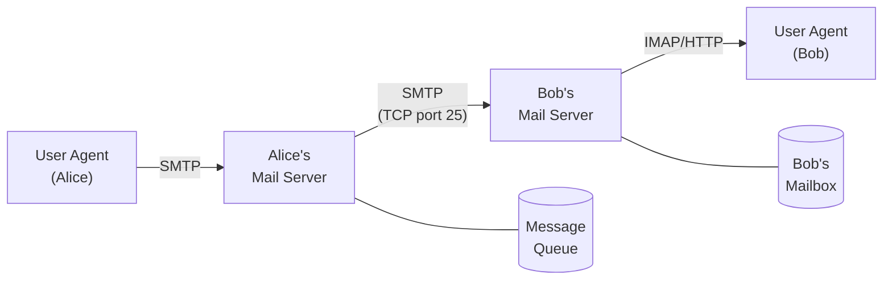
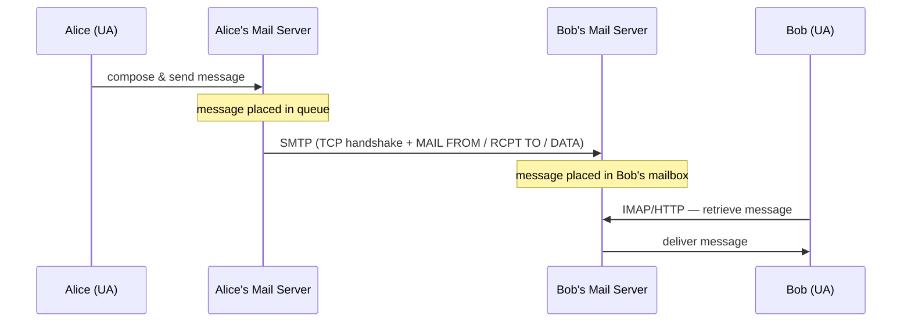
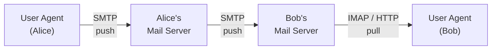

# 2.3 Electronic Mail in the Internet

> Kurose, J. & Ross, K. (2022). *Computer Networking: A Top-Down Approach* (8th ed.), Section 2.3.

---

## Architecture Overview

Email is an **asynchronous communication medium** — people send and read messages when convenient, without coordinating schedules. It is fast, easy to distribute, inexpensive, and supports attachments, hyperlinks, HTML-formatted text, and embedded photos.

Internet email has three major components:

| Component | Role |
|-----------|------|
| **User Agent (UA)** | Client-side interface for composing, reading, replying, forwarding, saving messages (e.g., Outlook, Apple Mail, Gmail) |
| **Mail Server** | Core infrastructure; hosts mailboxes, manages message queues, runs SMTP client and server |
| **SMTP** | Application-layer protocol for transferring messages between mail servers |

### Message Flow (Alice → Bob)

1. Alice invokes her UA, provides Bob's e-mail address, composes a message, and instructs the UA to send it.
2. Alice's UA sends the message to Alice's mail server, where it is placed in the outgoing message queue.
3. The client side of SMTP on Alice's mail server opens a TCP connection to an SMTP server running on Bob's mail server.
4. After SMTP handshaking, the SMTP client sends Alice's message into the TCP connection.
5. At Bob's mail server, the server side of SMTP receives the message and places it in Bob's mailbox.
6. Bob invokes his UA to read the message at his convenience.

**No intermediate servers:** SMTP does not use intermediate mail servers even when the two servers are on opposite sides of the world — e.g., if Alice's server is in Hong Kong and Bob's is in St. Louis, the TCP connection is direct.

**Fault tolerance:** If Bob's mail server is unreachable, Alice's mail server holds the message in its queue and retries (typically every 30 minutes). After several days without success, the message is discarded and Alice is notified.

**Dual role of every mail server:** Each mail server runs both the client and server sides of SMTP. When sending mail to other servers it acts as SMTP client; when receiving mail from other servers it acts as SMTP server.



---

## 2.3.1 SMTP

**Defined in:** RFC 5321  
**Transport:** TCP, port 25  
**Direction:** Push protocol (sender initiates transfer to recipient's server)

### Key Characteristics

- One of the oldest application-layer protocols (original RFC: 1982).
- Restricts message bodies to **7-bit ASCII** — a legacy constraint requiring binary attachments to be base64/ASCII-encoded before transmission (contrast with HTTP, which has no such restriction).
- Uses **persistent TCP connections**: multiple messages to the same destination can be sent over a single connection.
- **No intermediate relay servers** between sending and receiving mail server — the TCP connection is direct, even across continents.

### SMTP Handshake and Commands

During the handshaking phase, the SMTP client indicates the e-mail address of the sender and the e-mail address of the recipient. Once they have introduced themselves, the client sends the message. SMTP relies on TCP's reliable data transfer to deliver the message without errors.

After TCP connection is established on port 25:

```
S: 220 hamburger.edu
C: HELO crepes.fr
S: 250 Hello crepes.fr, pleased to meet you
C: MAIL FROM: <alice@crepes.fr>
S: 250 alice@crepes.fr ... Sender ok
C: RCPT TO: <bob@hamburger.edu>
S: 250 bob@hamburger.edu ... Recipient ok
C: DATA
S: 354 Enter mail, end with "." on a line by itself
C: Do you like ketchup?
C: How about pickles?
C: .
S: 250 Message accepted for delivery
C: QUIT
S: 221 hamburger.edu closing connection
```

The client issued five commands: `HELO` (abbreviation for HELLO), `MAIL FROM`, `RCPT TO`, `DATA`, and `QUIT`. The server issues replies to each command, with each reply having a **reply code** and an optional English-language explanation.

**Core commands:**

| Command | Purpose |
|---------|---------|
| `HELO` | Client identifies itself to server (abbreviation of HELLO) |
| `MAIL FROM:` | Declares envelope sender address |
| `RCPT TO:` | Declares recipient address (one per recipient) |
| `DATA` | Initiates message body transfer |
| `.` (lone period on a line) | Signals end of message body; in ASCII, each message ends with `CRLF.CRLF` (CR = carriage return, LF = line feed) |
| `QUIT` | Closes connection |

**Reply codes and meanings:**

| Code | Meaning |
|------|---------|
| `220` | Server ready (sent on connection) |
| `250` | OK / requested action completed |
| `354` | Start mail input; end with `CRLF.CRLF` |
| `221` | Service closing transmission channel |

### SMTP vs. HTTP

Both are application-layer protocols that transfer files (objects/messages) between hosts using persistent TCP connections. Key differences:

| Property | SMTP | HTTP |
|----------|------|------|
| Transfer direction | **Push** — sender pushes to receiver's server | **Pull** — client pulls from server |
| Data encoding | Restricts body to **7-bit ASCII** (binary data must be base64-encoded) | No ASCII restriction; transfers binary data natively |
| Object handling | Multiple objects sent in a **single message** (multipart) | Each object transferred in its **own HTTP response** |
| Connection role | Sender initiates to receiver | Client initiates to server |

### Persistent Connection Behavior

For multiple messages to the same server, the client issues a new `MAIL FROM:` without closing the TCP connection. `QUIT` is sent only after all messages are transferred.

### Testing SMTP Manually

```bash
telnet <mail-server-hostname> 25
```

After receiving `220`, manually issue `HELO`, `MAIL FROM:`, `RCPT TO:`, `DATA`, the message body, a lone `.`, and `QUIT`.



---

## 2.3.2 Mail Message Format

Defined in **RFC 5322**.

Structure: header lines, a blank line (CRLF), then the message body (ASCII). As with HTTP, each header line contains readable text consisting of a keyword followed by a colon followed by a value.

```
From: alice@crepes.fr
To: bob@hamburger.edu
Subject: Searching for the meaning of life.
                          ← blank line separating header from body
<message body in ASCII>
```

**Required headers:** `From:`, `To:`  
**Optional headers:** `Subject:`, `Cc:`, `Bcc:`, `Date:`, `Reply-To:`, `Received:`

> These RFC 5322 header lines are **distinct** from SMTP envelope commands (`MAIL FROM:`, `RCPT TO:`). The envelope is part of the SMTP protocol exchange; the headers are part of the message content itself. They may differ (e.g., in mailing lists).

---

## 2.3.3 Mail Access Protocols

SMTP is a **push** protocol — it cannot be used to retrieve messages from a mailbox. Retrieval requires a separate **pull** mechanism.

### Why a Shared Mail Server?

If Bob's mail server were on his local host, his host would have to remain always on and connected to the Internet to receive new mail (which can arrive at any time) — impractical for most users. Instead, a typical user runs a UA on the local host but accesses a mailbox stored on an always-on shared mail server shared with other users.

### Two-Step Submission (UA → Sender's Server → Recipient's Server)

Alice's UA does not talk directly to Bob's mail server. Instead:

1. Alice's UA pushes to **Alice's mail server** via SMTP (or HTTP for web-based clients).
2. Alice's mail server relays to **Bob's mail server** via SMTP.

This indirection gives Alice's server the ability to retry delivery if Bob's server is temporarily unreachable — the UA itself has no such retry capability. (If Alice's mail server is down, she has recourse to complain to her system administrator.)

### Retrieval Protocols

| Protocol | Transport | Notes |
|----------|-----------|-------|
| **IMAP** (Internet Mail Access Protocol) | TCP | RFC 3501; supports server-side folders, message state (read/flagged), partial fetch. Preferred for rich clients (Outlook, Thunderbird). |
| **HTTP** | TCP | Used by webmail (Gmail, Yahoo Mail, Outlook.com) and smartphone apps. Requires the mail server to expose an HTTP interface in addition to its SMTP interface. |

> **POP3** (Post Office Protocol version 3, RFC 1939) is an older retrieval protocol. It downloads messages to the client and (by default) deletes them from the server, making multi-device access awkward. IMAP supersedes it for most use cases.

### IMAP Capabilities (vs. POP3)

- Messages stay on the server; synchronized state across multiple devices.
- Server-side folder management: create, rename, delete folders; move messages; delete messages; mark messages as important.
- Partial message fetch (e.g., retrieve only headers, or only part of a large attachment).
- Supports multiple concurrent client connections to the same mailbox.

Both HTTP and IMAP allow Bob to manage folders maintained in Bob's mail server.



---

## Summary: Protocol Roles by Leg

```
[Alice UA] --SMTP/HTTP--> [Alice's Mail Server] --SMTP--> [Bob's Mail Server] --IMAP/HTTP--> [Bob UA]
              push                                  push                          pull
```

- **Leg 1 (UA → sender's server):** SMTP or HTTP
- **Leg 2 (server → server):** SMTP only
- **Leg 3 (receiver's server → UA):** IMAP or HTTP (never SMTP)
