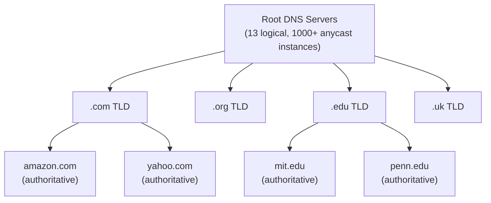
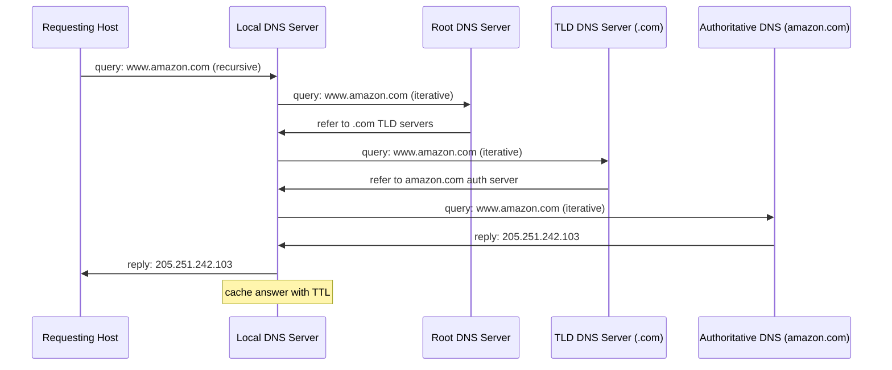
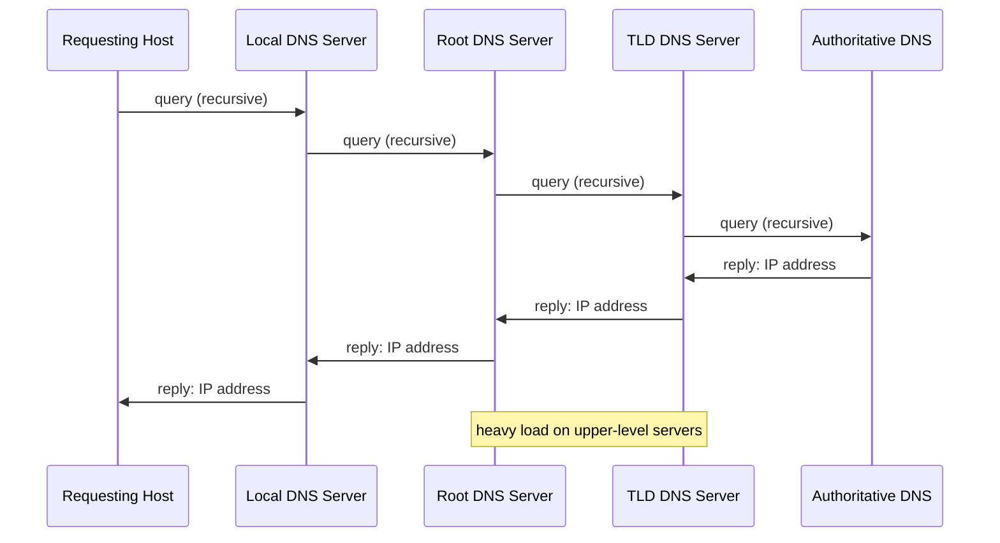

# 2.4 DNS — The Internet's Directory Service

> Kurose, J. & Ross, K. (2022). *Computer Networking: A Top-Down Approach* (8th ed.), Section 2.4.

---

## Overview

DNS (Domain Name System) is:
1. A **distributed database** implemented across a hierarchy of DNS servers worldwide
2. An **application-layer protocol** for querying that database

Protocol: UDP, port 53. Servers typically run BIND on UNIX.

DNS is not user-facing — it is infrastructure invoked by other protocols (HTTP, SMTP, etc.) to resolve hostnames before connections can be established.

Like HTTP, FTP, and SMTP, DNS is an application-layer protocol: it runs between communicating end systems using the client-server paradigm and relies on an underlying end-to-end transport protocol. However, unlike Web/email/FTP, users never interact with DNS directly — it provides a core Internet function at the network edges, embodying the Internet design philosophy of placing complexity at the edges.

---

## 2.4.1 Services Provided by DNS

### Primary Service: Hostname-to-IP Translation

Example flow for `www.someschool.edu/index.html`:
1. Browser extracts hostname `www.someschool.edu`
2. OS passes hostname to DNS client
3. DNS client sends query to a DNS server
4. DNS client receives reply with IP address
5. Browser initiates TCP connection to that IP on port 80

DNS lookup adds latency to every new connection, but caching mitigates this significantly.

### Additional Services

| Service | Description |
|---|---|
| **Host aliasing** | A host with a complicated canonical hostname can have one or more simpler alias names. Example: canonical hostname `relay1.west-coast.enterprise.com` may have aliases `enterprise.com` and `www.enterprise.com`. DNS returns the canonical hostname and IP address for a supplied alias. |
| **Mail server aliasing** | E-mail addresses are mnemonic (e.g., `bob@yahoo.com`) but the actual mail server hostname may be complex (e.g., canonical `relay1.west-coast.yahoo.com`). DNS (via MX records) maps the alias to the canonical hostname. The MX record permits a company's mail server and Web server to have identical aliased hostnames (e.g., both called `enterprise.com`); clients query for MX vs. CNAME to distinguish them. |
| **Load distribution** | A single hostname maps to a set of IP addresses (replicated servers). Busy sites like cnn.com run on multiple servers with different IPs. DNS rotates the ordering of addresses within each reply; clients typically use the first IP listed, so rotation distributes load. DNS rotation is also used for e-mail so multiple mail servers can share the same alias name. CDNs such as Akamai use DNS in more sophisticated ways for content distribution. |

---

## 2.4.2 How DNS Works

### Why Not Centralized?

A single DNS server would fail on every dimension:
- **Single point of failure** — if the DNS server crashes, the entire Internet goes down
- **Traffic volume** — a single server would have to handle all DNS queries from hundreds of millions of hosts (for every HTTP request, every email, etc.)
- **Distant centralized database** — a single server cannot be geographically close to all querying clients; queries from Australia to a New York server traverse slow, congested links
- **Maintenance** — the single database would be enormous and must be updated constantly for every new host

DNS is distributed by design. In fact, DNS is a prime example of how a distributed database can be implemented in the Internet.

### Distributed, Hierarchical Database

Three classes of DNS servers, organized hierarchically:

```
Root DNS Servers
    └── TLD DNS Servers (com, org, edu, uk, fr, ...)
            └── Authoritative DNS Servers (amazon.com, umass.edu, ...)
```

**Root DNS Servers**
- 13 logical root servers (labeled A–M), but over 1,000 physical instances worldwide via anycast
- Managed by 12 different organizations, coordinated by IANA
- Return IP addresses of TLD servers

**Top-Level Domain (TLD) Servers**
- One per TLD: `com`, `org`, `net`, `edu`, `gov`, country codes (`uk`, `fr`, `jp`, etc.)
- `com` TLD operated by Verisign; `edu` by Educause
- Return IP addresses of authoritative DNS servers

**Authoritative DNS Servers**
- Every publicly accessible organization must have one
- Houses DNS records mapping hostnames to IPs for that organization
- Can be self-hosted or delegated to a service provider
- Large organizations maintain primary + secondary (backup) authoritative servers

**Local DNS Server** (not part of the hierarchy, but critical)
- Provided by your ISP (configured automatically via DHCP)
- Acts as a proxy/forwarder for client queries into the hierarchy
- Typically 0–2 router hops from the client
- Caches results aggressively



### Query Resolution: Iterated vs. Recursive

**Typical pattern** (iterated from local DNS server):

```
cse.nyu.edu
    → dns.nyu.edu (local DNS, recursive query from client)
        → root server (returns TLD server IPs for .edu)
        → edu TLD server (returns authoritative server IP for umass.edu)
        → dns.umass.edu (returns IP for gaia.cs.umass.edu)
    ← dns.nyu.edu returns final IP to cse.nyu.edu
```

- Query from client to local DNS server: **recursive** (local DNS does all the work)
- Queries from local DNS server onward: **iterative** (each server returns a referral, not a final answer)
- Total messages for this example: 8 (4 queries + 4 replies)
- With an intermediate departmental DNS server (e.g., `dns.cs.umass.edu`): 10 messages



**Fully recursive** (theoretically possible, rarely used in practice):
- Each DNS server in the chain contacts the next on behalf of the requester
- Shown in Figure 2.20 of the textbook



---

## DNS Caching

DNS caching is critical to performance and scalability.

**Mechanics:**
- When any DNS server receives a reply, it caches the mapping in local memory
- Subsequent queries for the same hostname are answered from cache without further lookups
- Cached entries expire after a TTL (commonly ~2 days); entries are discarded after TTL expires

**Impact:**
- Local DNS servers cache TLD server IPs → root servers are bypassed for the vast majority of queries
- Root servers handle only a tiny fraction of total DNS traffic in practice
- Reduces both latency and DNS message volume across the Internet

---

## 2.4.3 DNS Records and Messages

### Resource Records (RRs)

All DNS servers store **resource records**. Each RR is a 4-tuple:

```
(Name, Value, Type, TTL)
```

| Type | Name | Value | Purpose |
|---|---|---|---|
| **A** | Hostname | IPv4 address | Standard hostname-to-IP mapping |
| **NS** | Domain | Hostname of authoritative DNS server for that domain | Routes queries further along the chain |
| **CNAME** | Alias hostname | Canonical hostname | Canonical name lookup for an alias |
| **MX** | Mail alias | Canonical hostname of mail server | Allows aliased mail server hostnames |

**Examples:**
```
(relay1.bar.foo.com, 145.37.93.126, A)
(foo.com, dns.foo.com, NS)
(foo.com, relay1.bar.foo.com, CNAME)
(foo.com, mail.bar.foo.com, MX)
```

**Key behavioral rules:**
- If a DNS server **is authoritative** for a hostname → contains a **Type A** record for it
- If a DNS server **is not authoritative** → contains:
  - A **Type NS** record pointing to the authoritative server's hostname
  - A **Type A** record for that authoritative server's IP (glue record)

**Example:** An `edu` TLD server not authoritative for `gaia.cs.umass.edu` holds:
```
(umass.edu, dns.umass.edu, NS)
(dns.umass.edu, 128.119.40.111, A)
```

**CNAME vs MX distinction:** A single alias hostname can have both a CNAME and an MX record pointing to different canonical names (e.g., web server vs. mail server). Clients query for the record type they need.

### DNS Message Format

Both **query** and **reply** messages use the same format:

```
+---------------------------+
|         Header            |  12 bytes
+---------------------------+
|      Question Section     |  Name + Type being queried
+---------------------------+
|       Answer Section      |  RRs answering the query
+---------------------------+
|      Authority Section    |  RRs for authoritative servers
+---------------------------+
|     Additional Section    |  Other helpful RRs
+---------------------------+
```

**Header fields (12 bytes):**
| Field | Size | Description |
|---|---|---|
| Query ID | 16 bits | Matches replies to queries |
| Query/Reply flag | 1 bit | 0 = query, 1 = reply |
| Authoritative flag | 1 bit | Set in reply if server is authoritative for queried name |
| Recursion-desired | 1 bit | Client requests recursive resolution |
| Recursion-available | 1 bit | Set in reply if server supports recursion |
| Number-of fields | 4 × N | Count of records in each of the four sections |

**Sections:**
- **Question:** Name being queried + record type (A, MX, etc.)
- **Answer:** One or more RRs with Name, Type, Value, TTL. Multiple RRs returned for replicated servers.
- **Authority:** RRs pointing to other authoritative servers
- **Additional:** Supplementary RRs — e.g., an MX reply's answer section contains the mail server's canonical name; the additional section contains the Type A record with its IP

### Querying DNS Directly

Use `nslookup` to send DNS queries from the command line to any DNS server (root, TLD, or authoritative):

```bash
# Interactive mode
nslookup

# Query a specific server
nslookup www.amazon.com dns.google

# Query for MX records
nslookup -type=MX amazon.com
```

`dig` is the preferred tool for developers:

```bash
dig www.amazon.com
dig @8.8.8.8 www.amazon.com
dig MX amazon.com
dig NS amazon.com +short
```

---

## Inserting Records into DNS

When registering a new domain (e.g., `networkutopia.com`):

1. Register with an **ICANN-accredited registrar** (e.g., via internic.net). Prior to 1999, Network Solutions had a monopoly on `.com`, `.net`, and `.org` registration; now many registrars compete and ICANN accredits them.
2. Provide the registrar with names and IPs of your **primary and secondary authoritative DNS servers**:
   - `dns1.networkutopia.com` → `212.212.212.1`
   - `dns2.networkutopia.com` → `212.212.212.2`
3. Registrar inserts **NS** and **A** records into the `com` TLD server (for each authoritative server):
   ```
   (networkutopia.com, dns1.networkutopia.com, NS)
   (dns1.networkutopia.com, 212.212.212.1, A)
   ```
4. You then add records to your own authoritative DNS servers:
   ```
   # Web server
   (www.networkutopia.com, 212.212.71.4, A)
   # Mail server
   (networkutopia.com, mail1.networkutopia.com, MX)
   ```
5. DNS records can be added statically (via config file) or dynamically via the **UPDATE** option added to the DNS protocol — see **RFC 2136** and **RFC 3007** for DNS dynamic updates.

**End-to-end verification example:** When Alice (in Australia) visits `www.networkutopia.com`, her local DNS server queries a `com` TLD server, which returns the NS and glue A records inserted by the registrar. The local DNS server then queries `212.212.212.1` directly for the Type A record for `www.networkutopia.com`, gets back `212.212.71.4`, and returns it to Alice's host. Alice's browser then opens a TCP connection to `212.212.71.4`.

---

## Key Specs and References

- Specified in **RFC 1034** and **RFC 1035** (plus many update RFCs)
- DNS is an application-layer protocol using the client-server paradigm
- Transport: **UDP**, port **53** (TCP used for zone transfers and large responses)
- System call for hostname resolution on UNIX: `gethostbyname()`
- Root server list and operators: [IANA Root Servers](https://www.iana.org/domains/root/servers)
- Registrar list: [InterNIC](http://www.internic.net)
