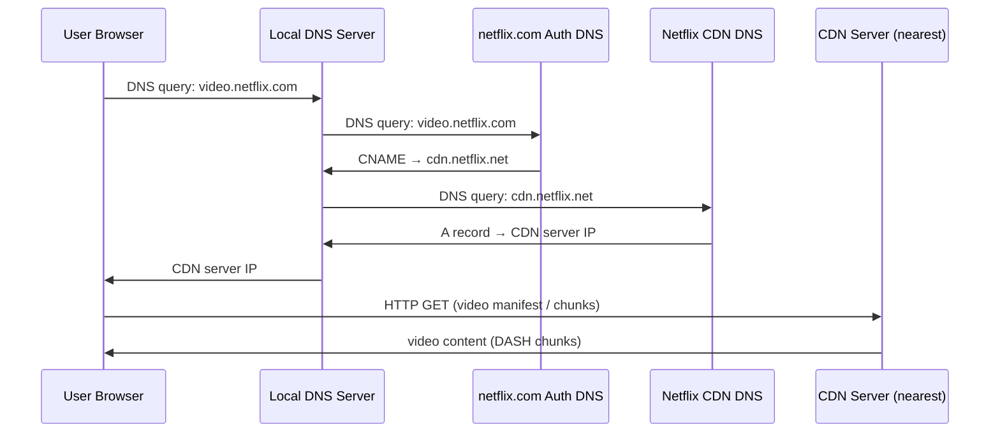
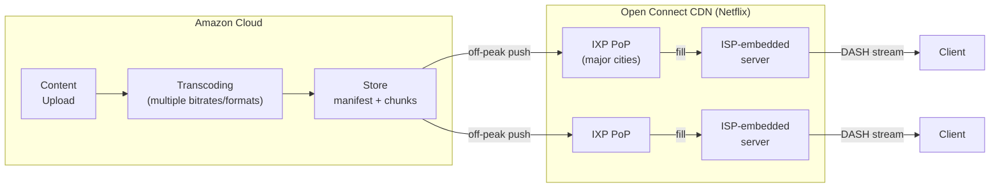

# 2.6 Video Streaming and Content Distribution Networks

> Kurose, J. & Ross, K. (2022). *Computer Networking: A Top-Down Approach* (8th ed.), Section 2.6.

---

## Overview

Streaming video (Netflix, YouTube, Amazon Prime) accounts for ~80% of Internet traffic (2020). These services are implemented using application-level protocols and servers that function similarly to caches.

---

## 2.6.1 Internet Video

### Video Fundamentals

- A video is a sequence of images displayed at constant rate (typically 24–30 fps)
- Each frame is an array of pixels encoded with bits for luminance and color
- Video can be compressed, trading quality for bit rate — compression can produce any target bit rate
- The same video can be compressed into **multiple versions** at different quality levels (e.g., 300 kbps, 1 Mbps, 3 Mbps), letting users choose based on available bandwidth (e.g., 3G smartphone vs. fiber)

### Video Compression: Spatial and Temporal Coding

- **Spatial coding (intra-frame):** Encodes redundancy within a single frame. Example: if a frame is mostly blue sky, store the color once rather than pixel-by-pixel.
- **Temporal coding (inter-frame / predictive coding):** Encodes only the *differences* between successive frames rather than each frame in full. Highly effective when backgrounds are static.
- **CBR (Constant Bit Rate):** Encoder targets a fixed output bit rate throughout. Simpler for network planning but wastes bits on easy scenes.
- **VBR (Variable Bit Rate):** Encoder varies the bit rate as the scene complexity changes, allocating more bits to complex scenes and fewer to simple ones. Better quality at the same average rate.

### Bit Rate Ranges

| Quality Level | Typical Bit Rate |
|---------------|-----------------|
| Low quality   | ~100 kbps       |
| Standard HD   | ~1–4 Mbps       |
| 4K streaming  | 10+ Mbps        |

**Storage implication:** A 2 Mbps video at 67 minutes = ~1 GB of storage and traffic.

### Key Performance Metric

Average end-to-end throughput must be **at least equal to the video's bit rate** to maintain continuous playout. End-to-end throughput is bounded by the bottleneck link.

---

## 2.6.2 HTTP Streaming and DASH

### Basic HTTP Streaming

- Video stored as an ordinary file at a specific URL on an HTTP server
- Client issues HTTP GET; server sends the file as fast as network allows
- Client buffers incoming bytes; playback starts once buffer exceeds a threshold
- Client periodically grabs frames from the buffer, decompresses, and renders

**Shortcoming:** All clients receive the same encoding regardless of available bandwidth. No adaptation to network conditions or device capability.

### DASH — Dynamic Adaptive Streaming over HTTP

DASH resolves the single-encoding problem by encoding multiple versions of each video at different bit rates.

#### How DASH Works

1. Video is encoded at multiple bit rates/quality levels, each stored as a separate version on the HTTP server
2. Server provides a **manifest file** listing all versions with their URLs and bit rates
3. Client requests the manifest first, then fetches video in chunks (a few seconds each) via individual HTTP GET requests
4. Client measures received bandwidth continuously and runs a **rate-determination algorithm** to select the next chunk's quality level
5. Client adapts dynamically: more bandwidth → higher-quality chunk; less bandwidth → lower-quality chunk

#### DASH Properties

- Each version has a distinct URL; the manifest maps bit rates to URLs
- The HTTP server provides a **manifest file** that lists each version's URL and its bit rate; the client requests the manifest first
- Client selects one chunk at a time by **specifying a URL and a byte range** in an HTTP GET request message for each chunk
- Chunks requested with HTTP GET, optionally using **byte-range headers**
- No special server infrastructure required — plain HTTP servers suffice
- Well-suited for mobile clients with fluctuating bandwidth (bandwidth availability fluctuates as users move relative to base stations)
- Clients freely switch between quality levels between chunks

```
Manifest File (simplified):
  300kbps  → http://server/video_low/...
  1Mbps    → http://server/video_med/...
  3Mbps    → http://server/video_high/...
```

---

## 2.6.3 Content Distribution Networks (CDNs)

### Why a Single Data Center Fails at Scale

| Problem | Description |
|---------|-------------|
| Throughput bottleneck | Long paths through many ISPs increase bottleneck risk; one slow link degrades the entire stream |
| Redundant traffic | Popular videos traverse the same links many times, wasting bandwidth and ISP transit costs |
| Single point of failure | One data center going down kills all streams globally |

### CDN Architecture

A CDN manages **geographically distributed servers**, stores copies of content (video, images, documents) across them, and directs each user request to the optimal server.

**CDN types:**
- **Private CDN** — owned and operated by the content provider (e.g., Google's CDN for YouTube)
- **Third-party CDN** — distributes content on behalf of multiple providers (e.g., Akamai, Limelight, Level-3)

### Placement Philosophies

| Strategy | Description | Tradeoffs |
|----------|-------------|-----------|
| **Enter Deep** (Akamai) | Deploy clusters deep inside access ISPs worldwide — thousands of locations | Very low latency, few hops to end user; complex maintenance and management |
| **Bring Home** (Limelight, others) | Fewer, larger clusters at Internet Exchange Points (IXPs) — tens of sites | Simpler management; slightly higher latency vs. Enter Deep |

### Content Placement: Not Every Video in Every Cluster

CDNs do not necessarily place a copy of every video in each cluster — some videos are rarely viewed or are only popular in certain countries. Many CDNs therefore use a **pull strategy** rather than pre-positioning all content everywhere.

### Content Replication: Push vs. Pull

- **Pull caching:** On cache miss, the cluster retrieves the video (from a central repository or from another cluster) and stores a copy locally while streaming the video to the client at the same time. When a cluster's storage becomes full, it removes videos that are not frequently requested (similar to web caching).
- **Push caching:** Content is proactively distributed to CDN servers at scheduled times (typically off-peak hours), regardless of demand signals.

---

### CDN Operation: DNS-Based Request Interception

CDNs intercept user requests using DNS to redirect the client to an optimal server cluster. Step-by-step flow (using NetCinema + KingCDN as an example, per textbook Figure 2.25):

- Each NetCinema video is assigned a URL that includes the string "video" and a unique identifier — e.g., Transformers 7 is assigned `http://video.netcinema.com/6Y7B23V`.

```
1. The user visits the Web page at NetCinema.
2. When the user clicks the link http://video.netcinema.com/6Y7B23V, the user's
   host sends a DNS query for video.netcinema.com.
3. The user's LDNS relays the DNS query to an authoritative DNS server for
   NetCinema, which observes the string "video" in the hostname. To hand off
   the query to KingCDN, instead of returning an IP address, the NetCinema
   authoritative DNS server returns to the LDNS a hostname in KingCDN's domain
   — for example, a1105.kingcdn.com.
4. From this point on, the DNS query enters KingCDN's private DNS infrastructure.
   The user's LDNS sends a second query, now for a1105.kingcdn.com, and
   KingCDN's DNS system eventually returns the IP addresses of a KingCDN content
   server to the LDNS. It is here, within KingCDN's DNS system, that the CDN
   server from which the client will receive its content is specified.
5. The LDNS forwards the IP address of the content-serving CDN node to the user's host.
6. Once the client receives the IP address for a KingCDN content server, it
   establishes a direct TCP connection with the server at that IP address and
   issues an HTTP GET request for the video. If DASH is used, the server will
   first send to the client a manifest file with a list of URLs, one for each
   version of the video, and the client will dynamically select chunks from the
   different versions.
```

**Key insight:** The CDN's cluster selection logic executes inside its own DNS system (step 4). The CDN learns the client's approximate location from the **LDNS IP address** in the DNS query.



---

### Cluster Selection Strategies

#### 1. Geographic Proximity
- Map LDNS IP to a geographic location using commercial geo-location databases (Quova, MaxMind)
- Assign client to the geographically nearest cluster (fewest km as the crow flies)
- **Limitation:** Geographic proximity ≠ network proximity; some users use remote LDNSs, making the mapping inaccurate

#### 2. Real-Time Network Measurement
- CDN clusters periodically send probes (ping, DNS queries) to LDNSs worldwide to measure delay and loss
- Select cluster with best measured performance to the client's LDNS
- **Limitation:** Many LDNSs are configured to ignore probes

Both strategies can be combined; CDNs treat cluster selection algorithms as proprietary.

---

## 2.6.4 Case Studies: Netflix and YouTube

### Netflix

**Architecture overview:** Two major components — Amazon cloud (control/processing plane) + private CDN (delivery plane).

Netflix originally (2007) relied on three third-party CDN companies before building its own private CDN (Open Connect). The shift to a private CDN gave Netflix full control over distribution quality and costs.

#### Amazon Cloud Functions

The Netflix website (including backend databases) runs entirely on Amazon servers. It handles: **user registration and login, billing, movie catalogue for browsing and searching, and a movie recommendation system.** Additionally the Amazon cloud handles:

- **Content ingestion:** Studio master files ("studio master versions") uploaded to hosts in the Amazon cloud
- **Content processing:** Transcoding to multiple formats (desktop, smartphone, game console) and multiple bit rates for DASH adaptive streaming
- **CDN upload:** Processed versions pushed to Netflix's own CDN servers

#### Netflix Private CDN (Open Connect)
- Server racks installed at 200+ IXP locations and hundreds of residential ISP locations
- Each server in a rack has several **10 Gbps Ethernet ports** and over **100 terabytes of storage**
- The number of servers in a rack varies: **IXP installations often have tens of servers** and contain the **entire Netflix streaming video library**, including multiple DASH versions
- ISP-resident racks hold most popular content (popularity determined day-by-day)

#### Content Distribution Model
- **Push-based** (not pull): Content pushed during off-peak hours on a scheduled basis
- No pull-caching / cache-miss retrieval

#### Client-CDN Interaction
- Browsing/UI served from Amazon cloud
- On play request: Netflix software (in Amazon cloud) first determines which CDN servers have copies of the movie. Among those servers, it determines the "best" server for that client request:
  - If the client is in a residential ISP with a Netflix rack installed **and** that rack has the movie → server in that rack is typically selected
  - Otherwise → a server at a nearby IXP is typically selected
- Client receives: IP address of the specific CDN server + manifest file listing URLs for each DASH version of the movie
- Client streams directly from CDN server using a **proprietary version of DASH** with approximately **4-second chunks** and **byte-range HTTP GET requests**
- **No DNS redirect needed** — Netflix software in the cloud directly assigns the CDN server to each client (possible because it's a private, video-only CDN)

#### Netflix vs. Standard CDN Pattern

| Feature | Standard CDN | Netflix |
|---------|-------------|---------|
| Request routing | DNS redirect | Application-layer (Amazon cloud assigns server directly) |
| Cache population | Pull or push | Push only (off-peak scheduled) |
| CDN ownership | Often third-party | Private (Open Connect) |



---

### YouTube

- YouTube began its service in **April 2005** and was acquired by Google in **November 2006**
- Hundreds of hours of video uploaded to YouTube every minute; **several billion video views per day**
- **Several million videos are uploaded to YouTube every day**
- Google/YouTube design and protocols are proprietary, but independent measurement studies have provided insight into its operation

Unlike Netflix's DASH-based adaptive streaming, YouTube does not use adaptive streaming — users must manually select a video quality version. YouTube uses HTTP byte-range requests and throttles transmission once a prefetch target is reached to avoid wasting bandwidth when users reposition or exit early. YouTube CDN cluster selection balances RTT proximity with server load, sometimes directing clients to more distant clusters for load balancing.

#### Architecture
- Google operates its own **private CDN** with server clusters installed at many hundreds of IXP and ISP locations
- Google also distributes YouTube videos directly from its large data centers
- Unlike Netflix, Google uses **pull caching** (not push) and **DNS redirect** (not application-layer assignment)

#### Key Differences from Netflix

| Aspect | Netflix | YouTube |
|--------|---------|---------|
| Cache strategy | Push | Pull caching |
| Request routing | App-layer direct assignment | DNS redirect |
| Adaptive streaming | DASH (proprietary) | HTTP streaming, no adaptive — user manually selects quality level |
| Cluster selection | Internal to Amazon cloud logic | RTT-based (lowest RTT wins); sometimes routes to more distant cluster for load balancing |

#### Bandwidth Optimization
- Uses **HTTP byte-range requests** to limit prefetch: after a target buffer amount is downloaded, transmission is throttled to **save bandwidth and server resources that would be wasted by repositioning or early termination**

#### Upload Pipeline
- YouTube uploaders upload videos from client to server over **HTTP**
- Transcoded to YouTube video format and multiple versions at different bit rates **entirely within Google data centers** (no edge processing)
- YouTube makes a small number of different versions available for each video, each with a different bit rate and corresponding quality level

---

## Summary: Key Design Principles

| Principle | Mechanism |
|-----------|-----------|
| Adaptive bitrate | DASH: multi-version encode + client-side rate algorithm |
| Geographic distribution | CDN clusters at IXPs and access ISPs |
| DNS-based routing | CNAME delegation to CDN DNS for cluster selection |
| Content replication | Push (scheduled) or pull (on-demand cache miss) |
| Throughput measurement | Cluster probing or RTT measurement for selection |
| Private vs. third-party CDN | Trade control/cost vs. operational complexity |
