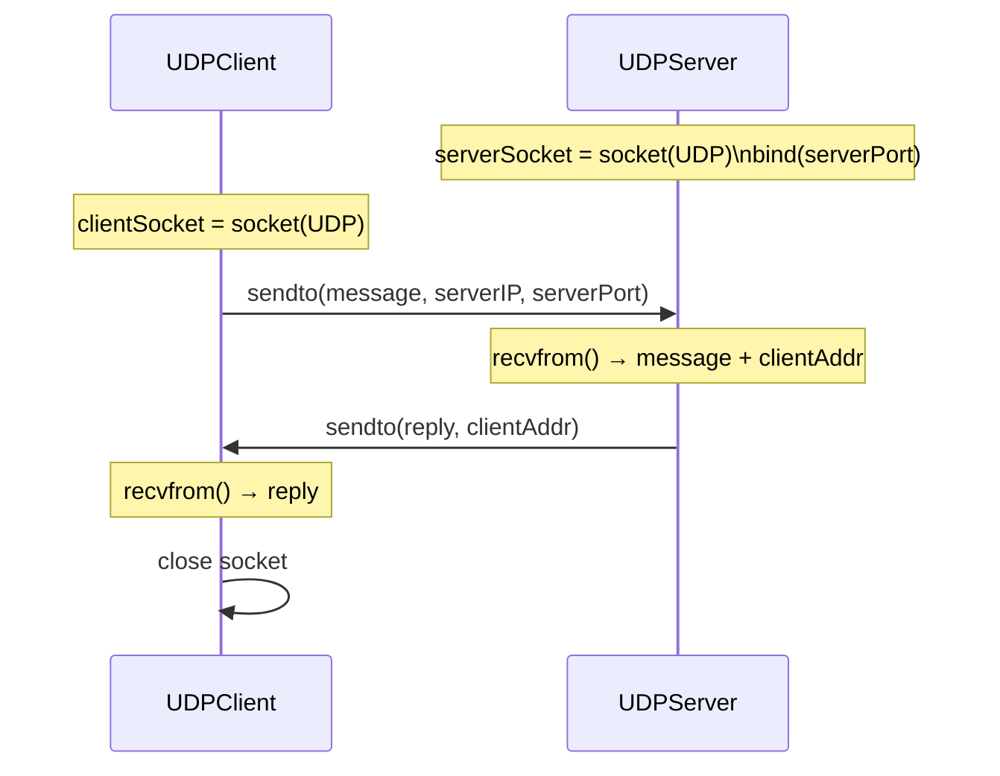
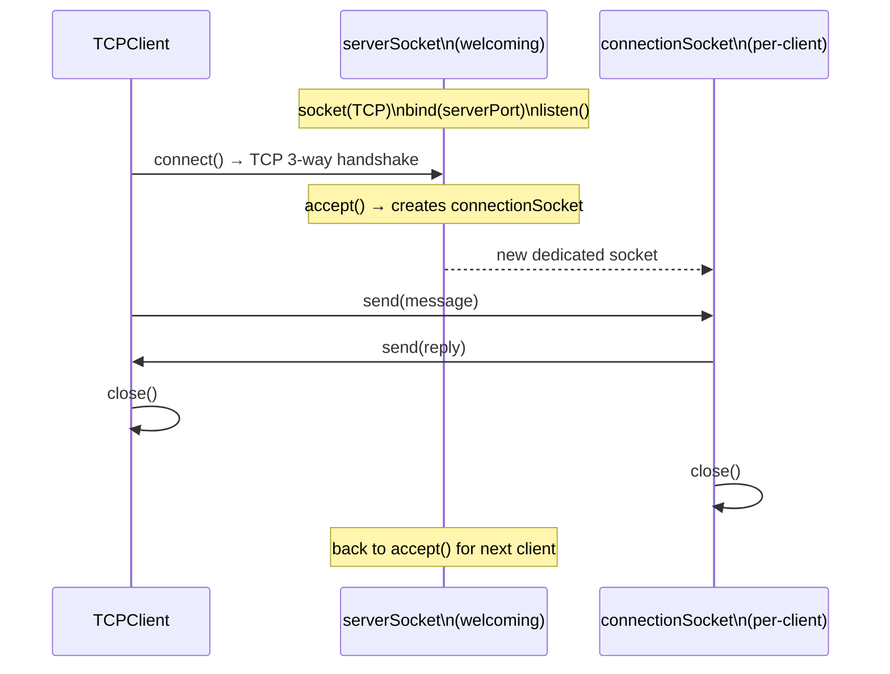

# 2.7 Socket Programming: Creating Network Applications

> Kurose, J. & Ross, K. (2022). *Computer Networking: A Top-Down Approach* (8th ed.), Section 2.7.

---

## Overview

A network application consists of a pair of programs — a client and a server — residing on two different end systems. These processes communicate by reading from and writing to **sockets**. The developer's task is to write code for both sides.

### Two categories of network applications

| Type | Description |
|------|-------------|
| **Open** | Operation specified in an RFC or standards document. Client and server from independent developers can interoperate (e.g., Chrome + Apache). |
| **Proprietary** | Uses an unpublished application-layer protocol. Single developer controls both sides; no external interoperability. |

Open protocol examples: Chrome browser + Apache web server; BitTorrent client + BitTorrent tracker — both sides independently developed but interoperate because both follow the RFC.

### TCP vs. UDP — choosing a transport

- **TCP**: Connection-oriented, reliable byte-stream, ordered delivery, guaranteed arrival.
- **UDP**: Connectionless, independent packets, no delivery guarantees, no ordering.

When implementing an RFC-defined protocol, use the well-known port number associated with it. For proprietary applications, avoid well-known port numbers.

> Examples in this section use **Python 3**. The same concepts apply directly in Java, C, and C++.

---

## 2.7.1 Socket Programming with UDP

### Core concepts

- Before sending, the application **attaches a destination address** (IP + port) to each packet explicitly.
- The source address (sender's IP + port) is attached automatically by the OS, not the application code.
- No connection is established before sending — each packet is routed independently.
- The server receives packets and extracts the source address from each incoming packet to know where to reply.

### Packet flow

```
Client                             Server
------                             ------
create SOCK_DGRAM socket           create SOCK_DGRAM socket
                                   bind to serverPort
read user input
sendto(message, (serverIP, port)) ──────────────────────► recvfrom() → (message, clientAddress)
                                                           process message
recvfrom() ◄─────────────────────────────────────────── sendto(reply, clientAddress)
print result
close socket
```



### UDPClient.py

```python
from socket import *

serverName = 'hostname'   # IP address or hostname; DNS lookup performed if hostname
serverPort = 12000

clientSocket = socket(AF_INET, SOCK_DGRAM)  # AF_INET = IPv4, SOCK_DGRAM = UDP
                                             # OS assigns client port number automatically

message = input('Input lowercase sentence:')

clientSocket.sendto(message.encode(), (serverName, serverPort))
# encode() converts str → bytes
# sendto() attaches destination (serverName, serverPort) and sends packet
# source address is attached automatically by OS

modifiedMessage, serverAddress = clientSocket.recvfrom(2048)
# blocks until packet arrives
# returns (data_bytes, (src_ip, src_port))
# buffer size 2048 bytes

print(modifiedMessage.decode())
clientSocket.close()
```

### UDPServer.py

```python
from socket import *

serverPort = 12000

serverSocket = socket(AF_INET, SOCK_DGRAM)
serverSocket.bind(('', serverPort))
# bind() explicitly assigns port 12000 to this socket
# '' means accept packets on any available interface
# Any packet sent to this host on port 12000 is directed here

print("The server is ready to receive")

while True:
    message, clientAddress = serverSocket.recvfrom(2048)
    # clientAddress contains both the client's IP address and port number
    # acts as a return address, similar to the return address on postal mail
    # server uses this to know where to direct its reply

    modifiedMessage = message.decode().upper()
    # heart of the application: decode bytes to str, capitalize, ready to send back

    serverSocket.sendto(modifiedMessage.encode(), clientAddress)
    # attaches client's address (IP + port) to the capitalized message and sends
    # the server's own address is also attached automatically by the OS, not explicitly by the code
    # after sending, the server stays in the while loop waiting for another UDP packet
    # from any client running on any host
```

### Testing UDP programs

Run `UDPServer.py` on one host and `UDPClient.py` on another host (or the same host with `localhost`). Start the server first so it is listening before the client attempts to send. The server idles until contacted; the client creates a process, the user types a sentence and presses Enter.

### Key differences from TCP (UDP)

- No `connect()` call — destination address is provided per-send via `sendto()`.
- No `accept()` — a single socket handles all clients.
- Destination must be explicitly attached to every outgoing packet.
- `recvfrom()` returns source address; server uses this as the reply address.

---

## 2.7.2 Socket Programming with TCP

### House/door analogy

The textbook uses a **house/door analogy** for process/socket: a process is like a house, and a socket is like a door — the interface through which data enters and exits. In TCP, the server must have a special "door" — the **welcoming socket** — that welcomes initial contact from client processes on arbitrary hosts. The client's initial contact is called **"knocking on the welcoming door."**

When the server "hears" the knock (via `accept()`), it creates a new door — a **connection socket** — dedicated to that particular client. The welcoming socket remains open for future knocks from other clients.

### Core concepts

- TCP is **connection-oriented**: a connection must be established via three-way handshake before any data is sent.
- The server has two types of sockets:
  - **Welcoming socket** (`serverSocket`): listens for initial contact from any client; never exchanges application data directly.
  - **Connection socket** (`connectionSocket`): created per-client after `accept()`; dedicated to that client's session.
- Once connected, data is sent by dropping bytes into the socket — no destination address required per-send.
- TCP guarantees delivery and in-order arrival: all bytes sent from one side are not only guaranteed to arrive at the other side but also guaranteed to arrive in order.
- The three-way handshake takes place within the transport layer and is **completely invisible to the client and server programs**.
- From the application's perspective, `clientSocket` and `connectionSocket` are directly connected by a **pipe**: the client process can send arbitrary bytes into its socket, and TCP guarantees the server process will receive each byte through the connection socket in the order sent. Just as people can go in and out the same door, the client process not only sends bytes into but also receives bytes from its socket (full-duplex).

> **Common confusion**: the welcoming socket (`serverSocket`) is the permanent point of contact for all incoming clients. `accept()` creates a new, separate connection socket (`connectionSocket`) dedicated to that one client. The welcoming socket immediately goes back to waiting.

### Packet flow

```
Client                                     Server
------                                     ------
create SOCK_STREAM socket                  create SOCK_STREAM socket
                                           bind to serverPort
                                           listen(1)      ← welcoming socket ready
connect((serverIP, serverPort)) ──────────────────────► (3-way handshake, invisible to app)
                                           accept() → connectionSocket, addr
                                                      (new socket dedicated to this client)
send(sentence.encode()) ──────────────────────────────► recv(1024)
                                                         process
recv(2048) ◄──────────────────────────────────────────  send(result.encode())
print result                               connectionSocket.close()
clientSocket.close()                       (serverSocket remains open for next client)
```



### TCPClient.py

```python
from socket import *

serverName = 'servername'
serverPort = 12000

clientSocket = socket(AF_INET, SOCK_STREAM)
# AF_INET = IPv4, SOCK_STREAM = TCP (vs. SOCK_DGRAM for UDP)
# OS assigns client port number automatically

clientSocket.connect((serverName, serverPort))
# initiates TCP three-way handshake
# blocks until connection is established
# no port number needed here — OS picks it

sentence = input('Input lowercase sentence:')

clientSocket.send(sentence.encode())
# drops bytes into TCP connection — no destination address needed
# does NOT explicitly create a packet or attach a destination (contrast with UDP sendto)
# TCP handles delivery and ordering

modifiedSentence = clientSocket.recv(2048)
# blocks until bytes arrive from server
# characters accumulate until the line ends with a carriage return character

print('From Server: ', modifiedSentence.decode())
clientSocket.close()
# closes TCP connection; sends TCP FIN to server (see Section 3.5)
```

### TCPServer.py

```python
from socket import *

serverPort = 12000

serverSocket = socket(AF_INET, SOCK_STREAM)
serverSocket.bind(('', serverPort))
serverSocket.listen(1)
# serverSocket is our welcoming socket — the welcoming door
# listen() puts socket into passive mode, waiting for a client to knock on the door
# parameter = maximum number of queued connections (at least 1)

print('The server is ready to receive')

while True:
    connectionSocket, addr = serverSocket.accept()
    # when a client knocks on the welcoming door, accept() is invoked
    # creates a NEW socket (connectionSocket) dedicated to this particular client
    # client and server complete the handshake via this new socket
    # serverSocket continues to listen — other clients can now knock on the door

    sentence = connectionSocket.recv(1024).decode()
    capitalizedSentence = sentence.upper()
    connectionSocket.send(capitalizedSentence.encode())

    connectionSocket.close()
    # closes this client's connection socket
    # serverSocket stays open; another client can now knock on the door
```

---

## UDP vs. TCP Socket API — Side-by-Side

| Aspect | UDP (`SOCK_DGRAM`) | TCP (`SOCK_STREAM`) |
|--------|--------------------|----------------------|
| Socket type constant | `SOCK_DGRAM` | `SOCK_STREAM` |
| Connection setup | None | `connect()` on client, `listen()` + `accept()` on server |
| Sending | `sendto(data, (host, port))` | `send(data)` |
| Receiving | `recvfrom(bufsize)` → `(data, addr)` | `recv(bufsize)` → `data` |
| Destination address | Must be attached per-packet | Implicit — set at connection time |
| Source address extraction | Returned by `recvfrom()` | `accept()` returns `(socket, addr)` |
| Server socket model | One socket handles all clients | Welcoming socket + per-client connection socket |
| Reliability | None | Guaranteed delivery, in-order |
| Explicit `bind()` on server | Required | Required |
| Explicit `bind()` on client | Not required (OS assigns port) | Not required (OS assigns port) |

---

## Socket API Reference (Python `socket` module)

```python
from socket import *

# Create a socket
s = socket(AF_INET, SOCK_DGRAM)   # UDP
s = socket(AF_INET, SOCK_STREAM)  # TCP

# Bind to a port (server-side)
s.bind(('', port))                 # '' = all interfaces

# UDP send/receive
s.sendto(data_bytes, (host, port))
data, addr = s.recvfrom(bufsize)   # addr = (ip, port)

# TCP connect (client)
s.connect((host, port))            # triggers 3-way handshake

# TCP listen + accept (server)
s.listen(backlog)
conn, addr = s.accept()            # returns new socket + client addr

# TCP send/receive
s.send(data_bytes)
data = s.recv(bufsize)

# Close
s.close()
```

### Parameter notes

- `AF_INET` — IPv4 address family. Use `AF_INET6` for IPv6.
- `SOCK_DGRAM` — UDP (datagram socket).
- `SOCK_STREAM` — TCP (stream socket).
- `bufsize` — read buffer size in bytes; 2048 is sufficient for most small messages.
- `listen(backlog)` — `backlog` sets the OS queue depth for pending connections awaiting `accept()`.
- `bind(('', port))` — binding to empty string listens on all network interfaces of the host.
- `encode()` / `decode()` — Python strings must be converted to/from `bytes` before socket I/O.

---

## Two-Socket Model for TCP Servers

A critical distinction from UDP: TCP servers maintain **two distinct socket objects**.

```
                  ┌─────────────────────────────────────┐
Internet ──────►  │  serverSocket  (welcoming / passive) │  listens on well-known port
                  └──────────────────┬──────────────────┘
                                     │ accept() called on new client knock
                                     ▼
                  ┌─────────────────────────────────────┐
                  │  connectionSocket  (per-client)      │  ephemeral port, full duplex
                  └─────────────────────────────────────┘
```

- `serverSocket` never exchanges application data; it only accepts new connections.
- `connectionSocket` is a full-duplex pipe between one client and the server.
- After `connectionSocket.close()`, `serverSocket` remains open for the next client.
- From the application's perspective, `clientSocket` and `connectionSocket` are directly connected by a pipe; bytes written on one end arrive in order at the other.
