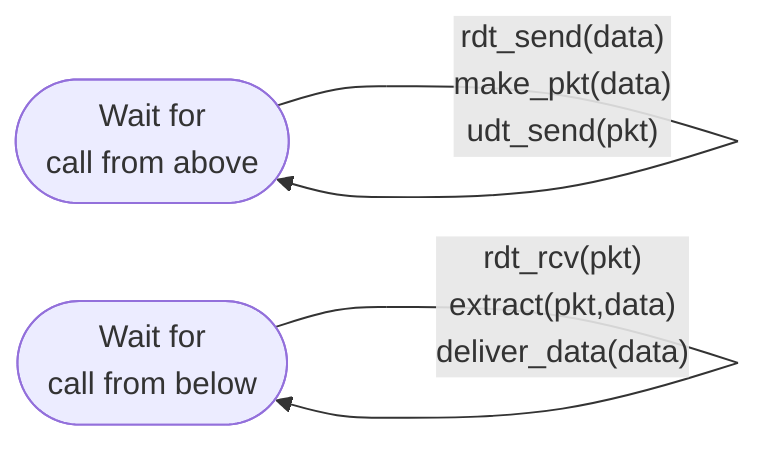
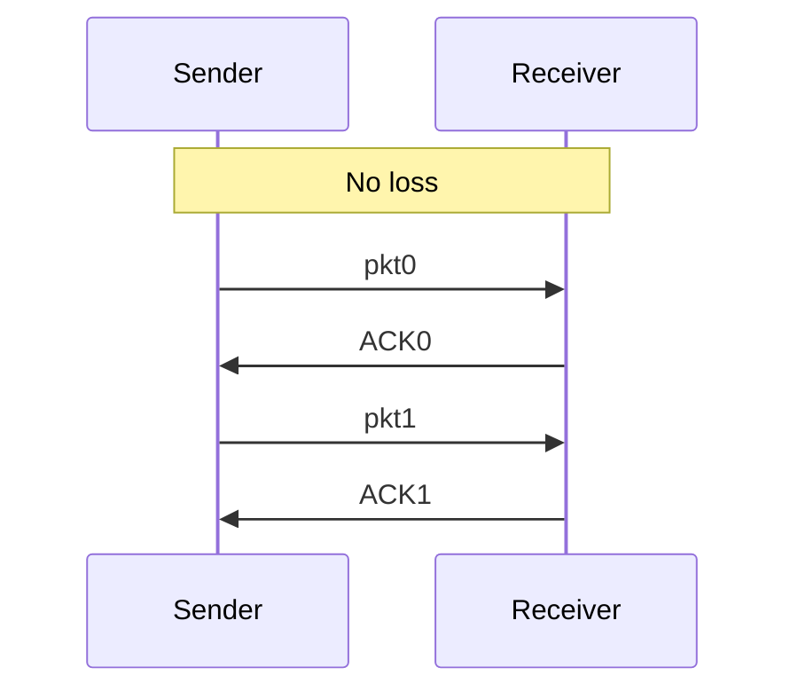

# 3.4 Principles of Reliable Data Transfer

General framework applicable at transport, link, and application layers.

## Interface

```
rdt_send(data)      ← called from upper layer (sender side)
udt_send(packet)    ← sends over unreliable channel
rdt_rcv(packet)     ← called when packet arrives (receiver side)
deliver_data(data)  ← delivers to upper layer (receiver side)
```

Assumption: packets delivered **in order** (no reordering), but may be lost or corrupted.

---

## 3.4.1 Building RDT Protocols

### rdt1.0 — Perfectly Reliable Channel

- No errors, no loss
- Sender: `rdt_send(data)` → `make_pkt(data)` → `udt_send(pkt)`
- Receiver: `rdt_rcv(pkt)` → `extract(pkt, data)` → `deliver_data(data)`
- No feedback needed



---

### rdt2.0 — Channel with Bit Errors (Stop-and-Wait + ARQ)

**ARQ (Automatic Repeat reQuest)** requires:
1. **Error detection**: checksum
2. **Receiver feedback**: ACK (positive) / NAK (negative)
3. **Retransmission**: sender retransmits on NAK

**Fatal flaw**: if ACK/NAK is corrupted, sender doesn't know what happened.

---

### rdt2.1 — Handles Corrupted ACK/NAK

- Adds **sequence numbers** (0 and 1) to packets
- Sender retransmits on corrupted ACK/NAK
- Receiver checks sequence number to detect duplicates
- Sender FSM: 4 states (wait-for-call-0, wait-for-ACK/NAK-0, wait-for-call-1, wait-for-ACK/NAK-1)
- Receiver FSM: 2 states (wait-for-0, wait-for-1)
- On out-of-order packet: receiver sends ACK for already-received packet

---

### rdt2.2 — NAK-free Protocol

- Eliminates NAK: receiver sends **ACK with sequence number** of last correctly received packet
- Duplicate ACK (ACK for wrong seq#) ≡ NAK
- Sender: on duplicate ACK → retransmit

```
make_pkt(ACK, 0, checksum)   // ACK includes sequence number
isACK(rcvpkt, 0)              // sender checks which seq# is ACKed
```

---

### rdt3.0 — Lossy Channel with Bit Errors (Alternating-Bit Protocol)

Adds **timer** to handle lost packets/ACKs:

1. Sender starts timer on packet send
2. On timeout: retransmit (don't know if pkt or ACK was lost — action same either way)
3. Sequence numbers (0/1) handle duplicates from premature timeouts

**Sender actions** (3 events):
- `rdt_send(data)`: packetize, send, start timer
- `timeout`: retransmit, restart timer
- `rdt_rcv(ACK)`: if correct ACK → stop timer, advance state



**4 scenarios**: no loss | lost packet | lost ACK | premature timeout (duplicate detected by seq#)

Also called **alternating-bit protocol** (seq# alternates 0↔1).

**Key mechanisms summary** (Table 3.1):

| Mechanism | Purpose |
|-----------|---------|
| Checksum | Detect bit errors |
| Timer | Detect lost packets/ACKs; trigger retransmit |
| Sequence number | Detect duplicates, identify lost packets |
| ACK | Confirm correct receipt |
| NAK | Signal incorrect receipt (can replace with duplicate ACK) |
| Window/pipelining | Increase utilization |

---

## 3.4.2 Pipelined Reliable Data Transfer

### Stop-and-Wait Performance Problem

Example: US cross-country link, R = 1 Gbps, RTT = 30 ms, L = 8000 bits

```
d_trans = L/R = 8000 / 10^9 = 0.008 ms
U_sender = (L/R) / (RTT + L/R) = 0.008 / 30.008 ≈ 0.00027 = 0.027%
Effective throughput: ~267 kbps on a 1 Gbps link
```

### Solution: Pipelining

- Allow N packets in flight (unacknowledged) simultaneously
- Window of N → utilization ≈ N × stop-and-wait utilization

**Consequences**:
- Larger sequence number space needed
- Sender and/or receiver must buffer multiple packets
- Two main approaches: **Go-Back-N** and **Selective Repeat**

---

## 3.4.3 Go-Back-N (GBN)

### Sender

- Window size **N** (max outstanding unACKed packets)
- Sequence number space: `[0, base-1]` = ACKed; `[base, nextseqnum-1]` = sent, not ACKed; `[nextseqnum, base+N-1]` = sendable; `≥ base+N` = unusable

```
base=1, nextseqnum=1

[Already ACKed | Sent, not ACKed | Usable, not sent | Not usable]
 0            base           nextseqnum        base+N
```

**GBN Sender FSM** (extended):
```
rdt_send(data):
  if nextseqnum < base + N:
    make_pkt, udt_send, start_timer if base==nextseqnum
    nextseqnum++
  else: return data to upper layer (window full)

timeout:
  retransmit ALL outstanding packets (base to nextseqnum-1)
  restart timer

ACK(n) received:
  base = n + 1  (cumulative ACK)
  if base == nextseqnum: stop timer
  else: restart timer
```

**ACKs are cumulative**: ACK(n) = all bytes through n received correctly.

### Receiver (GBN)

- Only delivers **in-order** packets
- Discards out-of-order packets (no buffering)
- Maintains only `expectedseqnum`
- Out-of-order arrival → send ACK for last in-order packet (duplicate ACK)

### Disadvantage

- Single error can cause retransmission of entire window
- High error rate → wastes bandwidth

---

## 3.4.4 Selective Repeat (SR)

### Key Difference from GBN

- Receiver **buffers** out-of-order packets
- Sender retransmits **only** lost/corrupted packets
- Each packet has **individual timer**

### Sender Window

```
[ACKed | Sent, not ACKed | Usable, not sent | Not usable]
        send_base      nextseqnum   send_base+N
```

**SR Sender actions**:
1. `rdt_send(data)`: if in window → send; else buffer or return
2. `timeout(n)`: retransmit packet n only, restart its timer
3. `ACK(n)`: mark n as received; if n == send_base → advance window to next unACKed

### Receiver Window

- Receiver window: `[rcv_base, rcv_base+N-1]`
- Packet in window → selective ACK, buffer if not rcv_base
- If rcv_base received → deliver batch of consecutive buffered packets, advance window
- Packet in `[rcv_base-N, rcv_base-1]` (already ACKed) → send ACK (sender may not have received it)
- Otherwise → ignore

### SR Dilemma: Window Size Constraint

With k-bit sequence numbers (2^k values):
- **GBN**: window size ≤ 2^k − 1
- **SR**: window size ≤ 2^k / 2 = 2^(k-1)

**Why**: With SR and window size = 2^(k-1) + 1, receiver cannot distinguish between new packet and retransmission when all ACKs are lost (Figure 3.27 scenario).

### Comparison

| Feature | GBN | SR |
|---------|-----|----|
| Receiver buffering | None | Yes (out-of-order) |
| Retransmit on error | All in window | Only lost packet |
| ACK type | Cumulative | Selective (individual) |
| Receiver state | expectedseqnum only | Window of rcv_base+N |
| Max window (k-bit seq#) | 2^k − 1 | 2^(k-1) |
| Complexity | Simpler receiver | Simpler sender retransmit |
