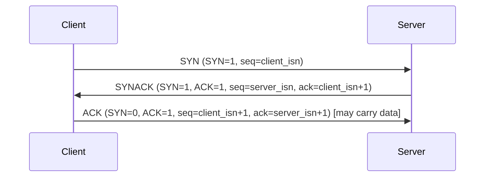
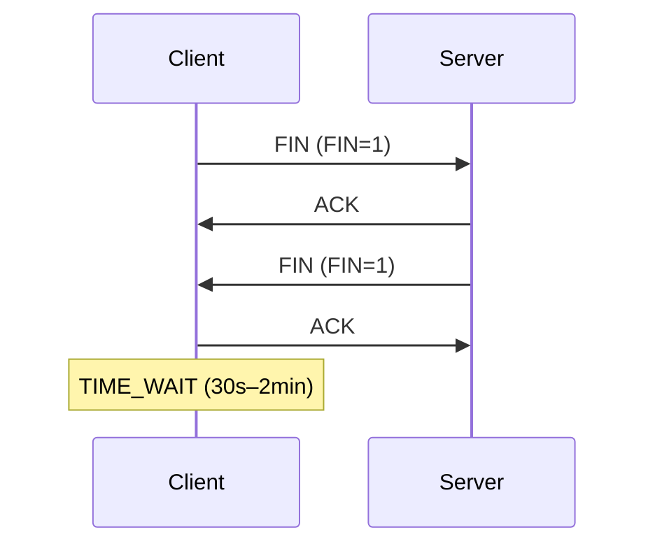
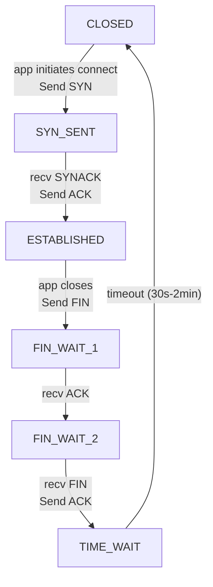
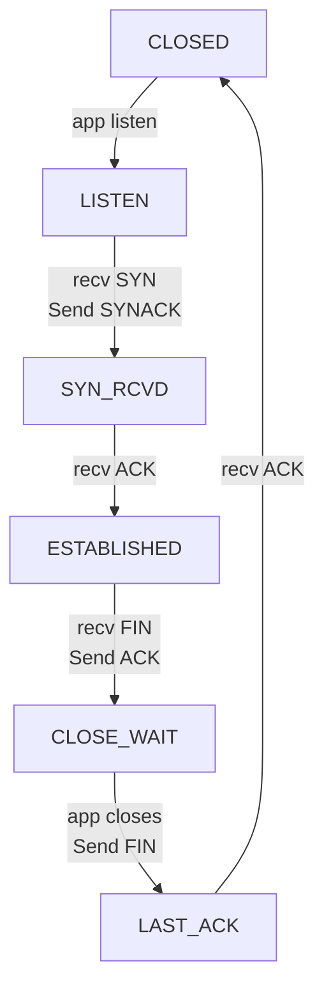

# 3.5 Connection-Oriented Transport: TCP

**RFC 793, 1122, 2018, 5681, 7323**

## 3.5.1 The TCP Connection

- **Connection-oriented**: both sides must handshake before data transfer
- Connection state exists **only in end systems** — routers are oblivious, see datagrams only
- **Full-duplex**: simultaneous bidirectional data flow on same connection
- **Point-to-point**: one sender, one receiver (no multicasting)
- **Three-way handshake** to establish; both sides initialize buffers and state variables

**Logical connection**: not a circuit; common state only in two endpoint TCPs.

---

## 3.5.2 TCP Segment Structure

```
 0                   1                   2                   3
 0 1 2 3 4 5 6 7 8 9 0 1 2 3 4 5 6 7 8 9 0 1 2 3 4 5 6 7 8 9 0 1
+-+-+-+-+-+-+-+-+-+-+-+-+-+-+-+-+-+-+-+-+-+-+-+-+-+-+-+-+-+-+-+-+
|          Source Port          |       Destination Port        |
+-+-+-+-+-+-+-+-+-+-+-+-+-+-+-+-+-+-+-+-+-+-+-+-+-+-+-+-+-+-+-+-+
|                        Sequence Number                        |
+-+-+-+-+-+-+-+-+-+-+-+-+-+-+-+-+-+-+-+-+-+-+-+-+-+-+-+-+-+-+-+-+
|                    Acknowledgment Number                      |
+-+-+-+-+-+-+-+-+-+-+-+-+-+-+-+-+-+-+-+-+-+-+-+-+-+-+-+-+-+-+-+-+
| Data  |           |U|A|P|R|S|F|                               |
| Offset| Reserved  |R|C|S|S|Y|I|            Window             |
|       |           |G|K|H|T|N|N|                               |
+-+-+-+-+-+-+-+-+-+-+-+-+-+-+-+-+-+-+-+-+-+-+-+-+-+-+-+-+-+-+-+-+
|           Checksum            |         Urgent Pointer        |
+-+-+-+-+-+-+-+-+-+-+-+-+-+-+-+-+-+-+-+-+-+-+-+-+-+-+-+-+-+-+-+-+
|                    Options (variable)                         |
+-+-+-+-+-+-+-+-+-+-+-+-+-+-+-+-+-+-+-+-+-+-+-+-+-+-+-+-+-+-+-+-+
|                             Data                              |
+-+-+-+-+-+-+-+-+-+-+-+-+-+-+-+-+-+-+-+-+-+-+-+-+-+-+-+-+-+-+-+-+
```

Also includes CWR and ECE bits (Figure 3.29 shows: URG, ACK, PSH, RST, SYN, FIN, CWR, ECE).

### Header Fields

| Field | Size | Description |
|-------|------|-------------|
| Source Port | 16 bits | Multiplexing |
| Destination Port | 16 bits | Demultiplexing |
| Sequence Number | 32 bits | Byte-stream position of first data byte in segment |
| Acknowledgment Number | 32 bits | Next byte expected from other side (cumulative) |
| Header Length | 4 bits | Header length in 32-bit words (typically 5 = 20 bytes) |
| URG | 1 bit | Urgent data present (rarely used in practice) |
| ACK | 1 bit | ACK field valid |
| PSH | 1 bit | Push data to upper layer immediately (rarely used) |
| RST | 1 bit | Reset connection |
| SYN | 1 bit | Connection establishment |
| FIN | 1 bit | Connection teardown |
| CWR | 1 bit | Congestion Window Reduced (ECN) |
| ECE | 1 bit | ECN-Echo (ECN) |
| Window | 16 bits | Receive window size (flow control) |
| Checksum | 16 bits | Error detection |
| Urgent Pointer | 16 bits | Points to end of urgent data (if URG set) |
| Options | variable | MSS negotiation, timestamps, SACK, window scaling, etc. |

**MSS (Maximum Segment Size)**: typically 1460 bytes  
= MTU (1500 bytes for Ethernet/PPP) − 40 bytes (TCP/IP headers)

### Sequence Numbers

- Numbered over **byte stream**, not over segments
- Sequence number of segment = byte-stream number of **first byte** in that segment
- Example: 500,000-byte file, MSS=1000 bytes → 500 segments; seq#s: 0, 1000, 2000, ...
- **Initial sequence number (ISN)**: randomly chosen to reduce collision with old connections

### Acknowledgment Numbers

- ACK = sequence number of **next byte expected** (not last received)
- TCP uses **cumulative acknowledgments**
- Out-of-order segments: TCP RFCs leave handling to implementation (practice: buffer them)
- **Piggybacking**: ACKs often carried in data segments going in reverse direction

#### Telnet Example (Figure 3.31)
- Client ISN=42, Server ISN=79
- Client sends 'C' (1 byte): seq=42, ACK=79
- Server echoes 'C': seq=79, ACK=43 (piggybacked ACK)
- Client ACKs: seq=43, ACK=80

---

## 3.5.3 Round-Trip Time Estimation and Timeout

### SampleRTT

- Measured for one outstanding segment at a time (not retransmitted segments — Karn's algorithm)
- Varies due to congestion and route changes

### EstimatedRTT (EWMA)

```
EstimatedRTT = (1 − α) × EstimatedRTT + α × SampleRTT
```

- Recommended: **α = 0.125** (1/8) [RFC 6298]
- Gives more weight to recent samples (exponential decay of old samples)

### DevRTT (RTT Variability)

```
DevRTT = (1 − β) × DevRTT + β × |SampleRTT − EstimatedRTT|
```

- Recommended: **β = 0.25**
- EWMA of deviation between sample and estimate

### TimeoutInterval

```
TimeoutInterval = EstimatedRTT + 4 × DevRTT
```

- Initial value: **1 second** [RFC 6298]
- On timeout: **double** TimeoutInterval (exponential backoff)
- On ACK received: recompute from EstimatedRTT + 4×DevRTT

---

## 3.5.4 Reliable Data Transfer

TCP builds reliability on top of IP's unreliable best-effort service.

### Simplified TCP Sender Logic

```c
// Events:
// 1. Data from app
// 2. Timer timeout
// 3. ACK received

NextSeqNum = InitialSeqNumber
SendBase   = InitialSeqNumber

loop forever:
  switch(event):
    case data_from_app:
      create segment(NextSeqNum, data)
      if timer not running: start timer
      pass to IP
      NextSeqNum += len(data)

    case timeout:
      retransmit segment with smallest unACKed seq#
      start timer

    case ACK(y):
      if y > SendBase:
        SendBase = y
        if outstanding segments exist: start timer
      else:
        // duplicate ACK — increment duplicate count
        if dupACKcount == 3: fast retransmit(y)
```

- `SendBase` = seq# of oldest unACKed byte
- Single timer for oldest unACKed segment

### Timeout Doubling

- On each timeout: `TimeoutInterval = 2 × TimeoutInterval`
- Resets when ACK or new data arrives and interval is recomputed normally
- Provides limited congestion control (backs off under congestion)

### Fast Retransmit

- **3 duplicate ACKs** (= 4 ACKs for same seq#) → retransmit before timeout
- Implicit NAK: receiver sends duplicate ACK when gap detected

### TCP ACK Generation Policy (Table 3.2 — RFC 5681)

| Event | Receiver Action |
|-------|----------------|
| In-order segment, all prior ACKed | Delayed ACK: wait up to 500 ms for next segment |
| In-order segment, one pending ACK | Immediately send cumulative ACK for both |
| Out-of-order segment (gap detected) | Immediately send duplicate ACK (expected seq#) |
| Segment fills gap | Immediately send ACK (if at lower end of gap) |

### GBN vs. SR — Where Does TCP Fit?

- TCP looks like **GBN**: cumulative ACKs, single timer, sender tracks SendBase and NextSeqNum
- BUT TCP buffers out-of-order segments (like SR)
- TCP won't retransmit segment n if ACK for n+1 arrives before timeout for n
- **SACK** (RFC 2018): selective acknowledgment option allows SR-like behavior

---

## 3.5.5 Flow Control

**Goal**: prevent sender from overflowing receiver's buffer.

### Variables (Receiver Side)

- `RcvBuffer`: total receive buffer size
- `LastByteRead`: last byte read by app process from buffer
- `LastByteRcvd`: last byte received from network into buffer

**Constraint**: `LastByteRcvd − LastByteRead ≤ RcvBuffer`

### Receive Window

```
rwnd = RcvBuffer − (LastByteRcvd − LastByteRead)
```

- Receiver advertises `rwnd` in every segment sent to sender
- Sender ensures: `LastByteSent − LastByteAcked ≤ rwnd`

### Zero-Window Problem

- If receiver advertises `rwnd = 0`, sender blocks
- TCP spec: sender continues to send **1-byte segments** when `rwnd = 0`
- These probe segments trigger receiver ACKs that eventually advertise non-zero rwnd

---

## 3.5.6 TCP Connection Management

### Three-Way Handshake (Setup)



- **Step 1**: Client sends **SYN segment**: SYN=1, seq=client_isn (randomly chosen)
- **Step 2**: Server allocates buffers, sends **SYNACK**: SYN=1, ACK=1, seq=server_isn, ack=client_isn+1
- **Step 3**: Client allocates buffers, sends **ACK**: SYN=0, ACK=1; may carry payload

ISN randomized to minimize risk of collision with segments from old connections.

### Connection Teardown (4-Way)



- Either side can initiate close
- **TIME_WAIT**: allows resending final ACK if lost; duration: 30s–2min (implementation-dependent)
- After TIME_WAIT: connection closed, resources (including ports) released

### Client TCP State Machine



### Server TCP State Machine



### No Matching Socket

- TCP segment arrives for port with no matching socket → host sends **RST** segment (RST=1)
- UDP packet arrives for unmatched port → host sends **ICMP** datagram

### SYN Flood Attack

- Attacker sends large number of SYN segments, never completes handshake
- Server allocates resources for each half-open connection → exhaustion
- Defense: **SYN cookies** — server encodes state in ISN, verifies on ACK without storing state

### nmap Port Scanning

- Send SYN to target port → 3 outcomes:
  1. **SYNACK** received → port open, app running
  2. **RST** received → port closed, but host reachable (no firewall blocking)
  3. **No response** → firewall blocking (SYN never reached host)
