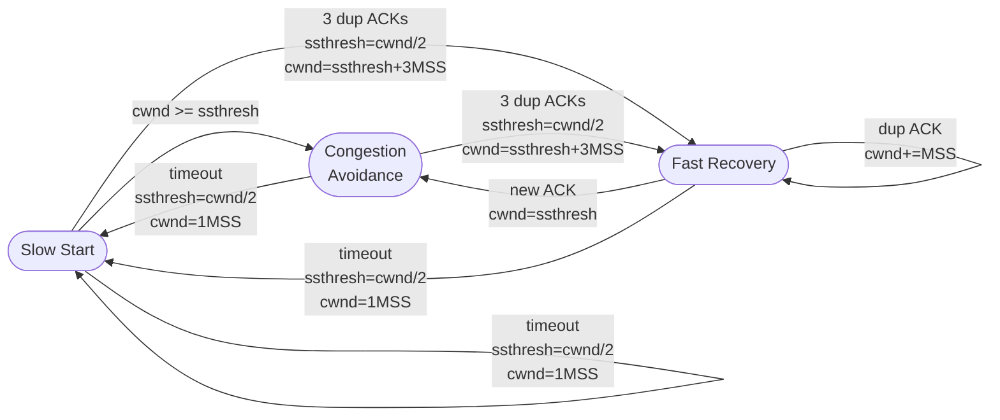
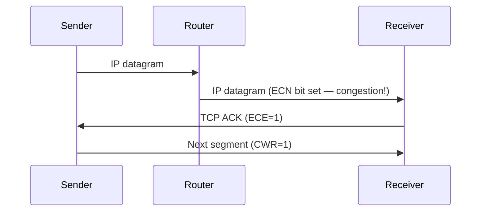

# 3.7 TCP Congestion Control

## Overview

- "Classic TCP" = RFC 2581 / RFC 5681: end-to-end congestion control, no network assistance
- Sender-side variable: **congestion window (cwnd)**
- Effective send constraint: `LastByteSent − LastByteAcked ≤ min(cwnd, rwnd)`
- Approximate send rate: `cwnd / RTT` bytes/sec
- TCP is **self-clocking**: ACKs trigger cwnd increases

**Loss events** (signals of congestion):
- Timeout → severe congestion
- 3 duplicate ACKs → milder congestion (some packets still getting through)

**Guiding principles**:
- Lost segment → decrease send rate
- ACKed segment → increase send rate (network not congested)
- Bandwidth probing: increase until loss, then back off

---

## 3.7.1 Classic TCP Congestion Control

### Algorithm: Three Components

1. **Slow Start** — exponential increase from scratch
2. **Congestion Avoidance** — linear (additive) increase near threshold
3. **Fast Recovery** — optional but recommended (RFC 5681)

### State Variable: ssthresh (Slow Start Threshold)

- Initial: typically 64 KB
- Set to `cwnd/2` whenever loss is detected

---

### Slow Start

- Initial cwnd = **1 MSS** [RFC 3390]
- Initial rate ≈ MSS/RTT (e.g., 500 bytes / 200 ms = 20 kbps)
- **Doubles cwnd every RTT**: each ACK → cwnd += 1 MSS → net effect: cwnd × 2 per RTT
- Exponential growth

**Exit conditions**:
| Event | Action |
|-------|--------|
| Timeout (loss) | ssthresh = cwnd/2; cwnd = 1 MSS; restart slow start |
| cwnd reaches ssthresh | Enter congestion avoidance |
| 3 duplicate ACKs | ssthresh = cwnd/2; cwnd = ssthresh+3MSS; enter fast recovery |

---

### Congestion Avoidance

- After cwnd ≥ ssthresh
- **Linear increase**: each ACK → cwnd += MSS × (MSS/cwnd) → net effect: cwnd += 1 MSS per RTT
- Probes cautiously for additional bandwidth

**Exit conditions**:
| Event | Action |
|-------|--------|
| Timeout | ssthresh = cwnd/2; cwnd = 1 MSS; enter slow start |
| 3 duplicate ACKs | ssthresh = cwnd/2; cwnd = ssthresh+3MSS; enter fast recovery |

---

### Fast Recovery

- Entered after 3 duplicate ACKs
- `cwnd = ssthresh + 3 × MSS` (3 MSS bonus for the 3 dup ACKs received = 3 packets left network)
- Each additional duplicate ACK: `cwnd += 1 MSS`
- When ACK for missing segment arrives: `cwnd = ssthresh`; enter congestion avoidance

**Exit condition**:
| Event | Action |
|-------|--------|
| New ACK | cwnd = ssthresh; enter congestion avoidance |
| Timeout | ssthresh = cwnd/2; cwnd = 1 MSS; enter slow start |

**Fast Recovery is recommended but not required.** TCP Tahoe never had it; TCP Reno added it.

---

### Full FSM (Figure 3.51)



---

### TCP Tahoe vs TCP Reno

| Event | TCP Tahoe | TCP Reno |
|-------|-----------|----------|
| Timeout | cwnd=1, slow start | cwnd=1, slow start |
| 3 dup ACKs | cwnd=1, slow start | cwnd=ssthresh+3MSS, fast recovery |

In Figure 3.52: at 3 dup ACKs after round 8 (cwnd=12 MSS, ssthresh=6 MSS):
- **Reno**: cwnd = 9 MSS, linear growth
- **Tahoe**: cwnd = 1 MSS, exponential growth until ssthresh, then linear

---

### AIMD — Additive Increase, Multiplicative Decrease

Ignoring slow start (after initial phase), TCP Reno is:
- **Additive increase**: +1 MSS per RTT (linear)
- **Multiplicative decrease**: ÷2 on triple dup ACK

Produces characteristic **sawtooth** cwnd pattern.

```
cwnd
W  |      /\      /\      /\
   |     /  \    /  \    /  \
W/2|    /    \  /    \  /    \
   |   /      \/      \/      \
   +-------------------------------- time
```

**Average throughput of TCP Reno** (long-lived connection):
```
average throughput = (0.75 × W) / RTT
```
where W = cwnd at loss event.

**Macroscopic model** (Mathis 1997):
```
average throughput ≈ (1.22 × MSS) / (RTT × √L)
```
where L = loss event probability.

---

### TCP CUBIC (RFC 8312)

**Motivation**: TCP Reno's linear increase is too conservative after loss on high-BDP links.

**Key idea**: After loss, quickly ramp up close to pre-loss rate (Wmax), then slow down near Wmax.

**Algorithm** (congestion avoidance only; slow start and fast recovery same as Reno):
- `Wmax` = cwnd when loss last occurred
- `K` = future time when cwnd would reach Wmax again (tunable parameters)
- `cwnd(t) = C(t − K)³ + Wmax` (cubic function of time since last loss)
- Far from K: large increases (fast ramp-up)
- Near K: small increases (cautious probing)
- Beyond K (if congestion threshold moved): rapid increase again

**Deployment**: Default in Linux kernel; ~50% of top 5000 web servers (as of ~2014, up from near-0 in 2000).

---

## 3.7.2 Network-Assisted Explicit Congestion Notification and Delay-Based Control

### Explicit Congestion Notification (ECN — RFC 3168)

- 2 bits in **IP header** Type of Service field (4 possible values)
- Router experiencing congestion → sets ECN congestion bit in IP datagram
- Destination receives marked datagram → sets **ECE (ECN-Echo)** bit in TCP ACK back to sender
- Sender: on ECE → reduce cwnd (as if 3 dup ACKs)
- Sender sets **CWR (Congestion Window Reduced)** bit to acknowledge receipt



- DCQCN (Data Center Quantized Congestion Notification) also uses ECN for data centers
- Growing deployment: increasing ECN capability in popular servers and routers

### Delay-Based Congestion Control

**TCP Vegas** (Brakmo 1995):
- Measure RTT for all ACKed packets
- `RTTmin` = minimum measured RTT (uncongested path baseline)
- Uncongested throughput = `cwnd / RTTmin`
- If actual throughput ≈ cwnd/RTTmin → not congested, increase cwnd
- If actual throughput << cwnd/RTTmin → congested (queuing delay building), decrease cwnd
- Proactive: detects congestion **before** packet loss

**Philosophy**: "Keep the pipe just full, but no fuller" (Kleinrock 2018)

**BBR (Bottleneck Bandwidth and Round-trip time)** [Cardwell 2017]:
- Builds on Vegas ideas
- Also competes fairly with non-BBR senders
- Google deployed BBR on B4 (internal backbone) in 2016, replacing CUBIC
- Also deployed on Google/YouTube web servers
- Other delay-based: TIMELY (data centers), Compound TCP (CTCP), FAST

---

## 3.7.3 Fairness

### Definition

K TCP connections sharing a bottleneck link with rate R → fair if each gets ~R/K.

### TCP Reno Fairness (Two Connections)

```
Connection 2 throughput
R |        /
  |   ___/___
  |  /Equal /
  | / share/
  |/______/
  +-------------- Connection 1 throughput
                  R
```

- AIMD drives connections toward equal-bandwidth share line
- Converges: connections alternate between increasing together (+45°) and halving on loss

### Concerns

**Fairness with different RTTs**:
- Smaller RTT → opens cwnd faster → gets more bandwidth
- Connections with smaller RTTs get disproportionately more throughput

**Fairness with UDP**:
- UDP apps (multimedia) don't throttle — no congestion control
- UDP can crowd out TCP connections
- Various proposals exist to address this [Floyd 1999, 2000; RFC 4340]

**Parallel TCP connections**:
- A single app using N parallel TCP connections gets N× more bandwidth than single-connection apps
- Web browsers use multiple parallel connections by design
- 9 existing connections + 1 new app with 11 parallel TCP = new app gets >R/2

---

## 3.8 Evolution: QUIC

### Problem with TCP for Modern Apps

- TCP + TLS requires 2 separate handshakes: TCP (1 RTT) + TLS (1-2 RTT)
- Head-of-line blocking: one stream blocked by loss on another in same connection
- Ossification: middleboxes inspect TCP headers → hard to deploy TCP modifications

### QUIC (Quick UDP Internet Connections) [IETF QUIC 2020]

- Implemented at **application layer** over UDP
- Used in **HTTP/3**

```
HTTP/3 stack:          vs.    HTTP/1.1 stack:
+------------+                +------------+
|    HTTP    |                |    HTTP    |
+------------+                +------------+
|    QUIC    |                |    TLS     |
| (enc+RDT+CC)|               +------------+
+------------+                |    TCP     |
|    UDP     |                +------------+
+------------+                |    IP      |
|    IP      |                +------------+
+------------+
```

**Key QUIC features**:

| Feature | Details |
|---------|---------|
| Connection establishment | 0-RTT or 1-RTT (combines transport+crypto handshake) |
| Security | Encryption integrated (not separate TLS layer) |
| Streams | Multiple independent streams per connection; loss in one stream doesn't block others |
| Reliable transfer | Per-stream; based on TCP NewReno (RFC 6582) |
| Congestion control | Based on TCP NewReno |
| Connection ID | Connection identified by connection ID, not (IP, port) — survives address changes |

**HTTP/3 stream model**: each object in a web page = separate QUIC stream; loss affects only that stream.

**Stream Control Transmission Protocol (SCTP)** [RFC 4960]: earlier protocol that pioneered multi-stream concept over single connection (used in telecom signaling).

**TCP Splitting** (cloud optimization):
- Client → nearby front-end server (short RTT, small slow-start impact)
- Front-end → data center via persistent TCP with large cwnd
- Response time ≈ `4 × RTT_FE + RTT_BE + processing` vs. `4 × RTT_end-to-end`
