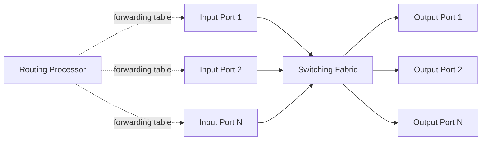
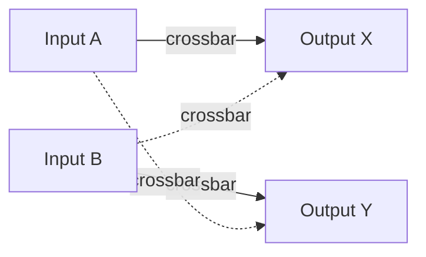

# 4.2 What's Inside a Router

## Router Architecture



### Four Components

| Component | Function | Implementation |
|---|---|---|
| **Input ports** | Physical/link termination + lookup (forwarding table) | Hardware |
| **Switching fabric** | Transfers packet from input to output port | Hardware |
| **Output ports** | Stores packets, transmits on outgoing link | Hardware |
| **Routing processor** | Runs routing protocols, maintains forwarding table; in SDN: communicates with remote controller | Software |

**Key constraint**: 100 Gbps link, 64-byte datagram → input port has **5.12 ns** to process each datagram. Must use hardware.

Forwarding table is **shadow-copied** from routing processor to each line card over a PCI bus — avoids per-packet centralized lookup bottleneck.

## 4.2.1 Input Port Processing and Destination-Based Forwarding

- **Lookup**: match destination IP address against forwarding table → find output port
- **Brute force impossible**: 32-bit addresses → 4 billion entries
- Solution: **prefix matching** — store prefixes, not full addresses

### Longest Prefix Match (LPM)
When a destination address matches multiple entries, use the **longest** (most specific) matching prefix.

Example forwarding table (binary notation):
```
Prefix                   → Interface
11001000 00010111 00010  → 0    (21-bit prefix)
11001000 00010111 00011000 → 1  (24-bit prefix)
11001000 00010111 00011  → 2    (21-bit prefix)
otherwise                → 3
```

For address `11001000 00010111 00011000 10101010`:
- Matches prefix for interface 1 (24 bits) AND interface 2 (21 bits)
- LPM → **interface 1** (longer match wins)

**Hardware implementation**: TCAM (Ternary Content Addressable Memories) — present 32-bit address, get result in ~constant time. Cisco Catalyst 6500/7600 supports >1M TCAM entries.

**Also at input port**: version/checksum/TTL check, counter updates, link/physical layer processing.

**Match-plus-action abstraction**: lookup (match) + forward to switching fabric (action). Generalizes to firewalls (drop on match), NAT (rewrite port on match), etc.

## 4.2.2 Switching

Three approaches:

### Switching via Memory
- Earliest routers; CPU controls switching
- Packet: input port → interrupt CPU → CPU reads packet → looks up table → copies to output port buffer
- **Throughput limit**: memory bandwidth B → max forwarding rate = B/2 (one read + one write per packet)
- Cannot forward two packets simultaneously (shared system bus)
- Modern variant: processing on line cards (not CPU), shared-memory multiprocessor style
- Example: Cisco Catalyst 8500

### Switching via Bus
- Input port prepends internal label (target output port) → puts packet on shared bus → all outputs receive, only matching one keeps it
- **Limit**: one packet at a time on bus → bus speed = max switching speed
- Sufficient for small/enterprise networks
- Example: Cisco 6500 — 32 Gbps backplane bus

### Switching via Interconnection Network (Crossbar)
- 2N buses connecting N inputs to N outputs
- Crosspoints can be opened/closed independently by switch fabric controller
- **Non-blocking**: packet to output port X is not blocked unless another packet is currently going to X
- Supports **parallel forwarding** of multiple packets simultaneously (different input→output pairs)
- Example: Cisco 12000 uses crossbar; Cisco CRS uses 3-stage non-blocking crossbar
- Can scale by running multiple fabrics in parallel; input splits packet into K chunks ("sprays") across K fabrics



## 4.2.3 Output Port Processing

- Stores packets from switching fabric in output port memory
- **Selects** packet for transmission (scheduling discipline)
- Performs link-layer and physical-layer transmission functions

## 4.2.4 Where Does Queuing Occur?

### Input Queuing

Occurs when switching fabric is slower than input line speed.

**Head-of-Line (HOL) Blocking**: packet at head of input queue blocks packets behind it, even if those behind-packets' output ports are free.

- Karol 1987: HOL blocking limits throughput to **58%** of capacity under FCFS scheduling with crossbar
- Condition: switch fabric rate Rswitch < N × Rline (N = number of ports)

### Output Queuing

Occurs even when Rswitch = N × Rline:
- All N input ports send to same output port → N packets arrive in 1 packet transmission time
- Output port can only transmit 1 packet per unit time → queue grows

**Packet drop policies when buffer full**:
- **Drop-tail**: drop arriving packet
- **Remove already-queued packets**: make room for new arrivals
- **AQM (Active Queue Management)**: proactively drop/mark before buffer full
  - **RED** (Random Early Detection): widely studied and implemented
  - **PIE** (Proportional Integral controller Enhanced): RFC 8033
  - **CoDel**: Nichols 2012
  - ECN (Explicit Congestion Notification) bits can be set instead of dropping

### Buffer Sizing

- **Old rule of thumb** (RFC 3439): B = RTT × C
  - Example: 10 Gbps link, RTT=250ms → B = 2.5 Gbits
- **Modern formula** (many flows): B = RTT × C / √N
  - N = number of independent TCP flows
  - In core networks, N is large → much less buffering needed

**Bufferbloat**: persistent full buffers cause large, consistent queueing delay even when no congestion.
- Example: home router with 25-packet burst → ACK clocking fills queue continuously → queue stays full, delay constant
- DOCSIS 3.1 added AQM (RFC 8033, RFC 8034) to combat bufferbloat

## 4.2.5 Packet Scheduling

### FIFO (First-In-First-Out) / FCFS
- Serve packets in arrival order
- Simplest; single queue
- Drop-tail or AQM on overflow

### Priority Queuing
- Classify packets into priority classes (e.g., by port number, src/dst address)
- Always serve highest-priority non-empty queue
- Within a class: FIFO
- **Non-preemptive**: transmission in progress is not interrupted by higher-priority arrival
- Risk: low-priority traffic starves if high-priority queue always non-empty

### Round Robin (RR)
- Classify packets into classes
- Serve classes in rotation (class 1, class 2, ..., class 1, ...)
- **Work-conserving**: if scheduled class is empty, immediately skip to next non-empty class

### Weighted Fair Queuing (WFQ)
- Generalization of round robin
- Each class i assigned weight w_i
- During any interval with class i packets queued, class i gets fraction of bandwidth:
  ```
  w_i / (Σ w_j)   [sum over all classes with queued packets]
  ```
- Guaranteed minimum throughput for class i with link rate R:
  ```
  R × w_i / (Σ w_j)
  ```
- Also work-conserving
- When all w_i equal → same as round robin

**Use case**: net neutrality debate — WFQ/priority mechanisms can give different service levels to different traffic classes; ISPs could potentially use these to favor paid traffic (paid prioritization), block competing services, or throttle content.

### Net Neutrality (US Context)
FCC 2015 "bright line" rules (later rolled back in 2017):
- No Blocking: cannot block lawful content/apps/services
- No Throttling: cannot impair lawful traffic based on content/service
- No Paid Prioritization: cannot give priority in exchange for payment
