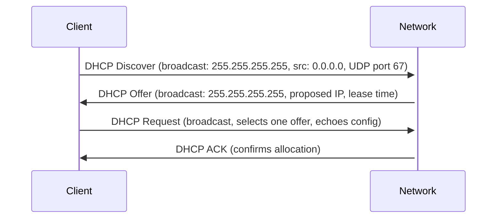
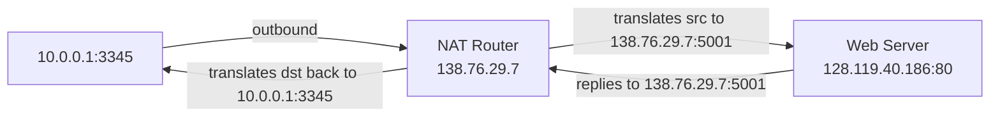
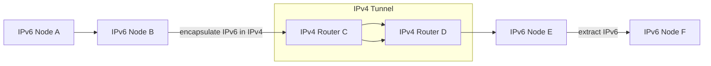

# 4.3 The Internet Protocol (IP): IPv4, Addressing, IPv6, and More

## 4.3.1 IPv4 Datagram Format

```
 0                   1                   2                   3
 0 1 2 3 4 5 6 7 8 9 0 1 2 3 4 5 6 7 8 9 0 1 2 3 4 5 6 7 8 9 0 1
+-+-+-+-+-+-+-+-+-+-+-+-+-+-+-+-+-+-+-+-+-+-+-+-+-+-+-+-+-+-+-+-+
|Version|  IHL  |Type of Service|          Total Length         |
+-+-+-+-+-+-+-+-+-+-+-+-+-+-+-+-+-+-+-+-+-+-+-+-+-+-+-+-+-+-+-+-+
|         Identification        |Flags|      Fragment Offset    |
+-+-+-+-+-+-+-+-+-+-+-+-+-+-+-+-+-+-+-+-+-+-+-+-+-+-+-+-+-+-+-+-+
|  Time to Live |    Protocol   |         Header Checksum       |
+-+-+-+-+-+-+-+-+-+-+-+-+-+-+-+-+-+-+-+-+-+-+-+-+-+-+-+-+-+-+-+-+
|                       Source Address                          |
+-+-+-+-+-+-+-+-+-+-+-+-+-+-+-+-+-+-+-+-+-+-+-+-+-+-+-+-+-+-+-+-+
|                    Destination Address                        |
+-+-+-+-+-+-+-+-+-+-+-+-+-+-+-+-+-+-+-+-+-+-+-+-+-+-+-+-+-+-+-+-+
|                    Options                    |    Padding    |
+-+-+-+-+-+-+-+-+-+-+-+-+-+-+-+-+-+-+-+-+-+-+-+-+-+-+-+-+-+-+-+-+
|                             Data                              |
+-+-+-+-+-+-+-+-+-+-+-+-+-+-+-+-+-+-+-+-+-+-+-+-+-+-+-+-+-+-+-+-+
```

### Field Reference

| Field | Size | Description |
|---|---|---|
| Version | 4 bits | IP version (4 = IPv4) |
| IHL (Header Length) | 4 bits | Header length in 32-bit words; needed because options make header variable-length |
| Type of Service (TOS) | 8 bits | Distinguish datagram types (real-time vs. non-real-time); 2 bits used for ECN |
| Total Length | 16 bits | Header + data in bytes; max 65,535 bytes; typical max 1,500 bytes (Ethernet MTU) |
| Identification | 16 bits | Used for fragmentation reassembly |
| Flags | 3 bits | Fragmentation control |
| Fragment Offset | 13 bits | Position of fragment in original datagram |
| TTL | 8 bits | Decremented by 1 at each router; datagram dropped when TTL = 0 (prevents routing loops) |
| Protocol | 8 bits | Upper-layer protocol: 6=TCP, 17=UDP (analogous to port number but at network layer) |
| Header Checksum | 16 bits | 1s complement sum of header 2-byte words; recomputed at every router (TTL changes) |
| Source IP | 32 bits | Sender's IP address |
| Destination IP | 32 bits | Receiver's IP address |
| Options | variable | Rarely used; complicates processing; not present in IPv6 |
| Data | variable | Transport-layer segment (TCP/UDP) or ICMP message |

**Typical IPv4 header**: 20 bytes (no options)
**With TCP segment**: 40 bytes total header overhead (20 IP + 20 TCP)

**Why checksum at both IP and TCP/UDP?**
- IP checksums only the IP header; TCP/UDP checksum covers entire segment
- TCP/UDP and IP can run over different protocol stacks

## 4.3.2 IPv4 Addressing

### Interfaces
- Every host/router interface needs a globally unique IP address (except behind NAT)
- IP address is associated with the **interface**, not the host/router
- 32-bit addresses, written in dotted-decimal: `a.b.c.d`

### Subnets

A **subnet** = set of device interfaces that can reach each other without a router:
- Detection recipe: detach each interface from its host/router → isolated networks = subnets

**Subnet notation (CIDR)**: `a.b.c.d/x`
- `/x` = subnet mask — leftmost x bits define the network prefix
- Remaining 32-x bits identify hosts within the subnet

Example:
```
223.1.1.0/24  → hosts 223.1.1.1 through 223.1.1.254
               (223.1.1.0 = network addr, 223.1.1.255 = broadcast)
```

### CIDR (Classless Interdomain Routing) — RFC 4632

- Replaced **classful addressing** (class A=/8, B=/16, C=/24 — too inflexible)
  - Class C (/24): max 254 hosts — too small for many orgs
  - Class B (/16): max 65,534 hosts — too large for most orgs → wasted addresses
- CIDR: prefix length x can be any value 0–32
- Enables **route aggregation**: single prefix entry in ISP routing tables covers all downstream org addresses

**Route aggregation example**:
```
ISP block: 200.23.16.0/20
  Org 0:   200.23.16.0/23
  Org 1:   200.23.18.0/23
  ...
  Org 7:   200.23.30.0/23
```
Outside Internet only needs one entry: `200.23.16.0/20` → ISP.

**Longest prefix match handles exceptions**: if Org 1 moves to a different ISP (ISPs-R-Us, block 199.31.0.0/16), ISPs-R-Us also advertises `200.23.18.0/23`. Routers use LPM → most-specific route wins → traffic to 200.23.18.x goes to ISPs-R-Us.

### Special Addresses
- **Broadcast**: `255.255.255.255` — delivered to all hosts on same subnet
- **Private address ranges** (RFC 1918):
  - `10.0.0.0/8`
  - `172.16.0.0/12`
  - `192.168.0.0/16`
- Private addresses must not appear in public Internet routing tables

### Obtaining Address Blocks
- Organizations get blocks from ISPs
- ISPs get blocks from regional registries (ARIN, RIPE, APNIC, LACNIC)
- Regional registries get allocations from **ICANN** — the ultimate authority (also manages DNS root servers)

### DHCP (Dynamic Host Configuration Protocol) — RFC 2131

**Purpose**: automatically assign IP address and network config to hosts ("plug-and-play" / "zeroconf")

**Also provides**: subnet mask, default gateway address, local DNS server address

**Four-step process** (DORA):



- Client broadcasts to `255.255.255.255`, source IP `0.0.0.0`
- If no DHCP server on subnet, router acts as **relay agent** and forwards to DHCP server elsewhere
- Lease has a time limit; client can renew before expiry
- **Limitation**: new IP on each subnet attach → TCP connections broken when host moves (mobile issue)

## 4.3.3 Network Address Translation (NAT)

**Problem**: ISP address blocks are finite; home networks need multiple private IPs.

**Solution**: NAT router presents single public IP to Internet, hides internal private network.

### How NAT Works



**NAT Translation Table** entry:
```
WAN side                    LAN side
138.76.29.7 : 5001    ↔    10.0.0.1 : 3345
```

- Port field is 16 bits → NAT can support **>60,000 simultaneous connections** behind a single public IP
- Internal hosts use private address space (e.g., `10.0.0.0/24`)
- Router gets its public IP from ISP via DHCP; internal hosts get private IPs from router's DHCP server

### NAT Criticisms
1. **Port numbers misused**: ports are for process addressing, not host addressing; breaks server processes / P2P
2. **Violates layering**: routers should only process network-layer headers; NAT modifies transport-layer port numbers
3. **P2P problem**: peers behind NAT cannot accept incoming connections without NAT traversal (RFC 5389, RFC 5128)

NAT traversal tools exist (RFC 5389) but are complex workarounds.

## 4.3.4 IPv6

### Motivation
- 32-bit IPv4 address space exhaustion (IANA allocated last pool in February 2011)
- IETF began IPv6 development in early 1990s; deployment ongoing

### IPv6 Datagram Format

```
 0                   1                   2                   3
 0 1 2 3 4 5 6 7 8 9 0 1 2 3 4 5 6 7 8 9 0 1 2 3 4 5 6 7 8 9 0 1
+-+-+-+-+-+-+-+-+-+-+-+-+-+-+-+-+-+-+-+-+-+-+-+-+-+-+-+-+-+-+-+-+
|Version| Traffic Class |           Flow Label                  |
+-+-+-+-+-+-+-+-+-+-+-+-+-+-+-+-+-+-+-+-+-+-+-+-+-+-+-+-+-+-+-+-+
|         Payload Length        |  Next Header  |   Hop Limit   |
+-+-+-+-+-+-+-+-+-+-+-+-+-+-+-+-+-+-+-+-+-+-+-+-+-+-+-+-+-+-+-+-+
|                                                               |
+                                                               +
|                         Source Address                        |
+                        (128 bits)                             +
|                                                               |
+-+-+-+-+-+-+-+-+-+-+-+-+-+-+-+-+-+-+-+-+-+-+-+-+-+-+-+-+-+-+-+-+
|                                                               |
+                                                               +
|                      Destination Address                      |
+                        (128 bits)                             +
|                                                               |
+-+-+-+-+-+-+-+-+-+-+-+-+-+-+-+-+-+-+-+-+-+-+-+-+-+-+-+-+-+-+-+-+
|                                                               |
+                            Data                               +
```

**Fixed header size: 40 bytes**

### IPv6 Fields

| Field | Size | Description |
|---|---|---|
| Version | 4 bits | = 6 |
| Traffic Class | 8 bits | Like IPv4 TOS; priority within/between flows |
| Flow Label | 20 bits | Identifies a flow for special handling (audio, video, high-priority user) |
| Payload Length | 16 bits | Bytes following the 40-byte fixed header |
| Next Header | 8 bits | Protocol of payload (same values as IPv4 Protocol field); also used for extension headers |
| Hop Limit | 8 bits | Like IPv4 TTL; decremented each hop; drop at 0 |
| Source Address | 128 bits | RFC 4291 |
| Destination Address | 128 bits | RFC 4291 |

### Key Changes vs. IPv4

| Feature | IPv4 | IPv6 |
|---|---|---|
| Address size | 32 bits (~4 billion) | 128 bits (2¹²⁸ — "every grain of sand on Earth") |
| Header size | 20 bytes minimum (variable) | 40 bytes fixed |
| Fragmentation | At routers | Only at source/destination; router sends ICMP "Packet Too Big" and drops |
| Header checksum | Yes (recomputed every hop) | **Removed** (redundant with transport/link layer checksums; speeds processing) |
| Options | In header | Moved to extension headers (Next Header chain) |
| New address type | — | **Anycast**: deliver to any one of a group of hosts |

**New address types**:
- Unicast, Multicast (as IPv4)
- **Anycast**: datagram delivered to any one host in the anycast group (e.g., nearest mirror server)

### IPv4 → IPv6 Transition

**Flag day** (simultaneous cutover): impossible at Internet scale.

**Tunneling** (RFC 4213) — deployed approach:
- IPv6 nodes connected by IPv4-only network
- IPv6 datagram encapsulated as **payload** of IPv4 datagram
- IPv4 datagram sent through IPv4 tunnel; IPv6 treated as link-layer payload
- Receiving IPv6 node: detects by IPv4 Protocol field = **41** → extracts IPv6 datagram



### IPv6 Adoption Status (as of book)
- IANA exhausted IPv4 pool: February 2011
- >1/3 of US government second-level domains IPv6-enabled
- ~25% of Google clients accessing via IPv6
- Proliferation of mobile devices (3GPP specifies IPv6 for mobile multimedia) driving adoption
- Lesson: network-layer protocol changes are extremely slow vs. application-layer changes
