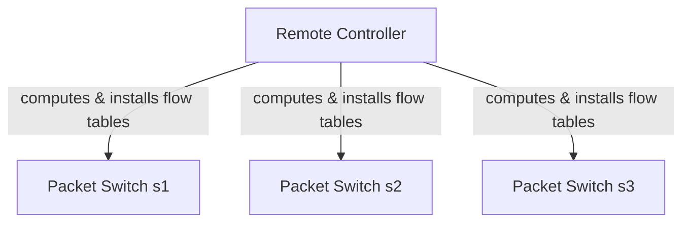

# 4.4 Generalized Forwarding and SDN

## Overview

**Destination-based forwarding**: match destination IP → action: forward to output port.

**Generalized forwarding**: match on **any combination of header fields** across layers 2, 3, 4 → action can be forward, drop, modify header, duplicate, etc.

Based on **OpenFlow** — the key SDN standard (McKeown 2008, ONF 2020).



Each packet switch has a **match-plus-action table** (flow table) installed by the remote controller.

## Flow Table Structure (OpenFlow)

Each entry has three components:
1. **Match fields**: header values to match incoming packets against
2. **Counters**: updated on match (packet count, time since last match)
3. **Actions**: list of operations applied if packet matches

**Implementation**: TCAM memory for hardware-speed matching (>1M entries possible).

**Priority**: if multiple entries match, highest-priority entry wins.

**No match**: packet can be dropped or sent to remote controller for further processing.

Note: flow table may be implemented as multiple physical tables for performance/cost, but abstract model = single table.

## 4.4.1 Match

**OpenFlow 1.0 matchable fields (12 total)**:

| Layer | Fields |
|---|---|
| Link (L2) | Ingress port, Ethernet src MAC, Ethernet dst MAC, Ethernet type, VLAN ID, VLAN priority |
| Network (L3) | IP src address, IP dst address, IP protocol, IP TOS |
| Transport (L4) | TCP/UDP src port, TCP/UDP dst port |

**Key points**:
- Matches across L2/L3/L4 — deliberately violates strict layering principle
- Wildcards supported (e.g., `128.119.*.*` matches any IP with those first 16 bits)
- Fields that **cannot** be matched in OpenFlow 1.0: TTL, datagram length (tradeoff: functionality vs. complexity)
- OpenFlow 1.0 → 12 matchable values; later specs grew to 41+ values
- P4 language (Programming Protocol-independent Packet Processors, 2014) enables fully programmable match fields

## 4.4.2 Action

Actions applied in order when a packet matches a flow table entry.

**Key actions**:

| Action | Description |
|---|---|
| **Forward** | Output to specific physical port, broadcast all ports except ingress, multicast selected ports, or send to remote controller |
| **Drop** | Flow table entry with no action → drop matched packet |
| **Modify-field** | Rewrite any of 10 header fields (L2/L3/L4 except IP Protocol) before forwarding |

Controller can receive packet, install new flow table entries, and return packet to switch for forwarding under updated rules.

## 4.4.3 OpenFlow Examples

### Network Topology (Reference)
```
Controller
    |
s1 ---|--- s2 ---|--- s3
|         |         |
h1,h2    h3,h4    h5,h6

s1 interfaces: 1(h1), 2(h2), 3(s2), 4(s3)
s2 interfaces: 1(h3), 2(s1), 3(h4), 4(s3)
s3 interfaces: 1(h5), 2(h6), 3(s1), 4(s2)

Addresses:
  h1: 10.1.0.1, h2: 10.1.0.2
  h3: 10.2.0.3, h4: 10.2.0.4
  h5: 10.3.0.5, h6: 10.3.0.6
```

### Example 1: Simple Forwarding (h5/h6 → h3/h4 via s1, avoid s3-s2 link)

**s3 flow table**:
| Match | Action |
|---|---|
| IP Src = 10.3.*.* ; IP Dst = 10.2.*.* | Forward(3) → toward s1 |

**s1 flow table**:
| Match | Action |
|---|---|
| Ingress Port = 1 ; IP Src = 10.3.*.* ; IP Dst = 10.2.*.* | Forward(4) → toward s2 |

**s2 flow table**:
| Match | Action |
|---|---|
| Ingress port = 2 ; IP Dst = 10.2.0.3 | Forward(1) → h3 |
| Ingress port = 2 ; IP Dst = 10.2.0.4 | Forward(3) → h4 |

### Example 2: Load Balancing (source-based routing — impossible with destination-only forwarding)

Traffic from h3 to 10.1.*.* → direct s2→s1 link.
Traffic from h4 to 10.1.*.* → indirect s2→s3→s1 path.

**s2 flow table**:
| Match | Action |
|---|---|
| Ingress port = 3 ; IP Dst = 10.1.*.* | Forward(2) → s1 direct |
| Ingress port = 4 ; IP Dst = 10.1.*.* | Forward(1) → s3 indirect |

> Note: port 3 = h3's interface, port 4 = h4's interface on s2. This routing decision is based on **source** (ingress port), which standard IP routing cannot do.

### Example 3: Firewalling (s2 only accepts traffic from 10.3.*.*)

**s2 flow table**:
| Match | Action |
|---|---|
| IP Src = 10.3.*.* ; IP Dst = 10.2.0.3 | Forward(1) |
| IP Src = 10.3.*.* ; IP Dst = 10.2.0.4 | Forward(3) |
| (no other entries) | → implicit drop |

Only traffic from s3's subnet (10.3.*.*) reaches h3/h4.

## SDN Beyond OpenFlow: P4

Match-plus-action flow tables = limited programmability (fixed match fields, fixed actions).

**P4 (Programming Protocol-independent Packet Processors)**:
- Full programming language for packet processing at line rate
- Variables, arithmetic, Boolean ops, functions, conditionals
- Constructs specifically for datagram processing
- Gained significant traction since 2014 introduction

## Summary: Generalized vs. Destination-Based Forwarding

| | Destination-Based | Generalized (OpenFlow) |
|---|---|---|
| Match on | Destination IP prefix | Up to 12 fields across L2/L3/L4 |
| Actions | Forward to output port | Forward, drop, modify-field, send to controller |
| Table installed by | Local routing algorithm | Remote SDN controller |
| Enables | Routing | Routing + switching + firewall + load balancing + NAT + virtual networks |
| Key standard | — | OpenFlow (ONF) |
