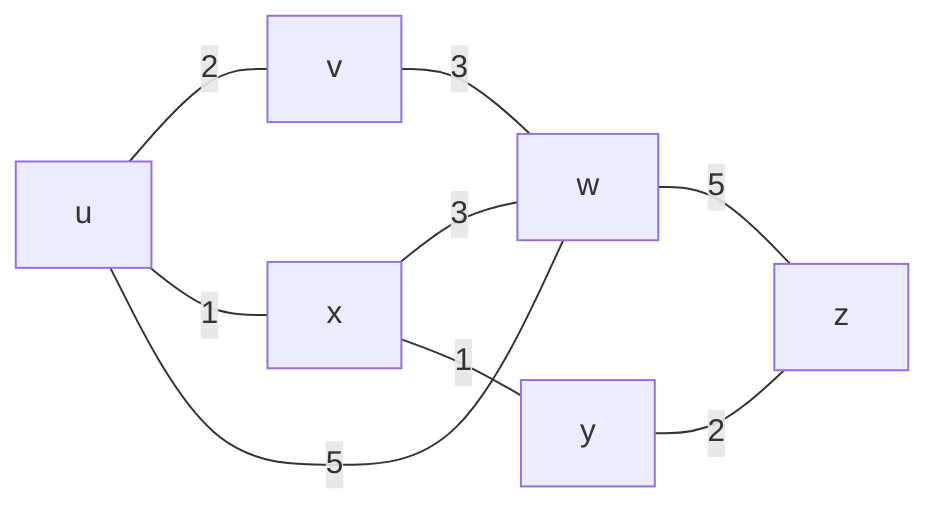

# 5.2 Routing Algorithms

**Source:** Kurose & Ross, *Computer Networking: A Top-Down Approach*, 8th ed., pp. 381–395

---

## Graph Model

- Network modeled as **G = (N, E)**: N = routers (nodes), E = links (edges)
- BGP usage: nodes = networks, edges = peering connections
- **c(x, y)** = cost of edge (x, y); if (x,y) ∉ E then c(x,y) = ∞
- Undirected graphs assumed here (c(x,y) = c(y,x))
- **Goal:** find least-cost path from source to each destination



*(Example network from Figure 5.3. Least-cost path u→w = u,x,y,w cost=3)*

---

## Classification of Routing Algorithms

| Dimension | Category A | Category B |
|---|---|---|
| Information scope | **Centralized (LS)** — global link-cost knowledge | **Decentralized (DV)** — only local + neighbor info |
| Change behavior | **Static** — change slowly, human intervention | **Dynamic** — respond to topology/load changes |
| Load sensitivity | **Load-sensitive** — costs reflect congestion | **Load-insensitive** — costs fixed (RIP, OSPF, BGP) |

---

## 5.2.1 Link-State (LS) — Dijkstra's Algorithm

### Mechanism
- Each node **broadcasts** link-state packets (LSPs) to all other nodes
- All nodes gain identical, complete network topology view
- Each node independently runs Dijkstra → same set of shortest paths

### Notation
- **D(v)**: current best-known cost from source u to v
- **p(v)**: predecessor of v on current least-cost path
- **N′**: set of nodes whose least-cost path is definitively known

### Pseudocode

```
Link-State (LS) Algorithm for Source Node u

1  Initialization:
2    N' = {u}
3    for all nodes v
4      if v is a neighbor of u
5        then D(v) = c(u, v)
6      else D(v) = ∞
7
8  Loop
9    find w not in N' such that D(w) is a minimum
10   add w to N'
11   update D(v) for each neighbor v of w and not in N':
12     D(v) = min(D(v),  D(w) + c(w, v))
13   /* new cost to v is either old cost to v or known
14      least path cost to w plus cost from w to v */
15 until N' = N
```

### Worked Example (Figure 5.3, source = u)

| Step | N′ | D(v),p(v) | D(w),p(w) | D(x),p(x) | D(y),p(y) | D(z),p(z) |
|---|---|---|---|---|---|---|
| 0 | {u} | 2,u | 5,u | 1,u | ∞ | ∞ |
| 1 | {u,x} | 2,u | 4,x | — | 2,x | ∞ |
| 2 | {u,x,y} | 2,u | 3,y | — | — | 4,y |
| 3 | {u,x,y,v} | — | 3,y | — | — | 4,y |
| 4 | {u,x,y,v,w} | — | — | — | — | 4,y |
| 5 | {u,x,y,v,w,z} | — | — | — | — | — |

**Forwarding table at u:**

| Destination | Next-hop link |
|---|---|
| v | (u,v) |
| w | (u,x) |
| x | (u,x) |
| y | (u,x) |
| z | (u,x) |

### Complexity
- Naive: O(n²) — search through n, n-1, n-2,… nodes each iteration = n(n+1)/2 ops
- With heap data structure: O(n log n)

### Pathology: Oscillations
- If link costs depend on load, LS can cause route oscillations (all routers simultaneously flip routes)
- Cause: routers self-synchronize their LS execution timing [Floyd 1994]
- Fix: randomize time each router sends link advertisements

---

## 5.2.2 Distance-Vector (DV) — Bellman-Ford Algorithm

### Key Properties
- **Distributed**: each node receives/sends info only to/from direct neighbors
- **Iterative**: repeats until no more updates exchange
- **Asynchronous**: no global clock required; nodes operate independently
- **Self-terminating**: no explicit stop signal needed

### Bellman-Ford Equation

$$d_x(y) = \min_v \{ c(x, v) + d_v(y) \}$$

where the min is taken over all neighbors v of x.

- dx(y) = cost of least-cost path from x to y
- v* achieving the minimum → next-hop for destination y in x's forwarding table

**Verification (Figure 5.3, source u, dest z):**
- dv(z)=5, dx(z)=3, dw(z)=3
- du(z) = min{2+5, 1+3, 5+3} = min{7, 4, 8} = **4** ✓

### Each Node x Maintains
1. Cost c(x,v) for each directly attached neighbor v
2. x's own distance vector **Dx** = [Dx(y) : y ∈ N]
3. Distance vectors of each neighbor: **Dv** for each neighbor v

### Pseudocode

```
Distance-Vector (DV) Algorithm — at each node x:

1  Initialization:
2    for all destinations y in N:
3      Dx(y) = c(x, y)      /* ∞ if y not a neighbor */
4    for each neighbor w:
5      Dw(y) = ? for all y in N
6    for each neighbor w:
7      send distance vector Dx = [Dx(y): y in N] to w
8
9  loop
10   wait (until link cost change to neighbor w
11         OR receive distance vector from neighbor w)
12
13   for each y in N:
14     Dx(y) = min_v { c(x,v) + Dv(y) }
15
16   if Dx(y) changed for any destination y:
17     send distance vector Dx = [Dx(y): y in N] to all neighbors
18
19 forever
```

### Convergence
- Good news (cost decrease): propagates quickly — O(hops) iterations
- Bad news (cost increase): **count-to-infinity problem**

### Count-to-Infinity Problem

**Scenario:** c(y,x) changes from 4 to 60

```
x ——60—— y ——1—— z
```

1. y computes Dy(x) = min{60+0, 1+5} = 6 (wrong — z's Dz(x)=5 was via y!)
2. Routing loop: y→z→y→z→… (black hole)
3. Loop persists for 44 iterations before z finds direct path to x beats 50

**Fix: Poisoned Reverse**
- If z routes to x via y, then z advertises Dz(x) = ∞ to y (lying)
- y never routes to x via z while z is using y
- Breaks 2-node loops; **does not** fix loops involving 3+ nodes

### LS vs. DV Comparison

| Feature | Link-State (LS) | Distance-Vector (DV) |
|---|---|---|
| Info required | Global (all link costs) | Local (neighbors only) |
| Message complexity | O(\|N\| \|E\|) broadcasts | O(iterations × neighbors) |
| Convergence speed | O(n²) computation, faster convergence | Slower; can have oscillations |
| Routing loops | No (full topology known) | Yes (during count-to-infinity) |
| Robustness | Node computes own table only | Bad calc can diffuse network-wide |
| Real-world use | OSPF | RIP, BGP (originally), ARPAnet |
