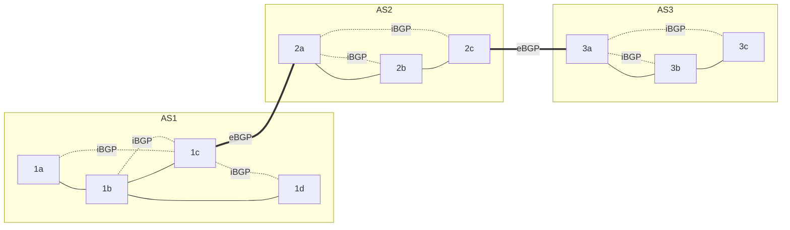
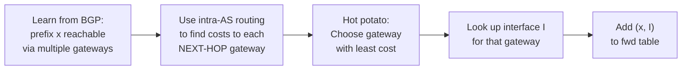

# 5.4 BGP — Border Gateway Protocol

**Source:** Kurose & Ross, *Computer Networking: A Top-Down Approach*, 8th ed., pp. 399–410

---

## Overview

- **BGP (Border Gateway Protocol)** [RFC 4271] — the Internet's **inter-AS routing protocol**
- All ASes in the Internet run the same inter-AS routing protocol: BGP
- Often called "the protocol that glues the Internet together"
- Decentralized, asynchronous — DV-like in spirit but policy-driven
- Routes to **CIDRized prefixes** (e.g., 138.16.68/22), not individual hosts
- Forwarding table entries: **(prefix, interface)**

---

## 5.4.1 Role of BGP

BGP gives each router the ability to:

1. **Obtain prefix reachability** from neighboring ASes — every subnet can advertise its existence
2. **Determine best routes** to prefixes — using reachability info + policy

---

## 5.4.2 BGP Sessions and Connections

### Connection Types

| Type | Description |
|---|---|
| **BGP connection** | Semi-permanent TCP connection (port **179**) between two routers; all BGP messages sent over it |
| **eBGP (external BGP)** | BGP connection spanning two ASes — between gateway routers |
| **iBGP (internal BGP)** | BGP connection within the same AS — between any two routers in the AS |

### Topology



*(Dashes = iBGP; double = eBGP. iBGP connections do not require physical links.)*

### Prefix Reachability Propagation (example: AS3 advertises prefix x)

```
AS3 gateway 3a  ──eBGP──→  AS2 gateway 2c
                               │ iBGP to all AS2 routers (incl. 2a)
AS2 gateway 2a  ──eBGP──→  AS1 gateway 1c
                               │ iBGP to all AS1 routers
```

After propagation: every router in AS1 and AS2 knows about x and the AS path to x.

---

## 5.4.3 BGP Attributes and Route Selection

### Route = Prefix + Attributes

When advertising a prefix, BGP includes **attributes**:

| Attribute | Description |
|---|---|
| **AS-PATH** | Ordered list of ASes the advertisement has traversed; used to detect/prevent loops (if own AS is in path → reject) |
| **NEXT-HOP** | IP address of the router interface that **begins** the AS-PATH (the first router outside the current AS) |
| **LOCAL-PREF** | Local preference value — policy set by local AS admin; higher = preferred |

**Example routes in AS1 to prefix x (two paths):**

```
Route 1:  NEXT-HOP=IP(2a's left iface);  AS-PATH=AS2 AS3;  prefix=x
Route 2:  NEXT-HOP=IP(3d's left iface);  AS-PATH=AS3;      prefix=x
```

### Hot Potato Routing

- Get packets out of the local AS **as quickly as possible** (minimize intra-AS cost to NEXT-HOP)
- Selfish: ignores cost outside own AS
- Steps:
  1. Learn from inter-AS (BGP) that prefix x is reachable via multiple gateways
  2. Use intra-AS routing to find cost to each gateway's NEXT-HOP
  3. Choose gateway with **smallest intra-AS cost**
  4. Look up outgoing interface I for that gateway; add (x, I) to forwarding table



### Full BGP Route-Selection Algorithm

Applied sequentially until one route remains:

1. **Highest LOCAL-PREF** — policy trumps everything (admin-configured)
2. **Shortest AS-PATH** — fewer AS hops preferred (DV-like, but AS hops not router hops)
3. **Hot potato** — closest NEXT-HOP router (smallest intra-AS cost)
4. **BGP identifier** tiebreak [Stewart 1999]

> Rule 2 applied before rule 3: BGP is not purely selfish — short AS paths (likely lower end-to-end delay) preferred over minimum local cost.

---

## 5.4.4 IP-Anycast

- BGP is used to implement **IP-anycast** [RFC 1546, RFC 7094] — commonly used in DNS
- **Mechanism:** Assign the **same IP address** to multiple geographically dispersed servers; each advertises that IP via BGP
- BGP routers treat multiple advertisements as different paths to "same location" — select the "best" (closest by AS hops)
- Result: client packets routed to nearest server automatically

**DNS use:** 13 root DNS IP addresses, but 100+ servers globally; IP-anycast routes queries to nearest root server

**CDN caveat:** CDNs generally avoid IP-anycast for TCP because BGP route changes can split a TCP connection across different servers

---

## 5.4.5 BGP Routing Policy

### Customer/Provider Relationship

```
        [Backbone A] ─── [Backbone B] ─── [Backbone C]
               │                                │
          [Access ISP W]              [Access ISP X] (multi-homed via B and C)
               │
          [Access ISP Y]
```

- **Access ISPs (W, X, Y):** all traffic entering/leaving must have origin/destination in that AS
- **Backbone providers (A, B, C):** carry transit traffic; they peer and share full BGP routes with customers

**Key policy rule:** X will **not** advertise to B that it has a path to Y (even if it knows one). Otherwise B could route B→X→Y, giving B a free ride through X's network.

**Provider rule of thumb:** Traffic crossing a backbone ISP's network must have either source or destination in a customer network of that ISP.

### Why Different Inter-AS and Intra-AS Protocols?

| Factor | Intra-AS | Inter-AS |
|---|---|---|
| **Policy** | Same admin — policy less critical | Different orgs — policy dominates (who carries whose traffic?) |
| **Scale** | Single ISP; manageable size | Global Internet — must scale to hundreds of thousands of prefixes |
| **Performance** | Optimize for speed/cost | Policy may override performance (longer policy-compliant route preferred) |

---

## 5.4.6 Obtaining Internet Presence (BGP in Practice)

When a new company connects to a local ISP:

1. Get IP address range (e.g., /24) from ISP
2. Get domain name from registrar; provide DNS server IP to registrar → entry in .com TLD servers
3. Local ISP uses **BGP to advertise your /24 prefix** to its upstream ISPs → propagates to all Internet routers
4. Eventually every router knows your prefix and can forward datagrams to your servers

---

## BGP Summary

| Feature | Value |
|---|---|
| Port | TCP 179 |
| Type | Path-vector (DV-like, with full AS-PATH) |
| Scope | Inter-AS (Internet-wide) |
| Loop prevention | AS-PATH contains own AS → reject |
| Policy enforcement | LOCAL-PREF attribute, selective route advertisement |
| Routing table size | Often >500,000 routes in tier-1 ISP routers |
