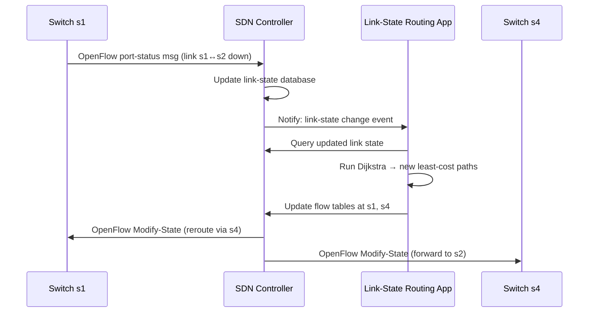

# 5.5 SDN Control Plane

**Source:** Kurose & Ross, *Computer Networking: A Top-Down Approach*, 8th ed., pp. 411–422

---

## Four Defining Characteristics of SDN

1. **Flow-based forwarding** — forwarding decisions based on any header field (transport, network, link layer); OpenFlow 1.0 supports 11 header fields; contrasts with traditional IP-only destination-based forwarding
2. **Separation of data and control planes** — switches are simple fast "match+action" executors; control logic lives in separate software
3. **Control functions external to data-plane switches** — SDN controller runs on distinct remote servers; not embedded in switches
4. **Programmable network** — network-control applications (the "brains") use controller APIs to program data-plane behavior

---

## SDN Architecture

```
┌───────────────────────────────────────────────────────┐
│              Network-Control Applications              │
│  (routing, load balancing, firewalling, access ctrl)  │
└───────────────────────┬───────────────────────────────┘
                        │  Northbound API (REST / intent)
┌───────────────────────▼───────────────────────────────┐
│                   SDN Controller                       │
│  ┌─────────────────────────────────────────────────┐  │
│  │      Interface to Network-Control App Layer     │  │
│  ├─────────────────────────────────────────────────┤  │
│  │    Network-Wide State Management Layer          │  │
│  │  (link state, host/switch state, flow tables)   │  │
│  ├─────────────────────────────────────────────────┤  │
│  │    Communication Layer (southbound)             │  │
│  └─────────────────────────────────────────────────┘  │
└───────────────────────┬───────────────────────────────┘
                        │  Southbound API (OpenFlow)
              ┌─────────┼─────────┐
           [Switch 1] [Switch 2] [Switch 3]   ← data plane
```

### Controller Layers (bottom-up)

| Layer | Role |
|---|---|
| **Communication (southbound)** | Protocol between controller and switches; carries flow table updates, switch events; OpenFlow is the standard protocol here |
| **Network-wide state management** | Maintains link state, host/switch state, copy of all flow tables, counters; single source of truth for network state |
| **Interface to network-control apps (northbound)** | API for applications to read/write state, register for event notifications; typically REST over HTTP |

- Controller is **logically centralized** but **physically distributed** (multiple servers for fault tolerance and scalability)
- OpenDaylight and ONOS implement logically centralized, physically distributed controller platforms

---

## 5.5.2 OpenFlow Protocol

- Operates over TCP, default port **6653**
- Communication between SDN controller and SDN-controlled switches

### Controller → Switch Messages

| Message | Purpose |
|---|---|
| **Configuration** | Query/set switch configuration parameters |
| **Modify-State** | Add/delete/modify flow table entries; set port properties |
| **Read-State** | Collect statistics and counters from flow tables and ports |
| **Send-Packet** | Send a specific packet out a specified switch port (packet in payload) |

### Switch → Controller Messages

| Message | Purpose |
|---|---|
| **Flow-Removed** | Flow table entry removed (timeout or Modify-State) |
| **Port-status** | Port state change notification |
| **Packet-in** | Packet arrived with no matching flow table entry → send to controller for processing; or matched packet sent as action |

---

## 5.5.3 Data/Control Plane Interaction: Example

**Scenario:** Link between s1 and s2 fails; Dijkstra's algorithm used for shortest-path routing



**Key differences from per-router control:**
- Dijkstra runs as a **separate application**, outside switches
- Switches send link updates to **controller**, not to each other

---

## 5.5.4 SDN History

| Year | Milestone |
|---|---|
| 1998 | ATM control framework with multiple controllers [van der Merwe] |
| 2004 | Arguments for data/control plane separation [Feamster, Lakshman, RFC 3746] |
| 2007 | Ethane project: 300+ simple flow-based Ethernet switches with centralized controller [Casado] |
| 2008 | NOX controller (first SDN controller) [Gude]; OpenFlow protocol introduced [McKeown] |
| 2013 | Google B4 network uses SDN with OpenFlow at scale [Jain] |
| 2020 | OpenDaylight and ONOS widely deployed |

---

## Controller Case Studies

### OpenDaylight (ODL)

```
┌──────────────────────────────────────────────┐
│   Network Orchestrations and Applications    │
│  (Traffic Eng., Firewalling, Load Balancing) │
├──────────────────────────────────────────────┤
│   Service Abstraction Layer (SAL)            │
│   - AD-SAL (REST/HTTP)                       │
│   - MD-SAL (YANG + NETCONF)                 │
├──────────────────────────────────────────────┤
│   Basic Network Functions (state mgmt)       │
├──────────────────────────────────────────────┤
│   Protocol Plugins: OpenFlow, SNMP,          │
│   NETCONF, OVSDB                             │
└──────────────────────────────────────────────┘
```

- **AD-SAL:** API-Driven — apps communicate via REST
- **MD-SAL:** Model-Driven — YANG models + NETCONF for device configuration
- Open-source, Linux Foundation

### ONOS Controller

```
┌──────────────────────────────────────────────┐
│ Northbound: Intent Framework + Listener API  │
│ (high-level service requests, no details)    │
├──────────────────────────────────────────────┤
│      Distributed Core                        │
│  (link/host/device state replicated across   │
│   all ONOS server instances)                 │
├──────────────────────────────────────────────┤
│ Southbound: Abstractions + Protocol Plugins  │
│ (device/protocol agnostic)                   │
└──────────────────────────────────────────────┘
```

- **Intent framework:** app requests "connect A to B" without specifying how — controller figures out the flow table entries
- State notifications: synchronous (query) or asynchronous (listener callbacks)
- Distributed deployment: multiple servers, each running identical ONOS; increased servers = increased capacity
- Open-source, Linux Foundation

### Google B4 Network

- Custom SDN-controlled WAN interconnecting Google data centers
- OpenFlow-based with custom switches; local OpenFlow Agent (OFA) per switch
- OpenFlow Controller (OFC) runs on Network Control Servers (NCS); uses ONIX controller
- Routing: BGP (inter-data-center) + IS-IS (intra-data-center)
- Paxos for hot failover of NCS components
- Traffic engineering app sits above NCS → global bandwidth provisioning
- Result: WAN links at ~70% utilization (2–3× improvement over traditional)

---

## SDN vs. Traditional Comparison

| | Traditional (per-router) | SDN |
|---|---|---|
| Control location | Embedded in each router | External controller |
| Forwarding basis | Destination IP only | Any header field (11+ fields in OpenFlow) |
| Adding new behavior | Change software in every router (multi-vendor problem) | Change application on controller |
| Network-wide view | Distributed; learned via routing protocols | Controller has complete state |
| Vendor lock-in | High (monolithic) | Low (open APIs, commodity hardware) |
