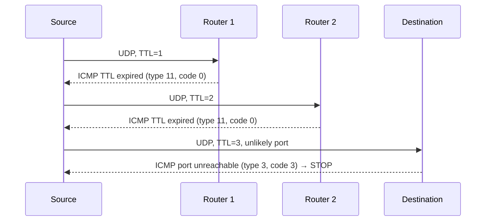

# 5.6 ICMP — Internet Control Message Protocol

**Source:** Kurose & Ross, *Computer Networking: A Top-Down Approach*, 8th ed., pp. 423–425

---

## Overview

- **ICMP** [RFC 792] — used by hosts and routers to communicate **network-layer information** to each other
- Primary use: **error reporting** (e.g., "Destination network unreachable")
- Architecturally sits **above IP** (but considered part of IP)
- ICMP messages carried as **IP payload** (just like TCP/UDP segments)
- Upper-layer protocol number = **1** (IP uses this to demux to ICMP)
- IPv6 version: **ICMPv6** [RFC 4443] — reorganized types/codes, added "Packet Too Big" and "unrecognized IPv6 options"

---

## ICMP Message Format

- **Type** field (8 bits)
- **Code** field (8 bits)
- First **8 bytes of the IP datagram** that caused the error (sender can identify which datagram triggered the error)

---

## ICMP Message Types

| Type | Code | Description |
|---|---|---|
| 0 | 0 | Echo reply (ping response) |
| 3 | 0 | Destination network unreachable |
| 3 | 1 | Destination host unreachable |
| 3 | 2 | Destination protocol unreachable |
| 3 | 3 | Destination port unreachable |
| 3 | 6 | Destination network unknown |
| 3 | 7 | Destination host unknown |
| 4 | 0 | Source quench (congestion control — seldom used) |
| 8 | 0 | Echo request (ping) |
| 9 | 0 | Router advertisement |
| 10 | 0 | Router discovery |
| 11 | 0 | TTL expired |
| 12 | 0 | IP header bad |

**Note on source quench (type 4):** Originally for congestion control — congested router signals source to slow down. Seldom used in practice; TCP handles congestion at transport layer; ECN bits handle network-layer signaling.

---

## Ping

- Sends **ICMP type 8 code 0** (echo request) to destination
- Destination responds with **ICMP type 0 code 0** (echo reply)
- Implemented directly in the OS (not a separate process)
- Measures round-trip time and host reachability

---

## Traceroute

Traceroute exploits ICMP to reveal the **path and RTTs** between source and destination.

### Mechanism

```
Source sends UDP datagram to destination:
  TTL=1, unlikely dest port
  TTL=2, unlikely dest port
  TTL=3, unlikely dest port
  ...
```

| Step | What Happens |
|---|---|
| Source sends datagram with TTL=n to dest | Timer started |
| nth router decrements TTL → 0, discards datagram | Sends **ICMP type 11 code 0** (TTL expired) back to source |
| ICMP message includes router's name and IP address | Source records RTT and router identity |
| Eventually a datagram reaches the destination | Dest returns **ICMP type 3 code 3** (port unreachable) — unknown UDP port |
| Source receives type 3 code 3 | Knows it has reached the destination; stops sending |



### Key Details
- Standard Traceroute sends **3 packets per TTL** — reports three RTTs per hop
- Client must instruct OS to: (1) generate UDP with specific TTL, (2) receive ICMP messages
- Source learns: number of routers between src and dst, each router's IP and name, RTTs

---

## ICMP vs. Other Error Mechanisms

| Mechanism | Layer | Use |
|---|---|---|
| ICMP | Network (via IP payload) | Router/host error reporting, diagnostics |
| TCP congestion control | Transport | End-to-end congestion management |
| ECN bits | Network header | In-network congestion signaling to endpoints |
