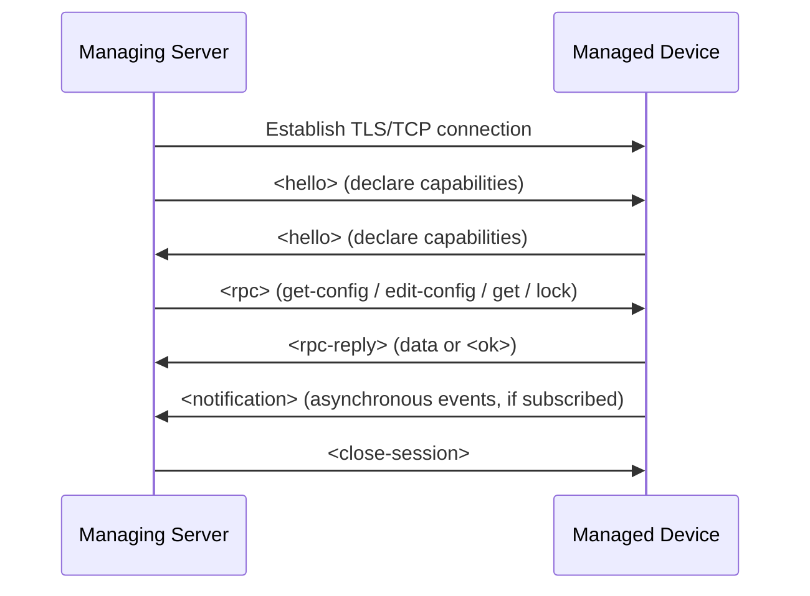

# 5.7 Network Management: SNMP, NETCONF/YANG

**Source:** Kurose & Ross, *Computer Networking: A Top-Down Approach*, 8th ed., pp. 425–436

---

## Definition (Saydam 1996)

> "Network management includes the deployment, integration, and coordination of the hardware, software, and human elements to monitor, test, poll, configure, analyze, evaluate, and control the network and element resources to meet the real-time, operational performance, and Quality of Service requirements at a reasonable cost."

---

## 5.7.1 Network Management Framework

### Key Components

```
┌─────────────────────┐
│   Managing Server   │   ← NOC; humans in the loop; initiates actions
│   (mgmt station)    │
└──────────┬──────────┘
           │  Network Management Protocol (SNMP / NETCONF)
     ┌─────┴──────────────────────────┐
     │        Managed Devices         │
     │  ┌─────────────────────────┐   │
     │  │  Management Agent       │   │   ← software process in device
     │  ├─────────────────────────┤   │
     │  │  MIB / Config Data      │   │   ← state, counters, config
     │  └─────────────────────────┘   │
     └────────────────────────────────┘
```

| Component | Description |
|---|---|
| **Managing server** | Application in NOC; controls collection, processing, analysis of network management info; initiates configure/monitor/control actions |
| **Managed device** | Any network-connected equipment (router, switch, host, modem, thermostat, etc.) |
| **Data (state)** | Configuration data (admin-set), operational data (device-acquired), device statistics (counters/indicators) |
| **Management agent** | Software process in managed device; communicates with managing server; acts on server commands |
| **Network management protocol** | Runs between managing server and managed devices; provides query/set/notify capabilities (does not itself manage — provides tools for managers) |

### Three Approaches to Network Management

| Approach | Characteristics |
|---|---|
| **CLI** | Direct commands (Telnet/SSH); vendor/device-specific; error-prone; hard to automate; doesn't scale |
| **SNMP/MIB** | Query/set MIB objects; good for monitoring; poor for large-scale configuration; devices managed individually |
| **NETCONF/YANG** | Abstract, network-wide view; strong configuration management; atomic multi-device transactions; replaces CLI+SNMP weaknesses |

---

## 5.7.2 SNMP and MIB

### SNMP Overview

- **Simple Network Management Protocol v3 (SNMPv3)** [RFC 3410] — application-layer protocol
- Typical mode: **request-response** (managing server queries/sets agent)
- Second mode: agent sends **unsolicited trap** to managing server
- PDUs typically carried over **UDP** (RFC 3417); unreliable — managing server must handle retransmission
- Request ID field: manages correlation of requests and replies, detect lost messages

### SNMPv3 PDU Types

| PDU Type | Direction | Description |
|---|---|---|
| **GetRequest** | manager → agent | Get value of one or more MIB object instances |
| **GetNextRequest** | manager → agent | Get value of next MIB object (traverse list/table) |
| **GetBulkRequest** | manager → agent | Get large block of data (avoids many Get round-trips) |
| **SetRequest** | manager → agent | Set value of one or more MIB objects |
| **InformRequest** | manager → manager | Inform remote managing entity of MIB values |
| **Response** | agent → manager OR manager → manager | Response to Get/Set/Inform; contains requested values or confirmation |
| **SNMPv2-Trap** | agent → manager | Asynchronous notification of exceptional event |

### SNMP PDU Format

```
┌─────────────────┬─────────────────┬─────────────────┬──────────────────┐
│  Get/set header │ Variables to    │   Trap header   │  Trap information│
│  (request ID,   │ get/set         │                 │                  │
│   error status) │ (OID + value)   │                 │                  │
└─────────────────┴─────────────────┴─────────────────┴──────────────────┘
```

### Trap Events (RFC 3418 well-known traps)
- Cold/warm start by device
- Link going up or down
- Loss of a neighbor
- Authentication failure

### SNMPv3 Security
- SNMPv1/v2 lacked security → used primarily for monitoring (SetRequest rarely used)
- SNMPv3 adds administration and security capabilities
- Lack of security in early SNMP was a major limitation

### MIB (Management Information Base)

- **MIB** = collection of managed objects representing device state
- Objects: counters, descriptive info, status flags, protocol-specific data
- Defined using **SMI (Structure of Management Information)** [RFC 2578, 2579, 2580]
- Related objects grouped into **MIB modules**; 400+ MIB-related RFCs; many vendor-specific (private) MIBs

**Example MIB object (from RFC 4293):**

```
ipSystemStatsInDelivers OBJECT-TYPE
    SYNTAX      Counter32
    MAX-ACCESS  read-only
    STATUS      current
    DESCRIPTION
        "The total number of datagrams successfully
         delivered to IP user-protocols (including ICMP).
         When tracking interface statistics, the counter
         of the interface to which these datagrams were
         addressed is incremented..."
    ::= { ipSystemStatsEntry 18 }
```

**Standard MIB modules:**

| RFC | MIB Module |
|---|---|
| RFC 4293 | IP and ICMP (ipSystemStatsInDelivers, etc.) |
| RFC 4022 | TCP |
| RFC 4113 | UDP |

---

## 5.7.3 NETCONF and YANG

### NETCONF Overview

- **NETCONF** [RFC 6241] — network configuration protocol
- Capabilities: retrieve/set/modify configuration; query operational data/statistics; subscribe to notifications
- Uses **XML-encoded** protocol messages (human-readable, reminiscent of HTTP/HTML vs. binary SNMP PDU)
- Transport: **RPC paradigm** over **TLS over TCP** (secure, connection-oriented)
- Addresses weaknesses of SNMP/CLI for configuration management at scale

### NETCONF Session Flow



### NETCONF Operations

| Operation | Description |
|---|---|
| **`<get-config>`** | Retrieve all or part of a given configuration (running or candidate) |
| **`<get>`** | Retrieve both configuration state and operational state data |
| **`<edit-config>`** | Change all or part of a specified configuration; returns `<ok>` or `<rpc-error>`; can rollback on error |
| **`<lock>` / `<unlock>`** | Lock/unlock the entire config datastore (short-lived; prevents concurrent modification by other NETCONF/SNMP/CLI sessions) |
| **`<create-subscription>` / `<notification>`** | Subscribe to events; device sends async `<notification>` until subscription terminated |

### Multi-Device Transactions
- Key NETCONF capability: operations can be grouped to execute **atomically** across multiple devices
  - All succeed together, or all roll back to pre-transaction state
- Critical requirement from [RFC 3535]: "enabling operators to concentrate on the configuration of the network as a whole rather than individual devices"

### NETCONF Example: Get All Config

```xml
<?xml version="1.0" encoding="UTF-8"?>
<rpc message-id="101"
     xmlns="urn:ietf:params:xml:ns:netconf:base:1.0">
  <get/>
</rpc>
```

Reply:
```xml
<?xml version="1.0" encoding="UTF-8"?>
<rpc-reply message-id="101"
           xmlns="urn:ietf:params:xml:ns:netconf:base:1.0">
  <!-- all configuration data returned -->
  ...
</rpc-reply>
```

### NETCONF Example: Set MTU

```xml
<?xml version="1.0" encoding="UTF-8"?>
<rpc message-id="101"
     xmlns="urn:ietf:params:xml:ns:netconf:base:1.0">
  <edit-config>
    <target><running/></target>
    <config>
      <top xmlns="http://example.com/schema/1.2/config">
        <interface>
          <name>Ethernet0/0</name>
          <mtu>1500</mtu>
        </interface>
      </top>
    </config>
  </edit-config>
</rpc>
```

Reply:
```xml
<rpc-reply message-id="101"
           xmlns="urn:ietf:params:xml:ns:netconf:base:1.0">
  <ok/>
</rpc-reply>
```

### YANG

- **YANG** [RFC 6020] — data modeling language for NETCONF
- Analogous to SMI for SNMP
- All definitions in **modules**; XML document describing device/capabilities generated from YANG module
- Small set of built-in data types (like SMI)
- Can express **correctness constraints** on configurations (powerful for ensuring validity)
- Used to specify NETCONF notifications as well
- Used in OpenDaylight's MD-SAL approach

---

## SNMP vs. NETCONF Comparison

| Feature | SNMP/MIB | NETCONF/YANG |
|---|---|---|
| Data model | SMI + MIB | YANG |
| Message format | Binary PDU | XML |
| Transport | UDP (unreliable) | TLS/TCP (reliable, secure) |
| Primary use | Monitoring + limited config | Configuration management |
| Multi-device transactions | No | Yes (atomic) |
| Scale | Poor for config at scale | Designed for scale |
| Security | Added late (SNMPv3) | Built-in (TLS) |
| Standardization | 400+ RFCs | Newer, growing adoption |
