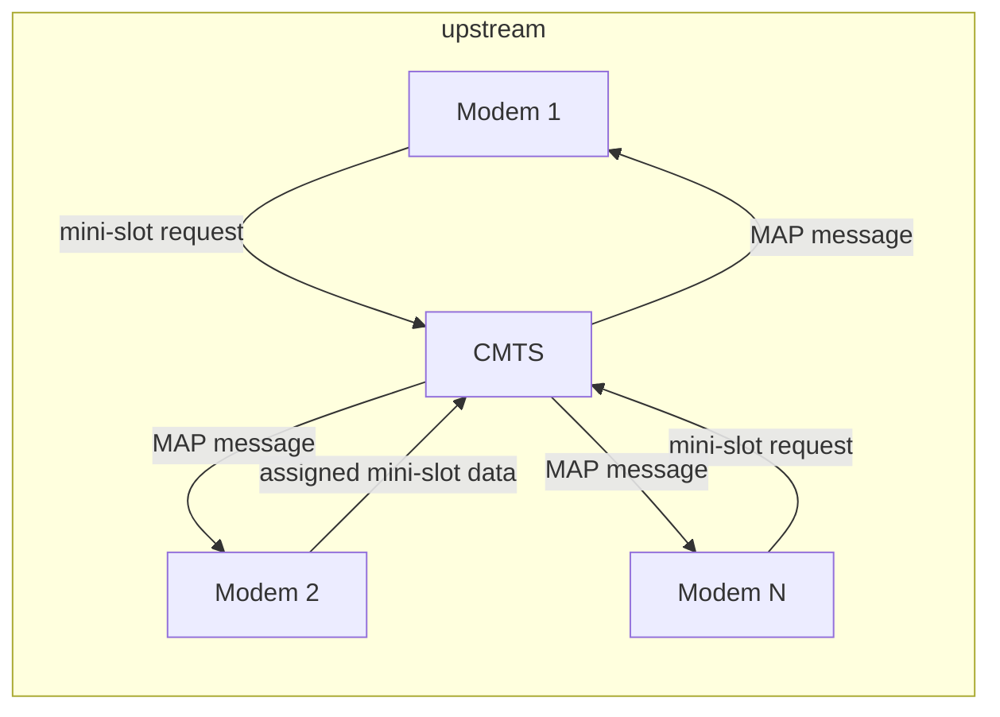

# 6.3 Multiple Access Links and Protocols

## Link Types

| Type | Description | Examples |
|------|-------------|---------|
| Point-to-point | Single sender ↔ single receiver | PPP, HDLC |
| Broadcast | Multiple nodes share single channel | Ethernet, 802.11, satellite |

**Multiple access problem**: how to coordinate transmissions on a shared broadcast channel.

## Desirable Properties of a MAC Protocol

For a broadcast channel of rate R bps:
1. Single active node → throughput = R bps
2. M active nodes → each gets ~R/M bps (average)
3. Decentralized (no single point of failure)
4. Simple (cheap to implement)

## Protocol Categories

### 6.3.1 Channel Partitioning Protocols

**TDM (Time Division Multiplexing)**
- Time divided into frames; each frame divided into N slots; one slot per node
- Pros: no collisions, perfectly fair (R/N bps per node)
- Cons: node limited to R/N even if sole active node; must wait for turn

**FDM (Frequency Division Multiplexing)**
- Channel bandwidth divided into N sub-bands of R/N bps each
- Same pros/cons as TDM
- Avoids collisions, fair, but limited to R/N even when alone

**CDMA (Code Division Multiple Access)**
- Each node assigned a unique spreading code
- Multiple nodes transmit simultaneously; receiver decodes using sender's code
- Anti-jamming; used in military systems and cellular telephony
- Details deferred to Chapter 7 (wireless)

---

### 6.3.2 Random Access Protocols

Node always transmits at full rate R; after collision, waits random delay then retransmits.

#### Slotted ALOHA

**Assumptions:**
- All frames = L bits; slot = L/R seconds (one frame per slot)
- Nodes synchronize to slot boundaries
- Collision detection within slot

**Operation:**
- On fresh frame: transmit at next slot start
- Success: done
- Collision: retransmit in each subsequent slot with probability p (independently)

**Efficiency Analysis** (N active nodes, each transmitting with prob p):
- P(given node succeeds in a slot) = p(1−p)^(N−1)
- P(any node succeeds) = Np(1−p)^(N−1)
- Optimal p* = 1/N → max efficiency as N→∞:

```
Max efficiency = lim[N→∞] Np*(1−p*)^(N-1) = 1/e ≈ 0.37
```

- 37% of slots: useful transmission
- 37% of slots: empty
- 26% of slots: collisions

#### Pure (Unslotted) ALOHA

- No synchronization; transmit immediately when frame arrives
- Collision window = 2 frame-transmission times (vulnerable before AND during transmission)
- Max efficiency:

```
Max efficiency = 1/(2e) ≈ 0.18
```

Half of slotted ALOHA — the cost of full decentralization.

#### CSMA (Carrier Sense Multiple Access)

**Carrier sensing**: listen before transmitting; if channel busy, wait.

**Why collisions still occur**: propagation delay — a node may not yet detect another's transmission.

- Longer propagation delay → higher collision probability

#### CSMA/CD (with Collision Detection)

**Collision detection**: while transmitting, monitor channel; if collision detected, abort immediately.

**Adapter algorithm:**
1. Get datagram, prepare frame, put in buffer
2. If channel idle: start transmitting. If busy: wait for idle, then transmit.
3. While transmitting: monitor for signal energy from other adapters
4. If entire frame transmitted without collision: done
5. If collision detected: abort transmission, wait random backoff, go to step 2

**Binary Exponential Backoff** (used in Ethernet and DOCSIS):
- After n-th collision: choose K randomly from {0, 1, 2, …, 2^n − 1}
- Wait K × 512 bit-times before retrying
- n capped at 10 → max K range = {0, …, 1023}
- Adapts interval to estimated number of colliding nodes

**CSMA/CD Efficiency:**

```
Efficiency = 1 / (1 + 5·d_prop/d_trans)
```

Where:
- `d_prop` = max propagation delay between any two adapters
- `d_trans` = time to transmit max-size frame (~1.2 ms for 10 Mbps Ethernet)

- As d_prop → 0: efficiency → 1
- As d_trans → ∞: efficiency → 1 (channel held productively for long periods)

---

### 6.3.3 Taking-Turns Protocols

Achieve both: single active node gets R bps, M active nodes each get ~R/M bps.

#### Polling Protocol

- Master node polls each node round-robin, granting permission to transmit up to max frames
- **Pros**: eliminates collisions and empty slots; high efficiency
- **Cons**:
  - Polling delay (must poll even inactive nodes)
  - Master node = single point of failure
- Example: Bluetooth (studied in Section 6.3)

#### Token-Passing Protocol

- Special token frame circulates in fixed order (node 1 → 2 → … → N → 1)
- Node with token: transmit up to max frames, then forward token
- Node without data: immediately forward token
- **Pros**: decentralized, highly efficient
- **Cons**:
  - One node failure can crash entire channel
  - Lost token requires recovery procedure
- Examples: FDDI, IEEE 802.5 token ring

---

### 6.3.4 DOCSIS: Cable Internet Multiple Access

Cable access network = textbook example combining all three protocol classes.

**Architecture**: many residential cable modems → Cable Modem Termination System (CMTS) at headend

**Downstream** (CMTS → modems):
- FDM: divided into frequency channels (24–192 MHz each, up to ~1.6 Gbps/channel)
- Single transmitter (CMTS) → no multiple access problem

**Upstream** (modems → CMTS):
- FDM: channels 6.4–96 MHz, up to ~1 Gbps/channel
- TDM-like: each channel divided into mini-slots
- Centrally allocated: CMTS sends MAP messages on downstream specifying which modem gets which mini-slot
- Request mechanism: modems send mini-slot-request frames in **dedicated random-access mini-slots**
  - Random access → collisions possible
  - Modems cannot sense channel or detect collisions
  - Infers collision if no allocation appears in next downstream MAP → uses binary exponential backoff to retry
  - If low traffic: modem may send data directly in request slots (skips waiting for allocation)

**Summary**: DOCSIS = FDM + TDM + random access + centrally allocated slots in one network.


