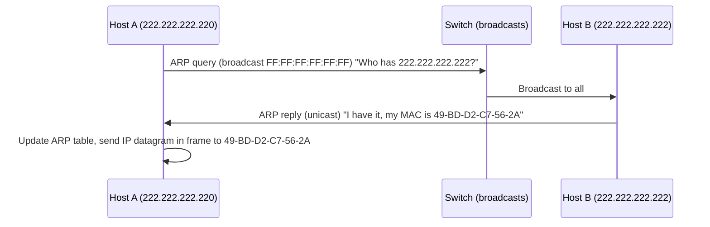
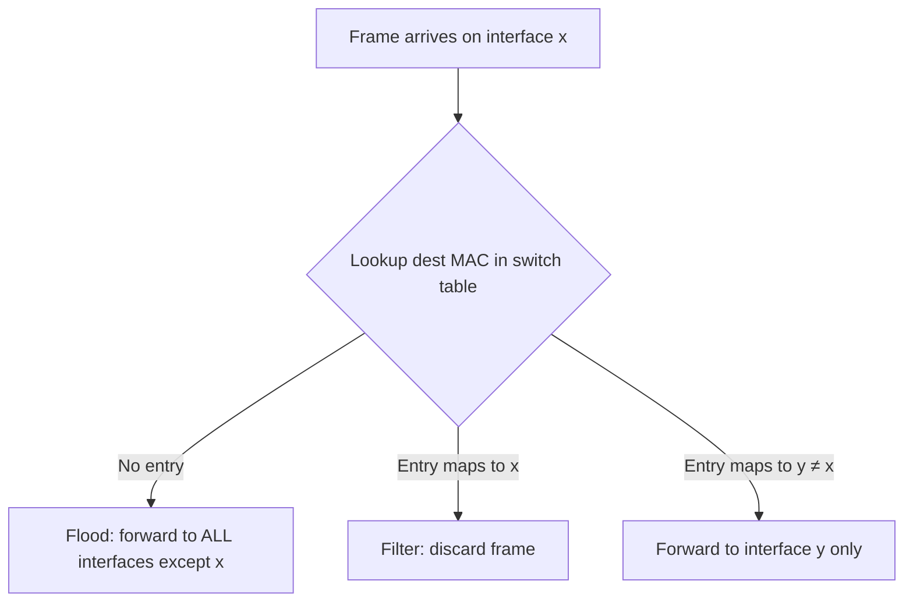

# 6.4 Switched Local Area Networks

Switches operate at the link layer (layer 2): forward frames using MAC addresses, not IP addresses; no routing protocols.

## 6.4.1 Link-Layer Addressing and ARP

### MAC Addresses

- Interfaces (not hosts/routers as a whole) have MAC addresses
- **Switch interfaces facing hosts/routers do NOT have MAC addresses** (switches are transparent)
- Also called: LAN address, physical address, MAC address
- **Size**: 6 bytes = 48 bits → 2^48 possible addresses
- **Notation**: hexadecimal pairs, e.g., `1A-23-F9-CD-06-9B`
- **Structure**: flat (no hierarchy) — doesn't change when device moves
- **IEEE-managed**: companies buy 2^24-address chunks (first 24 bits fixed by IEEE, last 24 bits assigned by company)
- Broadcast address: `FF-FF-FF-FF-FF-FF` (all 1s)

**MAC vs. IP:**

| MAC | IP |
|-----|-----|
| Flat address | Hierarchical (network + host) |
| Permanent (burned in) | Changes when host moves to new subnet |
| Link-layer (layer 2) | Network-layer (layer 3) |
| Analogy: social security number | Analogy: postal address |

**Why both?** LANs designed for arbitrary network-layer protocols, not just IP. Storing network-layer addresses in adapters would require reconfiguration on every move.

### Address Resolution Protocol (ARP)

**Purpose**: resolve IP address → MAC address within the same subnet (RFC 826)

- Like DNS but for link-layer addresses
- Only works within a single subnet (ARP for a node on another subnet returns error)
- Plug-and-play: ARP table builds automatically, no admin config

**ARP Table** (stored in each host/router):

```
IP Address       MAC Address         TTL
222.222.222.221  88-B2-2F-54-1A-0F  13:45:00
222.222.222.223  5C-66-AB-90-75-B1  13:52:00
```

- TTL typically 20 minutes; entries expire and are re-queried
- Table is partial: not all hosts may be in it

**ARP Query/Response Flow:**



**Sending off-subnet (via router):**
1. Source looks up next-hop router IP in forwarding table
2. ARP for router's MAC address (not destination host's MAC)
3. Frame sent to router's MAC; IP datagram inside still has final destination IP
4. Router receives, strips frame, consults its forwarding table, ARP for next-hop MAC, re-encapsulates in new frame

> ARP is a hybrid protocol — encapsulated in link-layer frames but contains network-layer addresses. Architecturally straddles the link/network boundary.

---

## 6.4.2 Ethernet

Dominant wired LAN technology. Standardized by IEEE 802.3 CSMA/CD working group.

### History

- **Mid-1970s**: Bob Metcalfe & David Boggs; coaxial bus, broadcast LAN
- **1980s–mid-1990s**: bus topology persists; CSMA/CD governs access
- **Late 1990s**: hub-based star topology; hub = physical-layer device, re-creates bits on all interfaces; still a broadcast LAN (collisions possible at hub)
- **Early 2000s**: switch replaces hub; collision-free, full-duplex, store-and-forward

### Ethernet Technologies (Acronym Key)

`<speed>BASE-<medium>`

- Speed: `10` = 10 Mbps, `100` = 100 Mbps, `1000` = 1 Gbps, `10G` = 10 Gbps, `40G` = 40 Gbps
- BASE = baseband (physical medium carries only Ethernet traffic)
- Medium: `T` = twisted-pair copper, `FX`/`SX`/`LX`/`BX` = fiber variants

| Standard | Speed | Notes |
|----------|-------|-------|
| 10BASE-2, 10BASE-5 | 10 Mbps | Coaxial cable, ≤500m segments |
| 10BASE-T | 10 Mbps | Twisted-pair |
| 100BASE-TX, 100BASE-FX | 100 Mbps | Multiple physical layer options; common MAC/frame |
| 1000BASE-T (IEEE 802.3z) | 1 Gbps | Cat5 UTP, fiber; full-duplex point-to-point |
| 10GBASE-T | 10 Gbps | |
| 40GBASE-T | 40 Gbps | Backward-compatible with Ethernet frame format |

Gigabit/40G Ethernet: full-duplex over point-to-point links → no collisions → MAC protocol unnecessary in switched deployments.

### Ethernet Frame Structure

```
┌──────────┬──────────┬──────────┬──────┬──────────────────┬─────┐
│ Preamble │  Dest    │  Source  │ Type │       Data       │ CRC │
│  8 bytes │ 6 bytes  │ 6 bytes  │2 bytes│  46–1500 bytes  │4 bytes│
└──────────┴──────────┴──────────┴──────┴──────────────────┴─────┘
```

**Field Details:**

| Field | Size | Purpose |
|-------|------|---------|
| Preamble | 8 bytes | First 7 bytes = `10101010` (sync clocks); 8th byte = `10101011` (signals start of frame) |
| Destination address | 6 bytes | Receiver's MAC; if `FF-FF-FF-FF-FF-FF` → broadcast |
| Source address | 6 bytes | Sender's MAC |
| Type | 2 bytes | Demultiplexing: identifies network-layer protocol (e.g., `0800` = IPv4, `0806` = ARP) |
| Data | 46–1500 bytes | Network-layer datagram; MTU = 1500 bytes; minimum 46 bytes (pad if needed) |
| CRC | 4 bytes | CRC-32 error detection; failed CRC → frame silently discarded |

**Ethernet service characteristics:**
- **Connectionless**: no handshake before sending
- **Unreliable**: no ACK/NAK; CRC failure → silent discard; gaps filled by TCP if needed

---

## 6.4.3 Link-Layer Switches

### Role
- Receive incoming frames, forward to outgoing interfaces
- **Transparent** to hosts/routers — no frame is addressed to the switch itself
- Output interfaces have buffers to handle rate mismatches

### Forwarding and Filtering

**Switch table entry**: (MAC address, interface, timestamp)

**Lookup logic** for frame with destination `DD-DD-DD-DD-DD-DD` arriving on interface x:



### Self-Learning

1. Switch table starts empty
2. For each incoming frame: record (source MAC, incoming interface, current time) in table
3. Age out entries: if no frame seen from a source MAC after `aging_time`, delete entry

**Properties of self-learning:**
- Plug-and-play: no admin configuration required
- Full-duplex: each interface can send and receive simultaneously
- Automatic recovery when hosts move or are replaced

### Properties of Link-Layer Switches

**Advantages over hubs/buses:**
- **Collision elimination**: no collisions; aggregate throughput = sum of all interface rates
- **Heterogeneous links**: different interfaces can run at different speeds and media types
- **Management**: detects jabbering adapters, isolates cable cuts, gathers statistics

### Switches vs. Routers

| Feature | Hub | Switch | Router |
|---------|-----|--------|--------|
| Traffic isolation | No | Yes | Yes |
| Plug and play | Yes | Yes | No |
| Optimal routing | No | No | Yes |
| Layer | 1 | 2 | 3 |
| Addressing | N/A | MAC | IP |
| Spanning tree restriction | N/A | Yes | No |
| Broadcast storm protection | No | No | Yes |

**When to use each:**
- Small networks (few hundred hosts): switches suffice — no IP config, low cost
- Large networks (thousands of hosts): routers needed — hierarchical addressing, broadcast containment, robust multi-path routing

**Switch drawbacks:**
- Active topology restricted to spanning tree (prevents broadcast frame cycles)
- Large switched networks → large ARP tables, heavy ARP traffic
- Susceptible to broadcast storms

**Router drawbacks:**
- Not plug-and-play (requires IP config)
- Higher per-packet processing (processes up through layer 3)

---

## 6.4.4 Virtual Local Area Networks (VLANs)

### Problem with Flat Switched LANs

1. **No traffic isolation**: broadcast traffic (ARP, DHCP, unknown destinations) floods entire network
2. **Inefficient switch usage**: 10 groups may each need separate switches
3. **Inflexible user management**: physical recabling required when users move

### Port-Based VLANs

- Network manager assigns each switch port to a VLAN
- Switch hardware only delivers frames between ports in the same VLAN
- Each VLAN = separate broadcast domain
- Undeclared ports → default VLAN

**Example**: 16-port switch, ports 2–8 → EE VLAN, ports 9–15 → CS VLAN

### Inter-VLAN Routing

- VLANs completely isolated by default
- Route between VLANs: connect a port to an external router OR use integrated switch+router (layer-3 switch)
- Datagram must cross VLAN → router → other VLAN (like separate subnets)

### VLAN Trunking (802.1Q)

When multiple switches need to carry multiple VLANs:

- **Naive approach**: one port per VLAN per switch → doesn't scale with N VLANs
- **Trunk port**: single port configured to carry all VLANs; frames tagged with VLAN ID

**802.1Q Frame Format:**

```
┌──────────┬──────┬──────┬────────────────┬──────────────────┬──────┐
│ Preamble │ Dest │  Src │   VLAN Tag (4B) │      Data        │ CRC' │
│          │      │      │ TPID(2B)|TCI(2B)│                  │      │
└──────────┴──────┴──────┴────────────────┴──────────────────┴──────┘
```

**VLAN Tag fields:**
- **TPID** (Tag Protocol Identifier): fixed value `0x8100` (2 bytes)
- **TCI** (Tag Control Information): 2 bytes total
  - 3-bit priority field (like IP TOS)
  - 12-bit VLAN identifier (allows up to 4096 VLANs)

**Trunk operation:**
- Sending switch: inserts VLAN tag before forwarding over trunk
- Receiving switch: parses and removes tag, delivers to correct VLAN port

### Other VLAN Types

- **MAC-based VLAN**: VLAN membership based on device MAC address
- **Protocol-based VLAN**: membership based on network-layer protocol (IPv4, IPv6, AppleTalk)
- **IP-extended VLAN**: VLANs spanning across IP routers (global scope)
- See IEEE 802.1Q standard for full details
