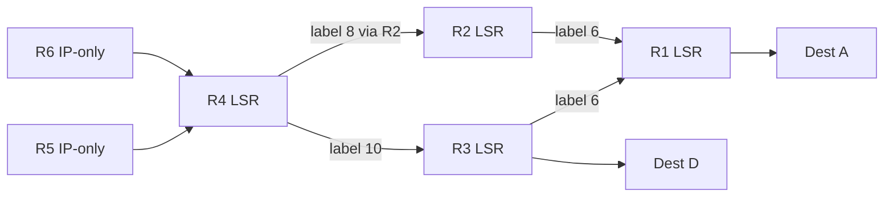

# 6.5 Link Virtualization: A Network as a Link Layer

## Concept

The "link" connecting two network-layer nodes can itself be a complex network:
- Dial-up modem: telephone network virtualized as a simple wire
- Switched Ethernet LAN: complex switched fabric looks like a single link to IP
- MPLS network: interconnects IP routers while appearing as a link-layer connection

## 6.5.1 Multiprotocol Label Switching (MPLS)

### Background

- Evolved mid-to-late 1990s to speed up IP forwarding using fixed-length labels (borrowed from virtual-circuit networks)
- Goal: augment IP, not replace it — labels coexist with IP addressing and routing
- Standardized by IETF: RFC 3031 (architecture), RFC 3032 (label stack encoding)
- Blends virtual-circuit techniques into a datagram routed network

### MPLS Frame Format

```
┌──────────────┬──────────────────────────────────┬───────────────┐
│  Layer-2     │         MPLS Header (4B)          │   IP Header   │
│  Header      │  Label(20b) | Exp(3b) | S(1b) | TTL(8b) │  + Payload │
│  (e.g. Eth.) │                                  │               │
└──────────────┴──────────────────────────────────┴───────────────┘
```

**MPLS Header Fields:**
- **Label** (20 bits): used for forwarding lookup instead of IP destination address
- **Exp** (3 bits): reserved for experimental use
- **S** (1 bit): bottom-of-stack indicator (1 = last MPLS header in a stack of headers)
- **TTL** (8 bits): time-to-live

**Key constraint**: MPLS frames can only travel between MPLS-capable routers (label-switched routers, LSRs). A non-MPLS router would be confused by the extra header.

### Forwarding Behavior

- **Label-switched router (LSR)**: looks up MPLS label in forwarding table → immediately sends to output interface (no longest-prefix IP lookup needed)
- Much faster than IP longest-prefix matching for forwarding-plane operations

### Label Distribution



- R1 advertises: "I can reach A; send me frames with label 6"
- R3 advertises: "I can reach A with label 10, D with label 12"
- R2 advertises: "I can reach A with label 8"
- R4 has two MPLS paths to A: via R3 (label 10) or via R2 (label 8)

Signaling protocol: RSVP-TE (RFC 3209, extension of RSVP); specified in RFC 3468 as IETF focus for MPLS signaling.

Routing info distribution: extended OSPF (or IS-IS) floods link-state info to MPLS routers; actual path computation algorithms are vendor-specific (not standardized).

### Traffic Engineering

**Core advantage over standard IP routing**: MPLS can force traffic along paths that IP routing would not choose.

- Standard IP: single least-cost path per destination
- MPLS: operator can split traffic for same destination across two different paths (for policy, load balancing, or performance)
- **Fast reroute**: pre-computed failover paths; reroute traffic in response to link failure without waiting for routing reconvergence (RFC 3469)
- **VPN support**: ISP uses MPLS to connect customer sites; isolates customer address space and resources from other users

### MPLS vs. SDN

- MPLS predates SDN; many of MPLS's traffic engineering capabilities can also be achieved via SDN (OpenFlow generalized forwarding, Chapter 4/5)
- Future coexistence vs. SDN replacing MPLS remains an open question
