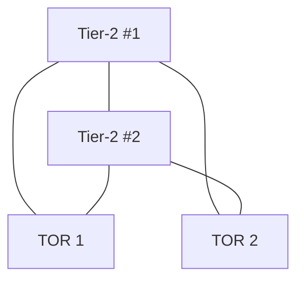

# 6.6 Data Center Networking

## Purpose of Data Centers

1. **Content delivery**: web pages, search, email, streaming video
2. **Massively parallel compute**: distributed index computation, big data processing
3. **Cloud computing**: IaaS/PaaS for external companies (AWS, Azure, Alibaba Cloud)

## Cost Breakdown (2009, 100,000-host DC, ~$12M/month)

| Category | % of Cost |
|----------|-----------|
| Hosts (replaced every 3–4 years) | ~45% |
| Infrastructure (UPS, generators, cooling) | ~25% |
| Electric utility | ~15% |
| Networking (gear, links, transit) | ~15% |

Networking is not the largest cost but is the key lever for performance and overall cost reduction.

## 6.6.1 Data Center Architectures

### Physical Layout

- **Blades**: commodity pizza-box hosts (CPU + memory + disk)
- **Rack**: 20–40 blades stacked
- **TOR (Top of Rack) switch**: one per rack; connects rack hosts to each other and up to the DC network
- Host NIC → TOR link: 40 Gbps or 100 Gbps Ethernet (current)
- Each host has a data-center-internal IP address

### Traffic Types

1. **External → internal**: client requests to hosted applications
2. **Internal → internal**: host-to-host traffic within DC (often dominant in cloud workloads)

### Load Balancing

- Each cloud application → publicly visible IP address
- **Load balancer** ("layer-4 switch"): distributes incoming requests across backend hosts
  - Decision based on: destination port (layer 4) + destination IP (layer 3)
  - Performs NAT-like translation: public IP ↔ internal host IP
  - Hides internal network structure from clients
  - Security benefit: prevents direct client-to-host contact

### Hierarchical Architecture

```
Internet
    │
┌───┴──────────────────┐
│  Border Routers      │
└───────┬──────────────┘
        │
┌───────┴──────────────┐
│  Access Routers      │
└───────┬──────────────┘
        │
┌───────┴──────────────┐
│  Tier-1 Switches     │ ← top-tier
└───────┬──────────────┘
        │
┌───────┴──────────────┐
│  Tier-2 Switches     │
└───────┬──────────────┘
        │
┌───────┴──────────────┐
│  TOR Switches        │ ← one per rack
└───────┬──────────────┘
        │
   [Racks of hosts]
```

- All links use Ethernet (mix of copper and fiber)
- Redundant equipment + redundant links for high availability
- Subnets localized below each access router; further partitioned into smaller VLAN subnets (~few hundred hosts) to contain ARP broadcast traffic

### Hierarchical Architecture Limitation: Bandwidth Bottleneck

**Problem**: hosts in same rack → 10 Gbps full rate. Hosts in different racks → bottleneck at higher-tier links.

**Example**: 40 simultaneous flows crossing a single 100 Gbps inter-tier link → each flow gets only 100/40 = 2.5 Gbps (vs. 10 Gbps NIC rate).

**Solutions:**
1. Deploy higher-rate switches/routers → very expensive
2. Co-locate related services/data in nearby racks → limited flexibility
3. **Increase interconnectivity**: connect each TOR to multiple tier-2 switches → multiple disjoint paths → increased aggregate capacity and reliability

### Highly Interconnected (Full Mesh) Topology



- Facebook DC: each TOR → 4 different tier-2 switches (in 4 "spline planes"); each tier-2 → 4 of 48 tier-1 switches per plane; 4 planes total
- Google Jupiter: TOR has 48 downlinks to servers + uplinks to 8 tier-2 switches; tier-2 has links to 256 TORs + 16 tier-1 switches

### Clos Networks

Multi-switch layered (tiered, multistage) interconnection networks = **Clos networks**
- Named after Charles Clos (studied in telephony context, 1953)
- Rich theoretical foundation; widely used in DC networking and multiprocessor interconnects
- Provides non-blocking or rearrangeably non-blocking switching fabric

### Multipath Routing

Increased connectivity → multipath routing becomes default:
- **ECMP (Equal Cost Multi Path)** (RFC 2992): randomized next-hop selection at each switch
- Advanced fine-grained load balancing (Alizadeh 2014, Noormohammadpour 2018)
- Packet-level multipath routing (He 2015, Raiciu 2010)

## 6.6.2 Trends in Data Center Networking

### Centralized SDN Control

- Single administrative authority → natural fit for logically centralized control
- Google, Microsoft, Facebook: SDN-like control with clear data/control plane separation
- Commodity switch hardware (merchant silicon) + software control plane
- Automated configuration and operational state management at scale

### Virtualization

- **VMs** decouple applications from physical hardware
- VM live migration: move VMs between physical servers (possibly different racks) while maintaining network connections
- Standard Ethernet/IP limitations for VM migration
- **Solution**: treat entire DC network as single flat layer-2 network
  - Modified ARP: DNS-style query instead of broadcast
  - Directory maintains IP → (physical switch, location) mapping for all VMs
  - Scalable schemes: [Mysore 2009, Greenberg 2009b]

### Physical Constraints

- Links: 40 Gbps and 100 Gbps commonplace; delays in microseconds
- Small buffers → congestion control must react extremely fast
- TCP and variants don't scale well in DC environment
- Solutions:
  - DC-specific TCP variants (DCTCP [Alizadeh 2010])
  - RDMA over standard Ethernet (RoCE) [Zhu 2015; Moshref 2016; Guo 2016]
  - Decoupled flow scheduling from rate control [Alizadeh 2013, Hong 2012]

### Hardware Modularity (MDC — Modular Data Centers)

- **Shipping container-based**: factory builds mini-DC in 12m container (up to few thousand hosts in tens of racks)
- Containers interconnected at data center site
- Designed for **graceful degradation**: components fail over time but container keeps running at reduced capacity; replaced wholesale when below performance threshold
- Two network levels:
  - Container-internal: fully connected using commodity Gigabit Ethernet
  - Core network between containers: challenging (high bandwidth across large number of containers)
- Hybrid electrical/optical architecture for container interconnects [Farrington 2010]

### Customization

- Largest cloud providers build/customize everything in-house:
  - NICs, TOR switches, tier-1/2 switches, routers, software, protocols
  - Use commodity merchant silicon [Greenberg 2015; Singh 2015]
- **Availability zones** (pioneered by Amazon): replicate distinct DCs in nearby buildings (few km apart)
  - Synchronize transactional data across zones
  - Fault tolerance without high latency
