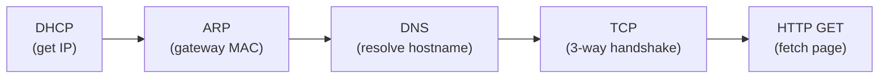

# 6.7 Retrospective: A Day in the Life of a Web Page Request

**Scenario**: Bob boots laptop, connects to school Ethernet switch, downloads `www.google.com`.

**Network setup:**
- School Ethernet switch → school router → Comcast ISP → Internet → Google
- DHCP server runs inside school router
- DNS server in Comcast network (68.87.71.226)
- Bob's laptop MAC: `00:16:D3:23:68:8A`
- Router's school-side MAC: `00:22:6B:45:1F:1B`

---

## Phase 1: Getting an IP — DHCP

```
Step 1  OS creates DHCP request
        UDP: src port 68 (DHCP client), dst port 67 (DHCP server)
        IP: src 0.0.0.0 (no IP yet), dst 255.255.255.255 (broadcast)
        Eth: dst FF:FF:FF:FF:FF:FF, src 00:16:D3:23:68:8A

Step 2  Ethernet frame broadcast → switch floods all ports → reaches router

Step 3  Router (DHCP server) extracts DHCP request from UDP segment

Step 4  DHCP server allocates IP: 68.85.2.101
        DHCP ACK contains:
          - Bob's IP: 68.85.2.101
          - DNS server IP: 68.87.71.226
          - Default gateway: 68.85.2.1
          - Subnet: 68.85.2.0/24
        Response: unicast Eth frame dst 00:16:D3:23:68:8A

Step 5  Switch forwards DHCP ACK to Bob's laptop (self-learned Bob's port)

Step 6  Bob's DHCP client records:
          - Own IP: 68.85.2.101
          - DNS server: 68.87.71.226
          - Default gateway: 68.85.2.1 (installed in IP forwarding table)
```

---

## Phase 2: DNS Lookup — ARP then DNS

```
Step 7  Bob types www.google.com → browser needs IP address
        OS creates DNS query: "www.google.com" in question section
        UDP: dst port 53 (DNS), src port ephemeral
        IP: dst 68.87.71.226 (DNS server), src 68.85.2.101

Step 8  Bob needs MAC of default gateway (68.85.2.1) to send DNS query
        → ARP query
        ARP: target IP 68.85.2.1
        Eth: dst FF:FF:FF:FF:FF:FF (broadcast)

Step 9  Router receives ARP query, finds 68.85.2.1 matches its interface
        ARP reply: "68.85.2.1 is at 00:22:6B:45:1F:1B"
        Eth: dst 00:16:D3:23:68:8A (unicast to Bob)

Step 10 Bob records: 68.85.2.1 → 00:22:6B:45:1F:1B

Step 11 Bob sends DNS query in frame:
        Eth dst: 00:22:6B:45:1F:1B (gateway router MAC)
        IP dst:  68.87.71.226 (DNS server IP)
```

---

## Phase 3: Routing to DNS Server

```
Step 12 School router receives frame, extracts IP datagram
        Forwarding table lookup → send toward Comcast leftmost router
        Encapsulates in appropriate link-layer frame for that link

Step 13 Comcast routers forward datagram toward DNS server
        Forwarding table populated by OSPF/RIP (intra-domain) + BGP (inter-domain)

Step 14 DNS server receives query, looks up "www.google.com"
        Finds cached A record: 64.233.169.105
        DNS reply in UDP segment → IP datagram → back through Comcast → school → Bob

Step 15 Bob extracts IP address of www.google.com: 64.233.169.105
```

---

## Phase 4: TCP Connection — Three-Way Handshake

```
Step 16 Bob creates TCP SYN segment
        TCP: dst port 80 (HTTP), src port ephemeral
        IP: dst 64.233.169.105 (google.com), src 68.85.2.101
        Eth: dst 00:22:6B:45:1F:1B (gateway router)

Step 17 School, Comcast, Google routers forward based on IP forwarding tables
        (inter-domain: BGP determines Comcast↔Google link forwarding)

Step 18 Google server: TCP SYN arrives at port 80, creates connection socket
        Sends TCP SYNACK → Bob's laptop

Step 19 Bob's laptop: receives SYNACK, TCP socket enters CONNECTED state
```

---

## Phase 5: HTTP Request and Response

```
Step 20 Bob's browser creates HTTP GET for www.google.com home page
        Writes to TCP socket → TCP segment → IP datagram → Eth frame → gateway
        Routed through school → Comcast → Google

Step 21 Google HTTP server reads GET from TCP socket
        Creates HTTP response with HTML content
        Writes to TCP socket

Step 22 HTTP response datagram routed back through Google → Comcast → school → Bob

Step 23 Bob's browser reads HTTP response from socket
        Parses HTML, renders page
```

---

## Protocol Stack Summary



| Step | Protocols Active |
|------|-----------------|
| IP assignment | DHCP, UDP, IP (broadcast), Ethernet |
| Gateway MAC resolution | ARP, Ethernet |
| DNS query | DNS, UDP, IP, ARP, Ethernet |
| Routing to DNS | IP, OSPF/RIP, BGP |
| TCP handshake | TCP, IP, Ethernet (each hop) |
| HTTP exchange | HTTP, TCP, IP, Ethernet |

**Omitted but real-world relevant**: NAT (at school gateway), wireless access, TLS/HTTPS, DNS hierarchy (recursive resolvers → authoritative), web caching, network management protocols.
