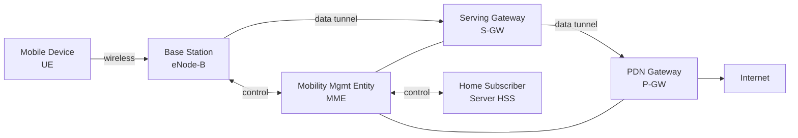

# 7.4 Cellular Networks: 4G and 5G

## Overview
- 4G coverage: >90% of time in US; 95–99.5% in Korea; download speeds ≥20 Mbps
- **Cell** — geographic coverage area; each cell has a base station
- 4G LTE standard: defined by 3GPP Technical Specifications [3GPP 2020]
- All-IP architecture; reflects Internet architectural principles (layering, edge/core separation, data/control plane separation)

## 7.4.1 4G LTE Architecture and Elements



### Network Elements

| Element | LTE Name | Role | WLAN Equivalent |
|---|---|---|---|
| Mobile Device | UE (User Equipment) | End-system running apps; full IP stack; has IMSI on SIM card | Host |
| Base Station | eNode-B | Wireless access + radio resource mgmt; creates device-specific IP tunnels; coordinates with nearby BSes for interference mgmt | AP (but does much more) |
| Mobility Management Entity | MME | Control plane: authentication, tunnel setup, cell location tracking, paging | AP (partial) |
| Home Subscriber Server | HSS | Database: subscriber info, auth keys, access privileges, billing | No WLAN equivalent |
| Serving Gateway | S-GW | Data plane router in carrier network; terminates tunnel from base station | iBGP/eBGP router |
| PDN Gateway | P-GW | Last LTE element before Internet; provides NAT addresses to devices; performs NAT | Access ISP gateway |

### IMSI (International Mobile Subscriber Identity)
- Globally unique 64-bit identifier on SIM card
- Identifies subscriber + home country + home carrier
- Analogous to a MAC address

### Authentication (MME + HSS)
- MME acts as middleman between mobile and home HSS
- Mutual authentication: network proves to device it's legitimate; device proves its IMSI identity
- When roaming: visited MME contacts home HSS

### Data Path
- Mobile ↔ Base Station (wireless hop)
- Base Station ↔ S-GW (IP tunnel, GTP)
- S-GW ↔ P-GW (IP tunnel, GTP)
- Tunnels use **Tunnel Endpoint ID (TEID)** in GTP header
- Tunnel setup controlled by MME; when device moves, only base-station-side tunnel endpoint changes

### Cell Location Tracking
- Active device: base stations track location, update MME
- Sleeping device: MME responsible; uses **paging** to find device

## 7.4.2 LTE Protocol Stacks

User-plane stack at mobile device (link layer has 3 sublayers):

```
App → TCP/UDP → IP → [PDCP → RLC → MAC] → Physical
```

| Sublayer | Full Name | Functions |
|---|---|---|
| PDCP | Packet Data Convergence Protocol | IP header compression; encryption/decryption of IP datagrams |
| RLC | Radio Link Control Protocol | Fragmentation + reassembly of large IP datagrams; ARQ-based link-layer reliable data transfer |
| MAC | Medium Access Control | Transmission scheduling (request + use of radio time slots); FEC (redundant bit transmission); error detection/correction |

- **GTP (GPRS Tunneling Protocol)** used for tunnels between base station ↔ S-GW
- Each tunnel identified by TEID; datagrams encapsulated in GTP → sent in UDP segments

## 7.4.3 LTE Radio Access Network

- Downstream channel: **OFDM (Orthogonal Frequency Division Multiplexing)**
  - Combination of FDM + TDM
  - "Orthogonal" = signals on different frequencies interfere very little even when tightly spaced
- Each active mobile allocated one or more **0.5 ms time slots** in one or more frequencies
- 20 slots × 0.5 ms = 10 ms frames per frequency (Fig 7.22)
- Slot reallocation can occur as often as **once per millisecond**
- Scheduling algorithm not mandated by standard — vendor/operator choice
- **Opportunistic scheduling** — match physical-layer protocol to current channel conditions; choose receivers based on channel state
- **LTE-Advanced** — allocates aggregated channels → hundreds of Mbps downstream

## 7.4.4 Network Attachment and Power Management

### Network Attachment (3 Phases)

**Phase 1 — Attachment to Base Station:**
- Device searches all channels/frequencies for **primary synchronization signal** (broadcast every 5 ms)
- Locates **secondary synchronization signal** → learns channel bandwidth, configurations, carrier info
- Selects base station (prefers home network if available)
- Establishes control-plane signaling channel with base station

**Phase 2 — Mutual Authentication:**
- Base station contacts local MME
- MME performs mutual authentication with HSS in device's home network
- MME + device mutually authenticated; MME knows which base station mobile is attached to

**Phase 3 — Data Path Configuration:**
- MME contacts P-GW (provides NAT address), S-GW, and base station
- Establishes two tunnels (base station ↔ S-GW; S-GW ↔ P-GW)
- Device can now send/receive IP datagrams via tunnels to Internet

### Power Management: Sleep Modes

| State | Trigger | Behavior |
|---|---|---|
| Discontinuous Reception | ~hundreds of ms of inactivity | Device + base station pre-schedule periodic wakeups (hundreds of ms apart); device monitors channel at scheduled times; radio sleeps otherwise |
| Idle State | 5–10 seconds of inactivity | "Deep sleep"; wakes even less frequently; device may move cells without informing base station; must re-associate on wakeup; MME pages via base stations near last known location |

## 7.4.5 Global Cellular Network: A Network of Networks

- Mobile device → home carrier network (e.g., Verizon, AT&T, T-Mobile, Orange, SK Telecom)
- Home network connects to other carriers and global Internet via gateway routers
- Carrier networks interconnect via **public Internet** or **IPX (Internet Protocol Packet eXchange) Network**
  - IPX: managed network specifically for carrier interconnection (analogous to IXPs for ISPs)
- 4G networks can peer with 3G voice/data and earlier voice-only 2G networks
- Global cellular network is a **"network of networks"** — same concept as the Internet

## 7.4.6 5G Cellular Networks

### Goals
- ~10× increase in peak bitrate vs. 4G
- ~10× decrease in latency
- ~100× increase in traffic capacity

### 5G Standards (Three Co-existing)

| Standard | Target | Key Features |
|---|---|---|
| **eMBB** (Enhanced Mobile Broadband) | Rich media applications | Higher bandwidth; moderate latency reduction; AR/VR, 4K/360° video |
| **URLLC** (Ultra Reliable Low-Latency Communications) | Factory automation, autonomous driving | Target latency: **1 ms**; still being standardized |
| **mMTC** (Massive Machine Type Communications) | IoT sensing, metering, monitoring | Narrowband; lower power requirements |

### Frequency Bands
| Band | Range | Notes |
|---|---|---|
| FR1 | 450 MHz – 6 GHz | Most early deployments; backward-compatible spectrum approach |
| FR2 (mmWave) | 24 GHz – 52 GHz | Much higher capacity; shorter range; susceptible to atmospheric interference (rain, foliage) |

**Note:** 5G physical layer is **not backward-compatible** with 4G LTE; requires new infrastructure.

### 5G Capacity Formula
```
capacity (bps/km²) = cell_density (cells/km²) × available_spectrum (Hz) × spectral_efficiency (bps/Hz/cell)
```
5G improves all three factors:
- **Cell density ↑** — mmWave shorter range → more base stations needed
- **Available spectrum ↑** — FR2 = 28 GHz band vs. ~2 GHz for 4G
- **Spectral efficiency ↑** — Massive MIMO + beamforming (vs. 17× power increase to double efficiency via theory alone); supports 10–20 simultaneous users per frequency band
- Small cells fill coverage gaps; distance between small cells: 10–100 m in dense areas

### 5G Core Network Changes
- All virtualized software-based network functions (NFV)
- Complete **control/user-plane separation** (CUPS)
- Network slicing for different applications
- Distributed servers/caches pushed to network edge → reduced latency
- MME decomposed into two functions:
  - **AMF (Access and Mobility Management Function)** — connection + mobility management
  - **SMF (Session Management Function)** — session management; IP address management (acts as DHCP); interacts with decoupled data plane
- **UPF (User-Plane Function)** — distributed packet processing at network edge
