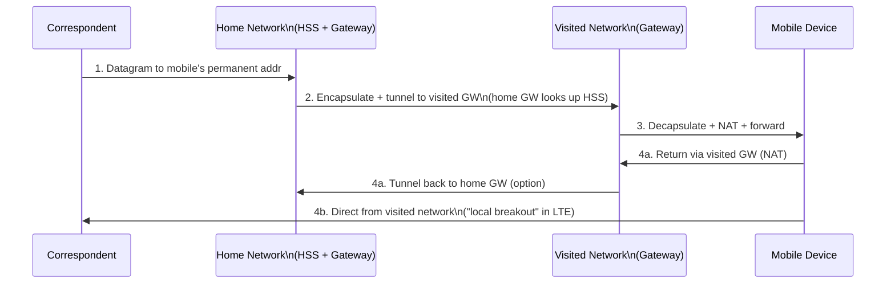
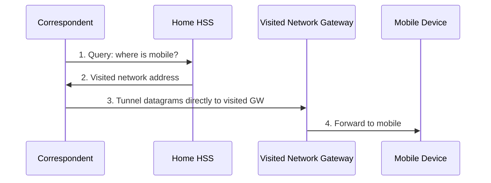

# 7.5 Mobility Management: Principles

## 7.5.1 Device Mobility: Network-Layer Perspective

Four scenarios on the mobility spectrum (Fig 7.24):

| Scenario | Description | Network-layer mobility? |
|---|---|---|
| (a) | Device powers off between networks; serially associates with each | None — handled by existing mechanisms |
| (b) | Device physically moves but stays on same access network | None from network-layer perspective |
| (c) | Device changes access network (WLAN/LTE cell) while maintaining active IP connections | Yes — requires **handover** |
| (d) | Device roams between multiple provider networks while active | Yes — requires inter-provider coordination |

- Real interest starts at scenario (c): **handover** required
- Scenario (d): providers must orchestrate handover together → considerably more complex

## 7.5.2 Home Networks and Roaming on Visited Networks

- Every cellular subscriber has a **home network** with a cellular carrier
- **HSS** (Home Subscriber Service) stores per-subscriber info: device ID (IMSI on SIM), accessible services, cryptographic keys, billing info
- When connected outside home network → device is **roaming on a visited network**
- Home network provides:
  1. Single authoritative location for device information
  2. Coordination point for communications to/from roaming device

**Internet analogy (Mobile IP was proposed but has limited deployment):**
- Eduroam provides authenticated network access across visited IP networks
- No deep architectural notion of home/visited networks in the Internet itself

## 7.5.3 Direct and Indirect Routing to/from a Mobile Device

### Mobile device has two identifiers (in 4G context):
- **Permanent identifier**: IMSI + phone number (on SIM), or permanent IP address (Mobile IP)
- **Transient identifier**: care-of-address or NAT address in visited network

### Approach 1: Leverage Existing IP Infrastructure (BGP)
- Visited network advertises specific /32 host route for mobile device via BGP
- All datagrams routed to visited network via longest-prefix match
- Old visited network withdraws route; new one advertises when mobile moves
- **Fatal flaw: scalability** — billions of mobile device routes in every router's table, with frequent updates

### Approach 2: Indirect Routing (push mobility to edge via home network)

**Protocols required:**
- Mobile ↔ visited network: **association/disassociation protocol**
- Visited network → home HSS: **registration protocol** (update mobile's location)
- Home gateway ↔ visited gateway: **datagram tunneling protocol** (encapsulation/decapsulation + NAT)

**When mobile moves between visited networks:** update HSS in home network; change home-gateway-to-visited-gateway tunnel endpoint.

**Loss during handover:** typically small; end-to-end mechanisms (TCP) recover from any dropped datagrams.

### Approach 3: Direct Routing

**Advantages:** eliminates **triangle routing** inefficiency

**Additional challenges:**
1. Correspondent needs a **mobile-user location protocol** to query HSS (steps 1–2)
2. When mobile moves to new visited network: need to proactively notify correspondent (HSS is only queried at session start)
   - More complex protocol mechanisms required

### Triangle Routing Problem
- Indirect routing: correspondent → home network → visited network, even when they are nearby
- Worst case: mobile roaming on same network as correspondent, yet datagrams bounce via home network overseas
