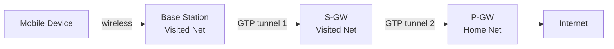
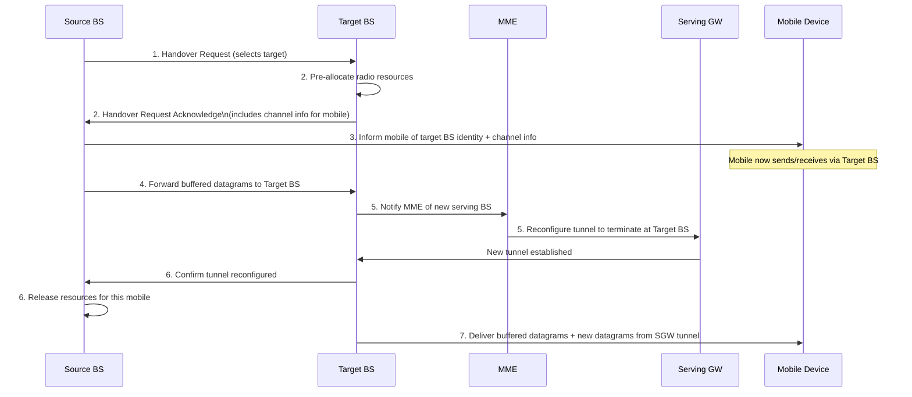

# 7.6 Mobility Management in Practice

## 7.6.1 Mobility Management in 4G/5G Networks

### Scenario
Mobile user (in a car) with smartphone:
1. Attaches to visited 4G/5G network
2. Streams HD video from remote server
3. Moves from one base station's cell to another

### Four Major Steps (Fig 7.28)

**Step 1: Mobile Device and Base Station Association**
- Device listens on all frequencies for primary synchronization signal (broadcast every 5 ms by each BS)
- Selects base station; bootstraps control-signaling channel
- Provides **IMSI** to base station (uniquely identifies device + home network)

**Step 2: Control-Plane Configuration of Network Elements**
- Base station contacts local **MME** in visited network
- MME:
  - Retrieves auth/encryption/service info using IMSI (from local cache, nearby MME, or home HSS)
  - Performs **mutual authentication** with home HSS
  - Informs home **HSS** that device is now in visited network → HSS updates database
  - Device + base station negotiate parameters for data-plane channel

**Step 3: Data-Plane Configuration — Forwarding Tunnels**
Two tunnels established (Fig 7.29):
- Tunnel 1: Base Station ↔ Serving Gateway (S-GW) [in visited network]
- Tunnel 2: S-GW ↔ PDN Gateway (P-GW) [in mobile's **home network**]

- **Indirect routing**: all traffic tunneled through home network's P-GW
- Tunnels use **GPRS Tunneling Protocol (GTP)**; each tunnel has a **TEID (Tunnel Endpoint ID)**
- TEID allows multiplexing/demultiplexing of multiple flows between tunnel endpoints
- **Local breakout** (alternative, rarely deployed): S-GW tunnels to P-GW in local visited network instead

**Step 4: Handover Management**

**Key points:**
- Target BS pre-allocates resources → avoids time-consuming full association protocol → fast handover
- Source BS temporarily forwards tunneled datagrams to target BS during transition
- PDN Gateway remains unaware of device mobility (for simple same-network handovers)
- Handover trigger: signal degradation OR cell overload
- Device periodically measures beacon signals from current + nearby BSes; reports once or twice per second to current BS
- Handover decision algorithm not specified by standard; active research area

### Inter-Network Handover (Visited Network A → Visited Network B)
More complex; requires coordination between:
- Source BS in visited net A
- Target BS in visited net B
- MMEs in both visited networks + home network HSS
- S-GW + P-GW endpoint reconfiguration
- 5G will make handover even more critical (denser, smaller cells)

### 5G and SDN
- 5G control plane migration to SDN framework → higher capacity, lower latency handover implementation

---

## 7.6.2 Mobile IP

### Status
- Standardized in RFC 5944 for IPv4
- ~20 years of standardization but **limited real-world deployment**
- Reasons: 2G/3G/4G cellular solved mobility for phones; Internet + WiFi served stationary/locally-mobile use cases
- Similar principles to 4G/5G but applied to Internet context

### Architecture Comparison

| 4G/5G Element | Mobile IP Element |
|---|---|
| Home network | Home network |
| Visited network | Foreign network |
| IMSI | Permanent IP address |
| Home Subscriber Service (HSS) | Home agent |
| MME in visited network | Foreign agent |
| Data plane: indirect forwarding via home network, GTP tunnels | Indirect forwarding via home network, IP-in-IP tunnels [RFC 2003, RFC 2004] |
| Base Station (eNode-B) | Access Point (AP) |
| Radio Access Network | WLAN (no specific technology specified) |

### Three Components of Mobile IP Standard

1. **Agent discovery** — foreign agent advertises mobility services to arriving mobile devices; provides **care-of-address**; registers mobile with home agent

2. **Registration with home agent** — protocols for mobile device and/or foreign agent to register/deregister a care-of-address with the home agent

3. **Indirect routing of datagrams** — home agent forwards datagrams to mobile device using tunneling; rules for error conditions and several tunneling forms [RFC 2003, RFC 2004]

### Care-of-Address
- Transient address allocated to mobile device in the foreign network
- Home agent tunnels datagrams from correspondent to the care-of-address at the foreign agent
- Foreign agent decapsulates and delivers to mobile device
