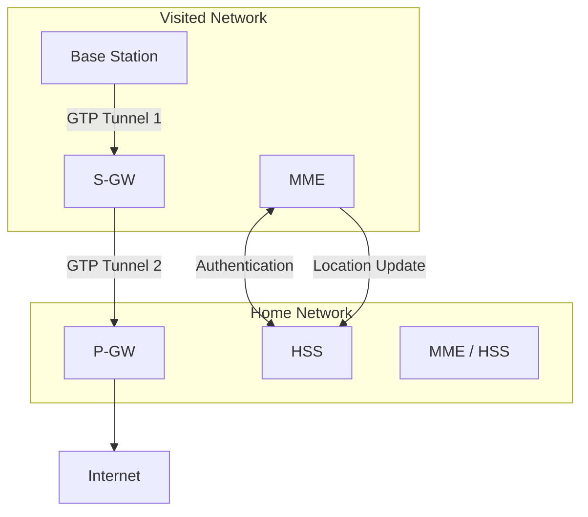

# 7.7 Managing Mobility in Cellular Networks

> Note: The textbook's section 7.7 is titled "Wireless and Mobility: Impact on Higher-Layer Protocols" — this content is captured in `7.8-impact-on-higher-layers.md`. The 4G/5G mobility management detail is in section 7.6.1 of the text, documented in `7.6-mobile-ip.md`.

## Summary of 4G/5G Mobility Management

Mobility management in 4G/5G involves three planes of activity:

### Control Plane (MME-driven)
- Device attachment: IMSI-based registration, mutual authentication via HSS
- HSS database update: tracks which visited network holds each mobile
- Tunnel configuration: MME orchestrates S-GW ↔ P-GW and BS ↔ S-GW tunnel setup
- Paging: locating idle/sleeping mobiles via broadcast paging messages to nearby base stations

### Data Plane (Tunnel-driven)
- All user traffic flows through GTP tunnels
- Indirect routing via home P-GW (symmetric)
- TEID per tunnel allows flow multiplexing
- Handover → only BS-side tunnel endpoint changes; S-GW ↔ P-GW tunnel unchanged

### Roaming Architecture

### Handover Within Single Network (Summary)
1. Source BS selects target BS, sends Handover Request
2. Target BS pre-allocates resources, sends Handover Request Ack
3. Source BS informs mobile of target BS channel info → mobile connects to target BS
4. Source BS forwards buffered datagrams to target BS
5. Target BS notifies MME → MME reconfigures S-GW tunnel endpoint to target BS
6. Target BS confirms to source BS → source BS releases resources
7. Target BS delivers queued + new datagrams to mobile

### Key Entities and Their Mobility Roles

| Entity | Mobility Role |
|---|---|
| Mobile Device | Initiates association; provides IMSI; measures signal strength; switches BS on handover |
| Base Station | Tracks active device location; reports to MME; initiates handover; buffers datagrams during handover |
| MME | Control hub: auth, HSS updates, tunnel orchestration, paging for sleeping devices |
| HSS | Authoritative store of device location (visited network) + subscriber credentials |
| S-GW | Visited-network data-plane anchor; tunnel endpoint changes on handover |
| P-GW | Home-network data-plane anchor; stable endpoint; provides NAT; connects to Internet |
