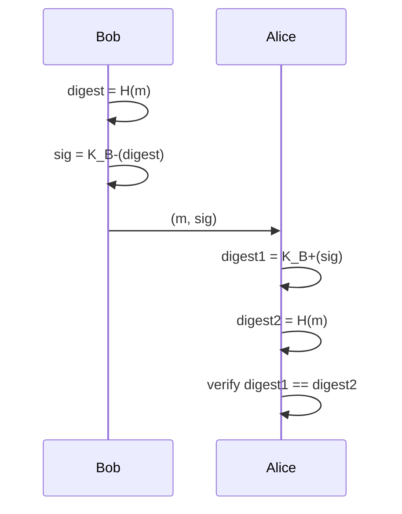

# 8.3 Message Integrity and Digital Signatures

## Goals

Verify that:
1. Message originated from claimed sender
2. Message was not tampered with in transit

## 8.3.1 Cryptographic Hash Functions

**Hash function**: `H(m)` — takes arbitrary-length input, produces fixed-length output ("fingerprint")

**Cryptographic requirement** (beyond ordinary checksum):
- Computationally infeasible to find any two messages `x ≠ y` such that `H(x) = H(y)`

**Why simple checksums fail**: "IOU100.99BOB" and "IOU900.19BOB" can produce the same 4-byte checksum — an attacker can craft a different message with identical checksum.

### Hash Algorithms

| Algorithm | Output Size | Notes |
|---|---|---|
| MD5 (RFC 1321) | 128 bits | 4-step process: pad → append length → init accumulator → loop over 16-word blocks |
| SHA-1 (FIPS 1995) | 160 bits | US federal standard; based on MD4 principles |
| SHA-256/SHA-3 | 256+ bits | Stronger; used in modern protocols |

## 8.3.2 Message Authentication Code (MAC)

**Problem with hash alone**: Trudy can create bogus `m'` and send `(m', H(m'))` — Bob can't detect fraud.

**Solution**: shared authentication key `s`

**MAC computation**:
```
MAC = H(m + s)    # concatenate message with shared secret, then hash
```

**Protocol**:
1. Alice sends `(m, H(m+s))`
2. Bob computes `H(m+s)` using shared `s`
3. If match → message is authentic and unaltered

**Key properties**:
- Does NOT require encryption
- Both parties need shared key `s`
- MAC ("message authentication code") ≠ MAC ("medium access control" in link layer)

### HMAC

- Standardized MAC algorithm (RFC 2104)
- Runs data and authentication key through hash function **twice**
- Works with MD5 or SHA-1
- Used in: OSPF, TLS, IPsec

**Key distribution problem**: How to securely distribute shared authentication key `s`? Use public key encryption to deliver it.

## 8.3.3 Digital Signatures

**Goal**: bind a message to its sender in a verifiable and non-forgeable way.

### Why MACs Don't Suffice for Signatures

MACs require a shared key — anyone who knows the key could have created it. A digital signature must be unique to one party.

### Digital Signature with RSA

Bob signs document `m` using his **private key**:
```
signature = K_B-(m)
```

Alice verifies using Bob's **public key**:
```
K_B+(K_B-(m)) = m   ✓
```

**Provides**:
- **Verifiability**: Anyone with Bob's public key can verify
- **Non-forgeability**: Only Bob knows `K_B-`
- **Message integrity**: If `m` is modified to `m'`, `K_B+(K_B-(m)) ≠ m'`

### Efficient Digital Signatures (with Hash)

Signing the full message is expensive. In practice, sign the hash:

```
signature = K_B-(H(m))
```

**Sending a signed message** (Figure 8.11 pattern):
```
Bob:   digest = H(m)
       sig    = K_B-(digest)
       send   (m, sig)

Alice: digest1 = K_B+(sig)        # decrypt signature
       digest2 = H(m)             # hash received message
       if digest1 == digest2 → authentic and unmodified
```



### MAC vs Digital Signature

| Property | MAC | Digital Signature |
|---|---|---|
| Requires encryption | No | Yes (public key) |
| Shared key needed | Yes | No |
| Non-repudiation | No | Yes |
| Requires PKI | No | Yes |
| Examples | OSPF, TLS, IPsec | PGP |

## Public Key Certification

**Problem**: Trudy can give Alice her own public key while claiming it's Bob's.

### Certification Authority (CA)

**CA roles**:
1. Verifies identity of entity (person, router, etc.)
2. Creates a **certificate** that binds the entity's public key to its identity
3. Signs the certificate with the CA's private key `K_CA-`

**Certificate fields** (X.509 / RFC 1422):

| Field | Description |
|---|---|
| Version | X.509 spec version number |
| Serial number | CA-issued unique identifier |
| Signature | Algorithm used by CA to sign certificate |
| Issuer name | CA identity in Distinguished Name (DN) format |
| Validity period | Start and end dates |
| Subject name | Entity identity in DN format |
| Subject public key | Public key + algorithm identifier |

**Verification flow**:
```
Alice receives Bob's certificate
  → applies K_CA+ to certificate signature
  → extracts Bob's public key
  → knows it genuinely belongs to Bob
```

**Standards**: ITU X.509, RFC 1422 (used with IPsec and TLS)
