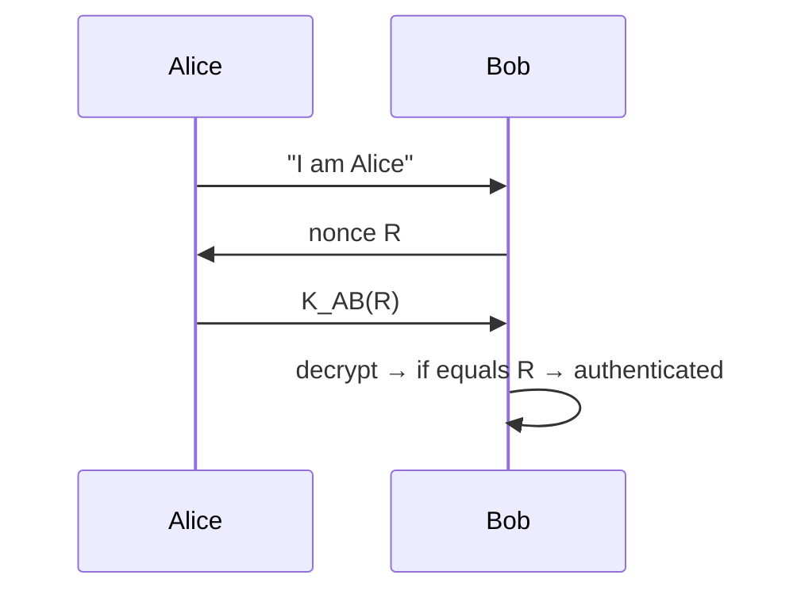

# 8.4 End-Point Authentication

## Goal

Prove the identity of a **live** party at the moment communication occurs — distinct from verifying a stored message's origin (Section 8.3).

Authentication must be done solely via messages and data — no biometric cues.

## Protocol Evolution

### ap1.0 — Plain Identity Claim

```
Alice → Bob: "I am Alice"
```
**Flaw**: Anyone (Trudy) can send "I am Alice".

### ap2.0 — IP Source Address Check

```
Alice → Bob: "I am Alice" [source IP = Alice's IP]
```
**Flaw**: IP spoofing — trivial to forge source IP in a crafted datagram. Trudy builds her own IP datagram with Alice's source address and sends it to Bob.

### ap3.0 — Password Authentication

```
Alice → Bob: "I am Alice" + Alice's password (plaintext)
```
**Flaw**: Eavesdropping. Trudy sniffs the password off the wire.

### ap3.1 — Encrypted Password

```
Alice → Bob: "I am Alice" + K_{A-B}(password)
```
**Flaw**: **Playback attack** (replay attack). Trudy records `K_{A-B}(password)` and replays it later. Trudy doesn't need to know the actual password.

### ap4.0 — Nonce-Based Challenge-Response

A **nonce** is a number used only once in a protocol's lifetime.

```
1. Alice → Bob: "I am Alice"
2. Bob  → Alice: R          (nonce)
3. Alice → Bob: K_{A-B}(R)  (encrypted nonce)
4. Bob decrypts K_{A-B}(R); if result = R → Alice authenticated
```

**Why this works**:
- Alice proves she knows `K_{A-B}` (by encrypting `R` correctly)
- Alice proves she is **live** (she encrypted a nonce Bob just generated — not a recording)



## Summary Table

| Protocol | Mechanism | Attack Defeated | Vulnerability |
|---|---|---|---|
| ap1.0 | Name only | — | Identity spoofing |
| ap2.0 | IP address | Very naive spoofing | IP spoofing |
| ap3.0 | Password plaintext | — | Eavesdropping |
| ap3.1 | Encrypted password | Eavesdropping | Replay attack |
| ap4.0 | Nonce + symmetric key | Replay attack | Requires shared key |

## Key Points

- **Nonce** solves the replay problem: Bob generates a fresh challenge each session
- TCP's three-way handshake solves the same problem using ISN (Initial Sequence Number)
- ap4.0 requires a pre-shared symmetric key `K_{A-B}` — key distribution is still a challenge
- Public key variant: Alice returns `K_A-(R)` (signed nonce); Bob verifies with `K_A+`
