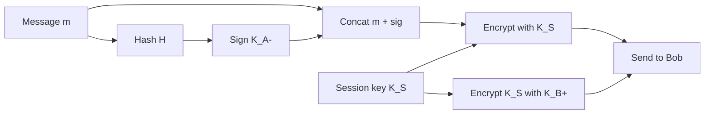

# 8.5 Securing E-Mail

## Why Application-Layer Security

Security can be deployed at any layer, but:
- Network-layer encryption (IPsec) provides blanket coverage but not user-level identity — a commerce site can't authenticate a customer via IP-layer security alone
- Higher layers are easier to deploy incrementally (PGP didn't require network changes)

## Security Goals for E-Mail

1. **Confidentiality** — only Bob can read Alice's message
2. **Sender authentication** — Bob knows the message came from Alice
3. **Message integrity** — message was not altered in transit
4. **Receiver authentication** — Alice knows she's sending to Bob (not Trudy)

## 8.5.1 Secure E-Mail Design

### Confidentiality Only

**Problem with symmetric key**: pre-sharing a secret key is hard.

**Public key approach** (inefficient for large messages):
```
Alice encrypts m with K_B+ → sends to Bob
Bob decrypts with K_B-
```

**Hybrid approach** (practical):
```
Alice:
  1. Generate random session key K_S
  2. Encrypt message:   encrypted_m = K_S(m)
  3. Encrypt session key: encrypted_K_S = K_B+(K_S)
  4. Send: (encrypted_m, encrypted_K_S)

Bob:
  1. Decrypt K_S = K_B-(encrypted_K_S)
  2. Decrypt m  = K_S^-1(encrypted_m)
```

### Sender Authentication + Message Integrity Only

```
Alice:
  1. Compute digest = H(m)
  2. Sign:   sig = K_A-(digest)
  3. Send:   (m, sig)   [m in cleartext]

Bob:
  1. digest1 = K_A+(sig)   # decrypt signature with Alice's public key
  2. digest2 = H(m)        # hash received message
  3. if digest1 == digest2 → authenticated and unmodified
```

### Full Security: Confidentiality + Authentication + Integrity

Combine both above:

```
Alice:
  1. Compute H(m), sign with K_A- → sig
  2. Package: pkg = (m, sig)
  3. Generate K_S, encrypt: encrypted_pkg = K_S(pkg)
  4. Encrypt session key: encrypted_K_S = K_B+(K_S)
  5. Send: (encrypted_pkg, encrypted_K_S)

Bob:
  1. Decrypt K_S = K_B-(encrypted_K_S)
  2. Decrypt pkg = K_S^-1(encrypted_pkg)
  3. Verify signature using K_A+
```

Alice uses public key crypto **twice**: once with `K_A-` (sign), once with `K_B+` (encrypt session key).
Bob uses public key crypto **twice**: once with `K_B-` (decrypt session key), once with `K_A+` (verify sig).



## 8.5.2 PGP (Pretty Good Privacy)

Written by Phil Zimmermann, 1991. Widely deployed; matches the design above.

**Algorithms used**:

| Function | Options |
|---|---|
| Message digest | MD5 or SHA-1 |
| Symmetric encryption | CAST, 3DES, or IDEA |
| Public key encryption | RSA |

**Setup**:
- Installation generates a public/private key pair
- Public key posted on web or public key server
- Private key protected by a password (entered each time)

**PGP signed message format**:
```
-----BEGIN PGP SIGNED MESSAGE-----
Hash: SHA1

Bob: Can I see you tonight?
Passionately yours, Alice

-----BEGIN PGP SIGNATURE-----
Version: PGP for Personal Privacy 5.0
Charset: noconv
yhHJRHhGJGhgg/12EpJ+lo8gE4vB3mqJhFEvZP9t6n7G6m5Gw2
-----END PGP SIGNATURE-----
```
The encoded block is `K_A-(H(m))` — digitally signed message digest.

**PGP encrypted message**:
```
-----BEGIN PGP MESSAGE-----
Version: PGP for Personal Privacy 5.0
u2R4d+/jKmn8Bc5+hgDsqAewsDfrGdszX68liKm5F6Gc4sDfcXyt...
-----END PGP MESSAGE-----
```

**Public key certification in PGP**:
- Uses **web of trust** instead of centralized CA
- Alice can certify any key/username pair she believes
- Alice can designate other users she trusts to vouch for keys
- **Key-signing parties**: users physically gather and sign each other's public keys
