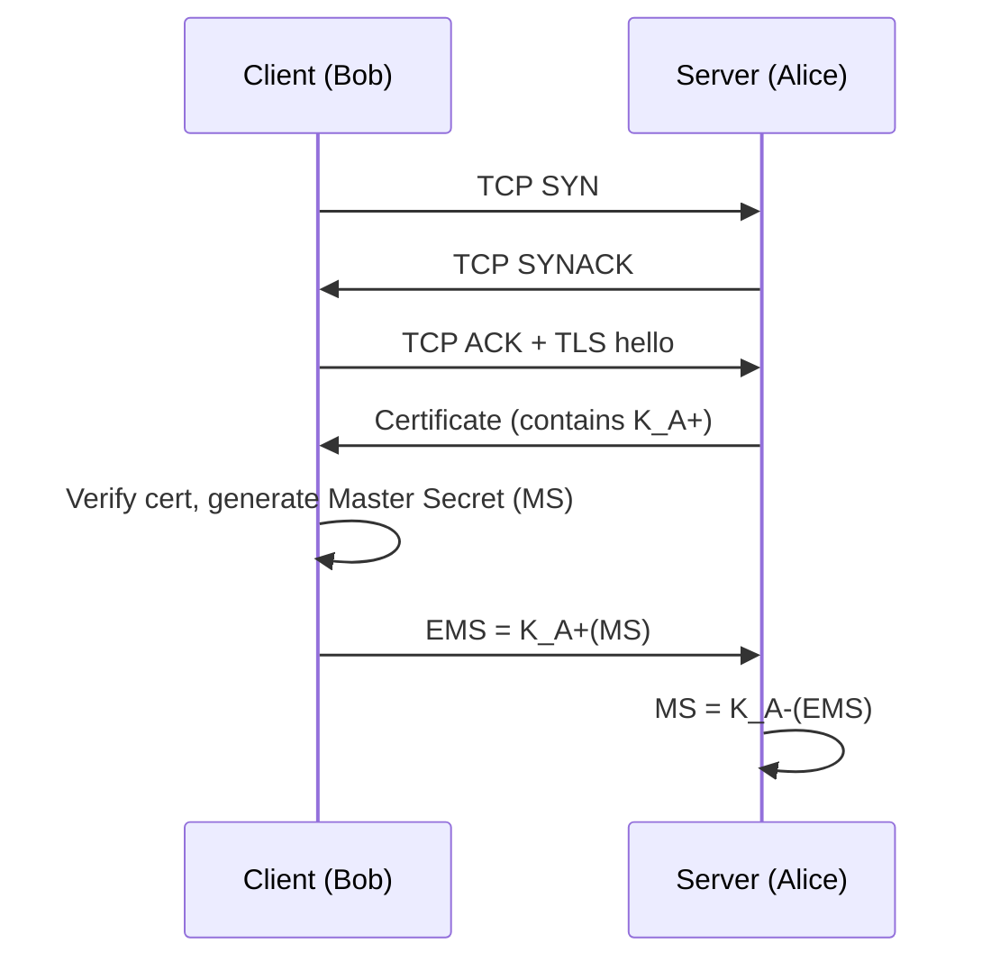

# 8.6 Securing TCP Connections: TLS

## Overview

- **TLS** (Transport Layer Security) — IETF standard (RFC 4346); successor to SSL v3
- Provides: confidentiality, data integrity, server authentication, (optionally) client authentication
- Used by: all major browsers, Gmail, all major e-commerce sites
- Protocol number visible when URL starts with `https://`
- Technically in application layer but presents a socket API similar to TCP

## Threat Model

Without TLS:
- No confidentiality → payment card info intercepted
- No data integrity → order quantity modified in transit
- No server authentication → attacker masquerades as merchant

## TLS Architecture

```
Application layer
  ↕ (TLS socket API — same interface as TCP sockets)
TLS sublayer
  ↕
TCP
```

## TLS Phases (Three-Phase Structure)

1. **Handshake** — establish TCP connection, authenticate server, agree on keys
2. **Key derivation** — generate 4 session keys from master secret
3. **Data transfer** — send records with encryption + HMAC

## 8.6.1 Almost-TLS (Simplified)

### Handshake



Both sides now share MS (Master Secret).

### Key Derivation

From MS, both sides derive **4 keys**:

| Key | Direction | Purpose |
|---|---|---|
| `E_B` | Bob → Alice | Encryption |
| `M_B` | Bob → Alice | HMAC (integrity) |
| `E_A` | Alice → Bob | Encryption |
| `M_A` | Alice → Bob | HMAC (integrity) |

Keys sliced from MS (in real TLS, more complex derivation).

### Data Transfer

- TLS breaks byte stream into **records**
- Each record: append HMAC, then encrypt

```
record = data_chunk
HMAC   = H(data_chunk + M_B + sequence_number)
payload = E_B(record + HMAC)
→ send payload via TCP
```

**Sequence numbers in HMAC**: prevent Trudy from reordering or replaying segments. Not included in the record itself — only in HMAC calculation.

### TLS Record Format

```
+------+---------+--------+------+------+
| Type | Version | Length | Data | HMAC |
+------+---------+--------+------+------+
  ^       ^         ^
  not encrypted (type, version, length in clear)
```

- **Type field**: handshake message vs. application data vs. closure
- **Length field**: used to extract records from TCP byte stream
- Data + HMAC encrypted with `E_B`

## 8.6.2 Real TLS Handshake

### Steps

```mermaid
sequenceDiagram
    participant C as Client
    participant S as Server
    C->>S: 1. ClientHello: list of supported algorithms + client_nonce
    S->>C: 2. ServerHello: chosen algorithms + certificate + server_nonce
    C->>C: 3. Verify cert, extract K_S+; generate PMS; compute MS from PMS + nonces
    C->>S: 3. Encrypted PMS = K_S+(PMS)
    S->>S: 4. Compute MS from PMS + nonces; derive 4 session keys + IVs
    C->>S: 5. HMAC of all handshake messages sent/received
    S->>C: 6. HMAC of all handshake messages sent/received
```

**Steps 5 and 6** protect against tampering: if Trudy deleted strong algorithms from step 1 (forcing weak cipher), the HMAC of handshake messages will not match.

### Key Concepts

- **PMS** (Pre-Master Secret) — generated by client, encrypted with server's public key
- **MS** (Master Secret) — derived from PMS + both nonces using a TLS key derivation function
- **Nonces** — defend against **connection replay attack** (Trudy replays entire prior session)
- **Sequence numbers** — defend against **segment replay attack** within a session
- **IVs** — one per side, derived from MS; used when CBC ciphers (3DES, AES-CBC) are used
- Algorithm negotiation: symmetric cipher (e.g., AES), public-key algorithm (e.g., RSA), HMAC algorithm (MD5 or SHA-1)

### Nonce vs Sequence Number

| Defense | Mechanism |
|---|---|
| Connection replay attack | Nonces: fresh nonces per session → different MS → different keys → old records fail HMAC |
| Segment replay within session | Sequence numbers embedded in HMAC calculation |

## Connection Closure

**Truncation attack**: Trudy sends TCP FIN early → Alice thinks she got all of Bob's data.

**Fix**: TLS type field in records signals TLS-level closure. Receiving a TCP FIN before a TLS closure record → alert.
