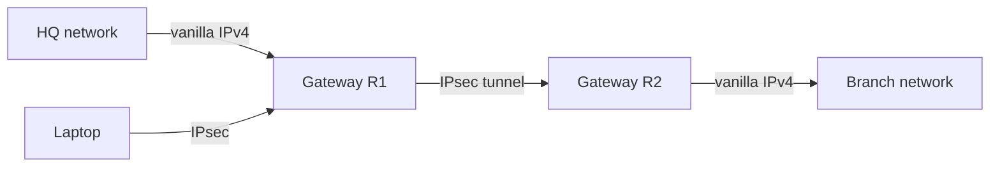

# 8.7 Network-Layer Security: IPsec and VPNs

## Overview

- **IPsec** — network-layer security protocol; secures IP datagrams between any two network-layer entities
- Provides: confidentiality, source authentication, data integrity, replay-attack prevention
- Primary use case: **VPNs** over public Internet
- Defined in RFC 4301 (architecture), RFC 6071 (overview), RFC 5996 (IKE)
- "Blanket coverage": encrypts ALL traffic (e-mail, web, TCP handshakes, SNMP, ICMP, etc.)

## 8.7.1 VPNs

**Private network**: institution deploys own physical infrastructure — expensive.

**VPN alternative**: inter-office traffic tunneled through public Internet via IPsec.

```
HQ ←—[internal vanilla IPv4]—→ HQ gateway router
HQ gateway router ←—[IPsec encrypted over public Internet]—→ Branch gateway router
Branch gateway router ←—[internal vanilla IPv4]—→ Branch hosts
```



- Public Internet routers see ordinary IPv4 datagrams and route them normally
- Only gateway routers (and IPsec-enabled hosts/laptops) understand the IPsec payload

## 8.7.2 AH vs ESP Protocols

| Protocol | Authentication | Integrity | Confidentiality | Use |
|---|---|---|---|---|
| AH (Authentication Header) | Yes | Yes | No | Rarely used |
| ESP (Encapsulation Security Payload) | Yes | Yes | Yes | Dominant; used for VPNs |

This section focuses on ESP in tunnel mode.

## 8.7.3 Security Associations (SAs)

- **SA** = unidirectional logical connection between source and destination for IPsec
- Bidirectional IPsec requires **two SAs** (one per direction)

**SA state maintained per endpoint**:

| Field | Description |
|---|---|
| SPI (32-bit) | Security Parameter Index — identifies the SA |
| Origin/Destination IP | Endpoints of the SA |
| Encryption type | e.g., 3DES with CBC |
| Encryption key | Symmetric key for encryption |
| Integrity check type | e.g., HMAC with MD5 |
| Authentication key | Key for MAC computation |

All SA state stored in **Security Association Database (SAD)** in the OS kernel.

**Example**: HQ + branch + `n` traveling salespersons → `(2 + 2n)` SAs at HQ gateway

## 8.7.4 IPsec Datagram (ESP Tunnel Mode)

### Construction ("the enchilada recipe")

Starting from original IPv4 datagram (src: `172.16.1.17`, dst: `172.16.2.48`):

1. Append **ESP trailer** to back of original datagram (padding, pad length, next header)
2. Encrypt (original datagram + ESP trailer) using SA's encryption key/algorithm
3. Prepend **ESP header** (SPI + sequence number) — sent in cleartext
4. Compute **MAC** over (ESP header + encrypted payload) using SA's authentication key
5. Append MAC → this whole unit = "enchilada"
6. Prepend **new IPv4 header** (src: R1 `200.168.1.100`, dst: R2 `193.68.2.23`, protocol=50)

```
+-------------+------------+-------------------+---------------+-----+
| New IPv4 hdr| ESP header |  Encrypted payload               | MAC |
|             |  SPI | seq | orig IPv4 hdr + data + ESP trailer|     |
+-------------+------------+-------------------+---------------+-----+
              |←——————————— authenticated ————————————————————→|
                            |←————————— encrypted —————————→|
```

Protocol number `50` in new IP header = IPsec ESP.

### ESP Header Fields

| Field | Purpose |
|---|---|
| SPI | Receiver looks up SA in SAD to get decryption/auth keys |
| Sequence number | Replay attack defense |

### ESP Trailer Fields

| Field | Purpose |
|---|---|
| Padding | Make encrypted block integer multiple of cipher block size |
| Pad length | Receiver knows how much to strip |
| Next header | Type of data inside (e.g., UDP, TCP) |

### Decapsulation at R2

1. Check destination IP → this datagram is for R2
2. Protocol=50 → apply IPsec ESP processing
3. Use SPI to find SA in SAD
4. Verify MAC (enchilada integrity check)
5. Check sequence number (replay defense)
6. Decrypt using SA's decryption key
7. Remove padding; extract original IPv4 datagram
8. Forward original datagram into branch office network

### Security vs. Attacker (Trudy)

| Attack | IPsec Defense |
|---|---|
| Read payload | Encrypted — Trudy sees only outer src/dst IPs |
| Modify datagram | MAC check fails at R2 |
| Forge datagram from R1 | MAC check fails (no auth key) |
| Replay datagram | Sequence number check fails |

Even protocol, src/dst of original datagram are hidden — more confidential than TLS.

## Security Policy Database (SPD)

- **SAD** = "how" to process: keys, algorithms per SA
- **SPD** = "what" to do: which traffic gets IPsec-processed, which SA to use

SPD matches datagrams by: source IP, destination IP, protocol type.

## 8.7.5 IKE: Key Management

**Manual keying**: fine for 2 endpoints; impractical for large VPNs.

**IKE** (Internet Key Exchange, RFC 5996) — automated SA establishment.

### IKE vs SSL/TLS Similarities

- Both exchange certificates
- Both negotiate algorithms
- Both derive session keys
- **Difference**: IKE uses two phases; second phase is cheap (no public key crypto)

### IKE Phase 1

Two message-pair exchanges between R1 and R2:

**Exchange 1**:
- Use Diffie-Hellman to create a bidirectional **IKE SA** (encrypted/authenticated channel)
- Establish encryption + authentication keys for IKE SA
- Establish master secret for later IPsec SA key derivation
- **No RSA** — neither side reveals identity in this exchange

**Exchange 2**:
- Both sides reveal identity (sign messages with private key)
- Identities protected since sent over encrypted IKE SA channel
- Negotiate IPsec encryption and authentication algorithms

### IKE Phase 2

- Create two IPsec SAs (one per direction) using algorithms negotiated in Phase 1
- Derive encryption and authentication session keys for each SA
- Uses master secret from Phase 1 — **no additional public key crypto** (fast)

**Rationale**: Phase 1 expensive (public key); Phase 2 cheap → can establish many SAs efficiently.
