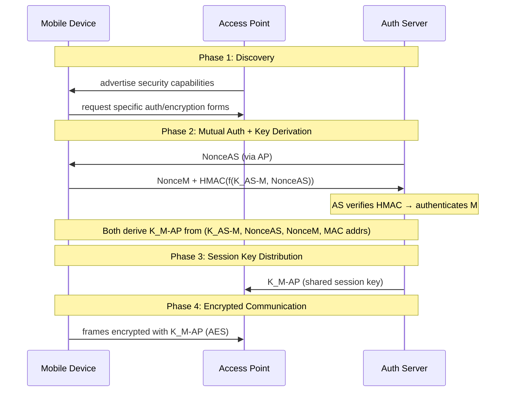
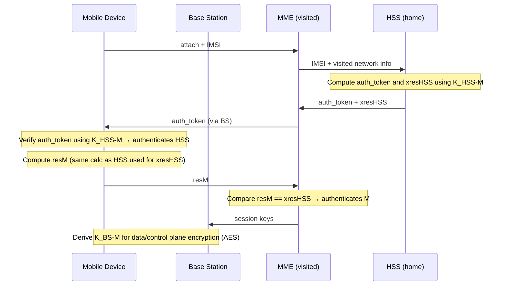

# 8.8 Securing Wireless LANs and 4G/5G Cellular Networks

## Why Wireless Security Is Critical

- Attacker can sniff frames by simply placing a receiver anywhere in transmission range
- Both 802.11 (WiFi) and 4G/5G are vulnerable
- Security techniques used: nonces (anti-replay), cryptographic hashing (integrity), AES encryption (confidentiality), shared symmetric key derivation

## 8.8.1 Authentication and Key Agreement in 802.11

### Two Key Goals

1. **Mutual authentication** — network authenticates device AND device authenticates network (prevents rogue APs)
2. **Encryption** — symmetric key encryption of link-level frames between device and AP

### Architecture

```
Mobile Device (M) ←→ Access Point (AP) ←→ Authentication Server (AS)
```

- AP is a **pass-through** — relays authentication messages between M and AS
- AS typically shared across all APs in a network

### Four Phases (WPA2)



### WPA2 Four-Way Handshake Detail

**Pre-condition**: M and AS share a secret `K_AS-M` (e.g., WiFi password).

| Step | Sender | Message | Purpose |
|---|---|---|---|
| a | AS | `NonceAS` | AS proves liveness; provides nonce |
| b | M | `NonceM` + `HMAC(f(K_AS-M, NonceAS))` | M proves it knows `K_AS-M`; AS authenticates M; both derive `K_M-AP` |
| c | AS | encrypted group key info | Group key derivation |
| d | M | ACK | Confirm group key |

**Session key derivation**:
```
K_M-AP = f(K_AS-M, NonceAS, NonceM, MAC_address_M, MAC_address_AS)
```

Both M and AS independently compute the same `K_M-AP`.

**AS → AP**: AS sends `K_M-AP` to AP (Step 3 in Figure 8.30).

### Security History

| Standard | Year | Notes |
|---|---|---|
| WEP | original | Broken — serious flaws discovered; public tools exploit it; DO NOT USE |
| WPA1 (2003) | 2003 | Fixed WEP flaws; added message integrity checks; avoided key-inference attacks |
| WPA2 | 2004 | Mandated AES encryption |
| WPA3 | 2018 | Fixes nonce-reuse attack on four-way handshake [Vanhoef 2017]; longer keys |

### 802.11 Security Protocol Stack

```
Mobile Device          Access Point           Auth Server
    EAP                   EAP                    EAP
   EAPoL               EAPoL / RADIUS          RADIUS
  802.11             802.11 / UDP-IP           UDP-IP
```

- **EAP** (Extensible Authentication Protocol, RFC 3748) — end-to-end message format (request/response)
- **EAPoL** (EAP over LAN) — encapsulates EAP over 802.11 wireless link
- **RADIUS** (RFC 2865) — encapsulates EAP between AP and AS over UDP/IP; de facto standard
- **DIAMETER** (RFC 3588) — projected future replacement for RADIUS

## 8.8.2 Authentication and Key Agreement in 4G/5G

### Architecture Components

| Component | Role |
|---|---|
| M (Mobile Device) | Device attaching to network; SIM card stores `K_HSS-M` |
| BS (Base Station) | Radio interface; will use session key `K_BS-M` to encrypt frames |
| MME (Mobility Management Entity) | Orchestrates authentication in visited network |
| HSS (Home Subscriber Service) | Stores device credentials; in device's home network |

**Key pre-condition**: M and HSS share `K_HSS-M` (stored in SIM card + HSS database).

### 4G AKA (Authentication and Key Agreement) Protocol



**Steps**:

| Step | Actor | Action |
|---|---|---|
| a | M → HSS (via MME) | Send IMSI + visited network info |
| b | HSS → MME | Compute `auth_token` = `K_HSS-M(IMSI)` and `xresHSS`; send both |
| c | M | Verify: `K_HSS-M(K_HSS-M(IMSI)) = IMSI` → HSS authenticated. Compute `resM` |
| d | MME | Compare `resM == xresHSS` → M authenticated |
| e | M + BS | Derive separate data-plane and control-plane keys using AES |

**MME role**: middleman only — sees `xresHSS` but never learns `K_HSS-M`.

### 4G vs 5G Differences

| Aspect | 4G | 5G |
|---|---|---|
| Authentication decision | MME (visited network) | Home network; visited network only rejects |
| Protocols | AKA only | AKA + AKA' (EAP-based) + IoT protocol (no pre-shared key) |
| IMSI protection | Transmitted in cleartext | Encrypted using public key crypto |

### Comparison: 802.11 vs 4G/5G Security

| Feature | 802.11 (WPA2) | 4G/5G |
|---|---|---|
| Pre-shared secret | WiFi password | SIM card `K_HSS-M` |
| Auth server | AS (can be co-located with AP) | HSS in home network |
| Middleman | AP relays EAP | BS + MME relay; HSS in home network |
| Session key | `K_M-AP` | `K_BS-M` (separate data/control) |
| Frame encryption | AES | AES |
| Nonces used | Yes | Yes (in AKA tokens) |
| Roaming support | No (single network) | Yes (visited + home network interaction) |
