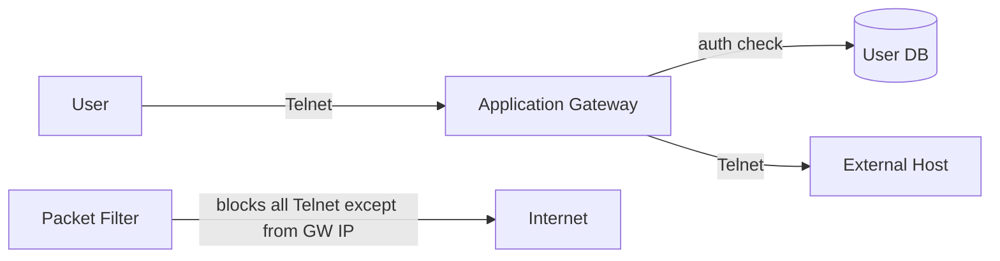

# 8.9 Operational Security: Firewalls and IDS

## 8.9.1 Firewalls

### Definition

Hardware + software combination that isolates an organization's internal network from the Internet, allowing some packets through and blocking others.

### Three Goals

1. All traffic between inside and outside passes through the firewall
2. Only authorized traffic (per local security policy) is allowed through
3. The firewall itself is immune to penetration

**Vendors**: Cisco, Check Point. Also: Linux `iptables` (open source). SDN-controlled firewalls in routers are increasingly common.

### Types of Firewalls

#### 1. Traditional Packet Filters

- Examines each datagram **in isolation**
- Decision to allow or drop based on:
  - IP source / destination address
  - Protocol type (TCP, UDP, ICMP, OSPF, etc.)
  - TCP or UDP source and destination port
  - TCP flag bits (SYN, ACK, etc.)
  - ICMP message type
  - Direction (inbound vs. outbound)
  - Router interface

**Example policies**:

| Policy | Firewall Rule |
|---|---|
| No outside web access | Drop all outgoing packets to any IP, port 80 |
| No incoming TCP connections except public web server | Drop all incoming TCP SYN to any IP except `130.207.244.203:80` |
| Block internet radio | Drop all incoming UDP except DNS |
| Prevent smurf DoS | Drop all outgoing ICMP ping to broadcast address |
| Prevent traceroute | Drop all outgoing ICMP TTL-expired packets |

**ACK bit trick**: Block incoming TCP with ACK=0 → blocks all externally-initiated connections; allows responses to internal connections (since all segments after SYN have ACK=1).

**Access control list example** (network `222.22/16`, web server inside):

| Action | Src Addr | Dst Addr | Proto | Src Port | Dst Port | Flag |
|---|---|---|---|---|---|---|
| allow | `222.22/16` | outside | TCP | >1023 | 80 | any |
| allow | outside | `222.22/16` | TCP | 80 | >1023 | ACK |
| allow | `222.22/16` | outside | UDP | >1023 | 53 | — |
| allow | outside | `222.22/16` | UDP | 53 | >1023 | — |
| deny | all | all | all | all | all | all |

Rules applied top-to-bottom; first match wins. This allows outbound web + DNS only.

**Limitation**: Cannot prevent spoofed source addresses; no application-layer awareness.

#### 2. Stateful Packet Filters

- Track **ongoing TCP connections** in a connection table
- Allows ACK=1 packets only if matching connection exists in table

**Connection tracking**:
- New connection: observe SYN → SYNACK → ACK three-way handshake
- Connection end: FIN packet or 60s timeout

**Connection table example**:

| Src Addr | Dst Addr | Src Port | Dst Port |
|---|---|---|---|
| `222.22.1.7` | `37.96.87.123` | 12699 | 80 |
| `222.22.93.2` | `199.1.205.23` | 37654 | 80 |
| `222.22.65.143` | `203.77.240.43` | 48712 | 80 |

**Modified ACL** adds "check connection" column:
- Incoming TCP ACK from port 80: check connection table → only allow if matching entry exists
- Incoming UDP from port 53: check connection table → only allow if DNS query was sent

**Defends against**: attackers sending unsolicited ACK=1 or malformed packets to crash internal hosts.

#### 3. Application Gateways

- Look **beyond** IP/TCP/UDP headers — inspects application data
- Application-specific server through which all data must pass
- Can enforce identity-based access (not just IP-based)

**Example**: Telnet application gateway

```
1. Internal user Telnets to application gateway
2. Gateway prompts for user ID + password
3. Gateway checks if user has permission to Telnet externally
4. If yes: gateway connects to external host, relays data bidirectionally
```



Packet filter blocks all outbound Telnet except from gateway's IP address.

**Limitations**:
- Separate gateway needed per application
- Performance penalty (all data relayed through gateway)
- Client must know to contact gateway first

Multiple gateways: Telnet, HTTP, FTP, e-mail. Mail server and web cache are application gateways.

## 8.9.2 Intrusion Detection Systems (IDS)

### IDS vs IPS

| System | Action on suspicious traffic |
|---|---|
| IDS (Intrusion Detection System) | Alert sent to administrator |
| IPS (Intrusion Prevention System) | Drops/filters suspicious traffic |

Both perform **deep packet inspection** (examine payload, not just headers).

### What IDS Detects

- Network mapping (nmap)
- Port scans, TCP stack scans
- DoS bandwidth-flooding
- Worms and viruses
- OS vulnerability exploits
- Application vulnerability attacks

### Deployment

```
Internet → Packet Filter → Application Gateway → Internal Network
                    ↓IDS sensor             ↓IDS sensor
                   DMZ (web server, DNS) → IDS sensor
                                                ↓
                                        Central IDS Processor
                                                ↓
                                        Network Administrator
```

- **DMZ** (Demilitarized Zone): lower-security zone with public-facing servers (web, DNS)
- Multiple sensors distribute load (deep packet inspection is expensive)
- Sensors send info to central processor; alerts sent to admins

### IDS Classification

#### Signature-Based IDS

- Maintains database of **attack signatures**
- Signature = set of rules about a single packet or series of packets
- Match signature → generate alert

**Snort signature example**:
```
alert icmp $EXTERNAL_NET any -> $HOME_NET any
  (msg:"ICMP PING NMAP"; dsize: 0; itype: 8;)
```
Detects nmap ping sweeps: ICMP type 8, empty payload, from external to internal.

**Snort**: public-domain, open source IDS. Linux/UNIX/Windows. Uses libpcap. Community of security experts maintains signature database — new attack signatures released within hours of attack discovery.

**Limitations**:
- Blind to new/undocumented attacks (requires prior knowledge)
- False positives: signature match ≠ actual attack
- Can be overwhelmed at high traffic rates

#### Anomaly-Based IDS

- Builds traffic profile during normal operation
- Detects statistically unusual patterns: abnormal ICMP ratio, sudden port scan growth, etc.
- **Advantage**: can detect previously unknown attacks
- **Disadvantage**: extremely difficult to distinguish normal from statistically unusual traffic

**In practice**: most deployments are primarily signature-based with some anomaly features.

### Firewall + IDS Comparison

| Device | Packet Inspection | State | Application Data | Action |
|---|---|---|---|---|
| Packet filter | Headers only | Stateless | No | Block/allow |
| Stateful filter | Headers + connection state | Stateful | No | Block/allow |
| Application gateway | Full (application-specific) | Yes | Yes | Block/allow |
| IDS | Full (deep packet) | Often stateful | Yes | Alert (or block if IPS) |
